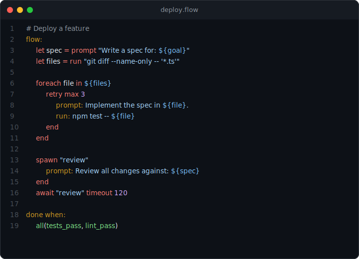

# @45ck/prompt-language

A verification-first supervision runtime for coding agents. It wraps Claude Code in a persistent state machine with deterministic control flow, verification gates, and state management.

[](https://www.npmjs.com/package/@45ck/prompt-language) [](https://github.com/45ck/prompt-language/actions/workflows/quality.yml) [](LICENSE) [](package.json) [](CONTRIBUTING.md) [](https://www.npmjs.com/package/@45ck/prompt-language)

<p align="center">
  
</p>

- **Deterministic execution** -- loops, branches, variables, and retries run without AI involvement. The AI only activates at `prompt` nodes. ~85% of execution is deterministic; ~15% is AI.
- **Verification gates** -- `done when: tests_pass` runs real commands and blocks completion until they pass. The AI cannot self-report "done."
- **Parallel agents** -- `spawn` launches child processes, `await` collects results, `race` picks the fastest. Variables flow between parent and children automatically.

## Install

```bash
npx @45ck/prompt-language
```

Requires [Claude Code](https://docs.anthropic.com/en/docs/claude-code/overview) and Node.js >= 22.

## Example

```
agents:
  builder:
    model: "sonnet"
    skills: "backend-engineer"
  reviewer:
    model: "opus"
    skills: "code-review", "security-review"

flow:
  let spec = prompt "Write a technical spec for: ${goal}"
  let files = run "git diff --name-only -- '*.ts'"

  foreach file in ${files}
    retry max 3
      prompt: Implement the spec changes in ${file}.
      run: npm test -- ${file}
      if command_failed
        prompt: Fix the failing tests in ${file}.
      end
    end
  end

  spawn "review" as reviewer
    prompt: Review all changes against the spec: ${spec}
  end
  await "review" timeout 120

  try
    run: npm run build
  catch
    prompt: The build failed. Fix the build errors.
    run: npm run build
  end

done when:
  all(tests_pass, lint_pass)
```

This flow captures a spec, loops over changed files, retries each until tests pass, spawns a parallel review agent, and gates completion on real test and lint results. Every node except `prompt` executes deterministically.

More examples: [docs/examples](docs/examples/index.md) | DSL cheatsheet: [docs/reference/dsl-cheatsheet.md](docs/reference/dsl-cheatsheet.md)

## Features

| Category          | Highlights                                                                                                |
| ----------------- | --------------------------------------------------------------------------------------------------------- |
| **Control flow**  | `if`/`else if`/`else`, `while`, `until`, `retry`, `foreach`, `try`/`catch`/`finally`, `break`, `continue` |
| **Variables**     | `let x = "literal"` / `run "cmd"` / `prompt "..."`, `${x}` interpolation, lists, arithmetic               |
| **Verification**  | `tests_pass`, `lint_pass`, `file_exists`, custom gates, `all()`/`any()` composition                       |
| **Agents**        | Named `agents:` with model/skills/profile, `spawn`/`await`, `race`, `send`/`receive`                      |
| **AI conditions** | `ask "question" grounded-by "command"` for subjective evaluation with real data                           |
| **Resilience**    | Persistent state, compaction survival, `snapshot`/`rollback`, `import`/`include`                          |

## CLI commands

| Command                               | What it does                                 |
| ------------------------------------- | -------------------------------------------- |
| `npx @45ck/prompt-language`           | Install the runtime                          |
| `npx @45ck/prompt-language status`    | Check installation                           |
| `npx @45ck/prompt-language validate`  | Parse, lint, score, and preview a flow       |
| `npx @45ck/prompt-language run`       | Execute a flow via Claude or headless runner |
| `npx @45ck/prompt-language ci`        | Run a flow in headless CI mode               |
| `npx @45ck/prompt-language watch`     | Live TUI flow monitor                        |
| `npx @45ck/prompt-language init`      | Scaffold a starter flow                      |
| `npx @45ck/prompt-language demo`      | Print an annotated example                   |
| `npx @45ck/prompt-language uninstall` | Remove the runtime                           |

Full CLI documentation: [docs/reference/cli-reference.md](docs/reference/cli-reference.md)

## Documentation

| Topic                   | Link                                                                     |
| ----------------------- | ------------------------------------------------------------------------ |
| Getting started         | [docs/guides/getting-started.md](docs/guides/getting-started.md)         |
| Language reference      | [docs/reference/index.md](docs/reference/index.md)                       |
| DSL cheatsheet          | [docs/reference/dsl-cheatsheet.md](docs/reference/dsl-cheatsheet.md)     |
| How the runtime works   | [docs/guides/guide.md](docs/guides/guide.md)                             |
| Architecture and design | [docs/architecture.md](docs/architecture.md)                             |
| Security model          | [docs/security.md](docs/security.md)                                     |
| Examples                | [docs/examples/index.md](docs/examples/index.md)                         |
| Experiments             | [docs/experiments.md](docs/experiments.md)                               |
| Troubleshooting         | [docs/operations/troubleshooting.md](docs/operations/troubleshooting.md) |
| Roadmap                 | [docs/roadmap.md](docs/roadmap.md)                                       |
| Full doc index          | [docs/index.md](docs/index.md)                                           |

## Tooling

- **VS Code extension** -- syntax highlighting for `.flow`, `.prompt`, and inline flow blocks. Source in `vscode-extension/`.
- **GitHub Actions** -- run flows in CI with [`45ck/prompt-language-action`](https://github.com/45ck/prompt-language-action).

## Contributing

See [CONTRIBUTING.md](CONTRIBUTING.md).

## License

MIT. See [LICENSE](LICENSE).
