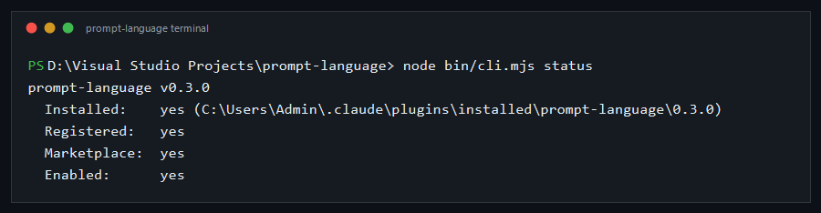
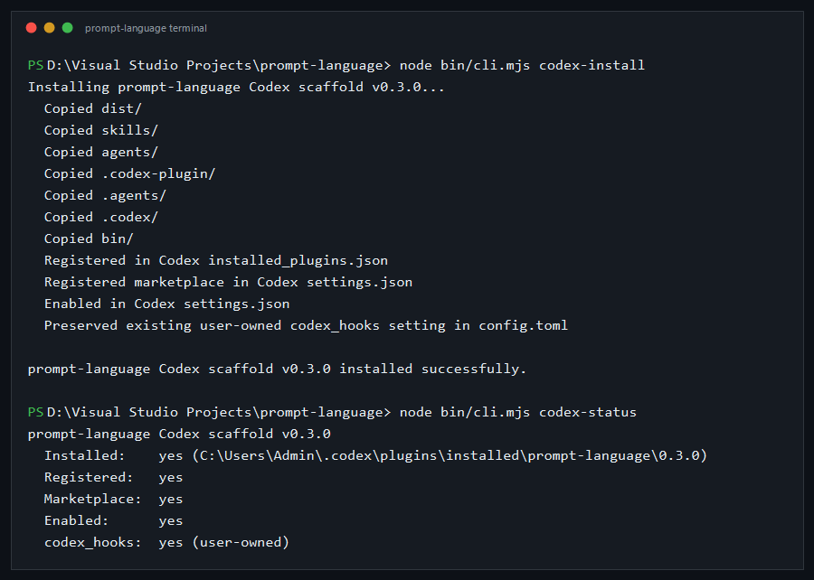
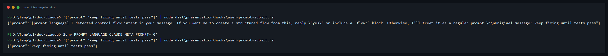
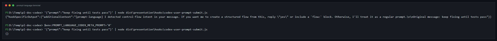

# Claude Code And Codex

Use this guide when you want prompt-language to improve ordinary prompts in Claude Code or Codex without forcing every user to write DSL by hand.

This guide covers:

- how to install and verify the Claude Code and Codex surfaces
- how NL-to-DSL meta-prompting works
- how to turn the meta-prompt path on or off per harness
- how skill-aware prompt wrapping helps preserve prompt-language inside host skills
- how to verify the behavior with shipped eval commands

## Why this is useful

prompt-language helps most when a user starts with a normal prompt such as:

- "keep fixing until tests pass"
- "retry the build up to three times"
- "review this after both workers finish"

Those are useful instructions, but they are still just prose. prompt-language adds a stricter runtime around them:

- it can turn control-flow-like prose into an explicit flow
- it can keep gates, retries, and loops deterministic
- it can preserve prompt-language DSL when a host skill already contains the right workflow
- it can keep Claude Code and the stronger Codex runner path on one runtime contract instead of having two different mental models

The point is not "more prompt engineering." The point is making verification and control flow visible and enforceable.

## What is shipped today

There are two separate surfaces:

1. **Interactive hook path**
   Claude Code and the local Codex scaffold can inspect ordinary user prompts and offer the NL-to-DSL confirmation/meta-prompt path.
2. **Headless runner path**
   `prompt-language run` and `prompt-language ci` execute flows through the shared runtime for `claude`, `codex`, and other supported runners.

Important:

- Claude Code install is the default product path.
- Codex install is still documented as an experimental local scaffold.
- The Codex headless runner path is stronger and more proven than the native Codex scaffold lifecycle.

## Prerequisites

- Node.js `>= 22`
- Claude Code installed if you want the Claude hook path
- Codex CLI installed if you want the Codex runner or Codex scaffold path
- from this repo root: `D:\Visual Studio Projects\prompt-language`
- built hook artifacts if you want to run the `dist/` hook examples directly:

```powershell
npm run build
```

## Claude Code Setup

Install the runtime:

```powershell
node bin/cli.mjs install
node bin/cli.mjs status
```



Expected result:

- `Installed: yes`
- `Registered: yes`
- `Marketplace: yes`
- `Enabled: yes`

## Codex Setup

Install the local Codex scaffold:

```powershell
node bin/cli.mjs codex-install
node bin/cli.mjs codex-status
```



Expected result:

- `Installed: yes`
- `Registered: yes`
- `Marketplace: yes`
- `Enabled: yes`

## How NL-To-DSL Meta-Prompting Works

When the hook sees a prompt that looks like control-flow intent, it does **not** silently rewrite your prompt into DSL. It uses a two-step path:

1. detect control-flow intent
2. ask for confirmation
3. on a trivial reply such as `yes`, `ok`, or `go ahead`, emit the DSL helper prompt

That means the user can still back out and keep the original prose path when needed.

### Claude hook example

```powershell
'{"prompt":"keep fixing until tests pass"}' |
  node dist/presentation/hooks/user-prompt-submit.js
```

With the default setting, the hook emits the confirmation prompt:



### Codex hook example

```powershell
'{"prompt":"keep fixing until tests pass"}' |
  node dist/presentation/hooks/codex-user-prompt-submit.js
```

With the default setting, the Codex hook emits the same confirmation path through `additionalContext`:



Keep the product boundary in mind here:

- Claude Code is the default interactive install path.
- The native Codex scaffold remains experimental.
- The stronger Codex path today is still `run` or `ci --runner codex`.

## Hybrid Local/Frontier Teams

For team-style work, keep prompt-language as the parent supervisor and route
bounded child sessions through the runner that fits the lane.

Use local runners for bulk work:

```powershell
$env:PL_SPAWN_RUNNER = 'ollama'
```

Use Codex for high-reasoning review or escalation:

```powershell
$env:PL_SPAWN_RUNNER = 'codex'
```

The recommended pattern is local-first, frontier-on-escalation: Ollama, OpenCode,
or aider performs inventory, repetitive edits, and verifier-guided repair; Codex
handles architecture/security ambiguity, repeated local failure, and final
read-only review. The parent flow should convert frontier findings into explicit
tasks, gates, or stop conditions.

See [Team Of Agents Guide](team-of-agents.md) for the full operating model.

## Meta-Prompt Toggle Controls

Use these env vars when you want to change the default behavior.

| Env var                              | Scope               | Default |
| ------------------------------------ | ------------------- | ------- |
| `PROMPT_LANGUAGE_META_PROMPT`        | all supported hooks | on      |
| `PROMPT_LANGUAGE_CLAUDE_META_PROMPT` | Claude hook only    | inherit |
| `PROMPT_LANGUAGE_CODEX_META_PROMPT`  | Codex hook only     | inherit |

Accepted true values:

- `1`
- `true`
- `on`

Accepted false values:

- `0`
- `false`
- `off`

Examples:

```powershell
$env:PROMPT_LANGUAGE_META_PROMPT = '0'
```

Disable only the Claude hook:

```powershell
$env:PROMPT_LANGUAGE_CLAUDE_META_PROMPT = '0'
```

Disable only the Codex hook:

```powershell
$env:PROMPT_LANGUAGE_CODEX_META_PROMPT = '0'
```

When disabled:

- the prompt passes through unchanged
- no pending NL confirmation state is recorded
- explicit `flow:` programs still work normally

## Skill-Aware Prompt Wrapping

Claude and Codex prompt-turn runners now default to a skill-aware prompt wrapper.

That wrapper tells the harness:

- use a relevant host or repo skill if one is already available
- preserve embedded prompt-language DSL exactly
- preserve exact fixture strings, filenames, and literal file contents

This matters when a host skill already contains the right workflow and you want prompt-language text inside that skill to survive intact instead of being flattened into prose.

It does **not** make skills part of the DSL. Skills remain host-facing assets. The wrapper just makes the runner safer and more literal about how it treats them.

## Skill Wrapper Toggle Controls

| Env var                                       | Scope                       | Default |
| --------------------------------------------- | --------------------------- | ------- |
| `PROMPT_LANGUAGE_SKILL_PROMPT_WRAPPER`        | Claude + Codex prompt turns | on      |
| `PROMPT_LANGUAGE_CLAUDE_SKILL_PROMPT_WRAPPER` | Claude prompt turns         | inherit |
| `PROMPT_LANGUAGE_CODEX_SKILL_PROMPT_WRAPPER`  | Codex prompt turns          | inherit |

Examples:

```powershell
$env:PROMPT_LANGUAGE_SKILL_PROMPT_WRAPPER = '0'
```

```powershell
$env:PROMPT_LANGUAGE_CODEX_SKILL_PROMPT_WRAPPER = '0'
```

When disabled, the runner forwards the raw prompt without the wrapper preamble.

## Recommended Usage Patterns

### Use ordinary prose when the user is still thinking

Examples:

- "keep fixing until tests pass"
- "retry the build up to 3 times"
- "spawn two workers and review after both finish"

This is the best place for the NL-to-DSL path.

### Use explicit DSL when precision matters

Examples:

- exact gate names
- exact loop bounds
- exact child names and variable references
- exact file-write behavior

Example:

```yaml
Goal: fix the test failure

flow:
  retry max 5
    run: npm test
    if command_failed
      prompt: Fix the failing tests shown above.
    end
  end

done when:
  tests_pass
```

### Use host skills when they already package the right workflow

If a Claude Code or Codex-facing skill already contains a prompt-language flow or a prompt-language-shaped pattern:

- keep the skill host-facing
- let the skill-aware wrapper preserve the embedded DSL literally
- do not re-model the skill as a new language primitive

## How To Run With Claude And Codex

### Claude headless runtime

```powershell
Get-Content .\example.flow | node bin/cli.mjs ci --runner claude
```

### Codex headless runtime

```powershell
Get-Content .\example.flow | node bin/cli.mjs ci --runner codex
```

### Claude with medium effort

```powershell
$env:PROMPT_LANGUAGE_CLAUDE_EFFORT = 'medium'
Get-Content .\example.flow | node bin/cli.mjs ci --runner claude
```

### Codex with medium reasoning

```powershell
$env:PROMPT_LANGUAGE_CODEX_REASONING_EFFORT = 'medium'
Get-Content .\example.flow | node bin/cli.mjs ci --runner codex
```

## Practical Verification Commands

Use these when you want to verify the feature end to end instead of only reading the docs.

Deterministic NL hook coverage:

```powershell
npm run eval:e2e
```

Claude-side skill coverage:

```powershell
npm run eval:skill:quick
```

Codex-side skill coverage:

```powershell
node scripts/eval/skill-eval.mjs --quick --harness codex
```

High-signal live smoke slice for Claude:

```powershell
node scripts/eval/smoke-test.mjs --quick --only AK,AM,AN,AP,AQ
```

High-signal live smoke slice for Codex:

```powershell
node scripts/eval/smoke-test.mjs --harness codex --quick --only AK,AM,AN,AP,AQ
```

## Why This Is Better Than Leaving It As Plain Prose

- You keep the ergonomics of ordinary prompts for users who do not want to hand-write DSL.
- You can still force precision when the task needs exact gates or deterministic flow.
- Claude Code and the stronger Codex runner path use the same runtime semantics instead of diverging around prompt handling.
- Host skills can preserve embedded prompt-language logic instead of accidentally paraphrasing it away.
- The toggle surface is explicit, so teams can decide where they want the conversion/wrapper layer and where they do not.

## What To Read Next

- [Getting Started](getting-started.md)
- [How It Works](guide.md)
- [Natural Language](../reference/natural-language.md)
- [CLI Reference](../reference/cli-reference.md)
- [Manual Smoke Test Guide](../operations/manual-smoke-test.md)
