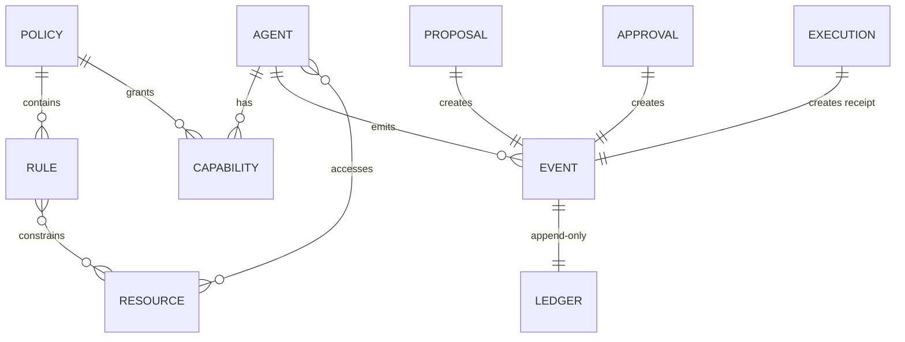
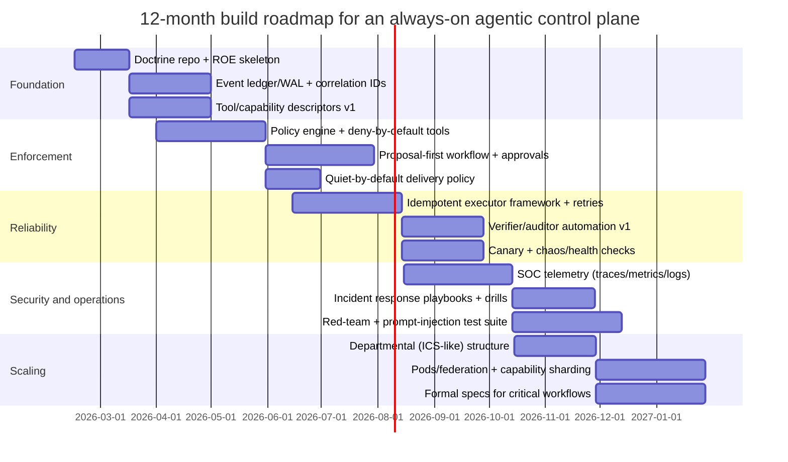

# Designing an Always-on Agentic AI Organisation for a Flawless Control Plane

## Executive summary

A “flawless” always-on agentic organisation is less about clever agent prompts and more about a **disciplined control plane**: least-privilege capabilities, separation-of-duties, hard enforcement points, durable audit trails, and cost/quietness controls that remain intact under adversarial inputs and routine failures. The most transferable architectural framing comes from **zero trust**: split the organisation into **policy decision** and **policy enforcement** components, with continuous logging and termination authority at the enforcement layer. citeturn9view0turn8view0

The decisive design pressure is that agentic systems ingest untrusted data (web, email, chats) while possessing real actuators (exec, file writes, financial actions). Modern guidance emphasises prompt injection and “excessive agency” as first-class risks, so safety must be engineered as **impact reduction** (compartmentalisation + approvals + deny-by-default tool exposure), not merely “model alignment”. citeturn0search1turn0search5turn2search1

From an organisational design perspective, the strongest baseline for your stated constraints (“least-privilege, compartmentalised, auditable, cost-controlled, quiet-by-default, resilient; agents can be added/removed later”) is typically a **hybrid**:

- **Triad separation-of-duties for high-impact actions** (Plan → Execute → Audit) grounded in explicit separation-of-duties and least-privilege controls. citeturn12view0turn12view1
- **ICS-style functional staff** (Ops, Planning, Logistics, Finance/Admin) for incident handling, scaling, and clarity of responsibilities under churn and outages. citeturn9view1turn8view1
- **Mission-command delegation for low-impact / reversible work** (commander’s intent + bounds; subordinates exercise disciplined initiative), but only when enforcement boundaries are strong and auditability is high. citeturn11view4turn11view3turn12view3

Technically, this maps to an event-sourced, proposal-first control plane: every action is a typed event; major actions are gated by policy (and sometimes human thresholds); execution is idempotent and retriable; and observability is treated as a product feature (not an afterthought). citeturn10view2turn4search4turn4search2

## What “flawless” means in practice

You defined “flawless” as: **least-privilege, compartmentalised, auditable, cost-controlled, quiet-by-default, resilient**, with the ability to add/remove agents later. This can be made concrete as a set of non-negotiable system invariants (what must always remain true) plus measurable service objectives.

### Control plane invariants

**Least privilege and separation of duties are enforced, not advisory.** NIST-style controls treat least privilege as allowing only the accesses necessary for assigned tasks, and separation of duties as reducing abuse of authorised privileges by splitting responsibilities and access authorisations. citeturn12view0turn12view1  
Practical implication: any “department” or agent is a capability boundary with its own credentials, tool allowlist, and write permissions, and cannot self-grant additional authority.

**Policy decision is separated from policy enforcement.** Zero Trust Architecture distinguishes components that decide policy (policy engine/administrator) from the component that enforces and terminates access (policy enforcement point), communicating via a control plane. citeturn9view0turn8view0  
Practical implication: the agent that “decides” cannot be the same thing that unilaterally executes high-impact actions without an enforcement layer that can deny/kill it.

**Auditability is a first-class output.** Audit review/reporting and logging of privileged functions are explicitly framed as governance-critical: privileged functions should be logged, and audit records should support analysis and reporting. citeturn12view1turn11view1  
Practical implication: every tool call and external side effect must be ledgered with correlation IDs; the ledger must survive restarts; and “why” (proposal/approval context) must be reconstructable.

**Quiet-by-default is policy, not preference.** Quietness is achieved by explicit default-deny delivery rules (for example, blocking certain session types like cron), and only allowing notifications through approved channels and conditions. citeturn8view4  
Practical implication: background automation does not chat unless it has a reason and a route.

**Resilience is measurable and managed.** Reliability disciplines such as SLOs and error budgets create explicit mechanisms for trading off change velocity vs stability; the point is to force stability work when reliability falls below target. citeturn3search2turn3search6  
Practical implication: you define SLOs for “control plane correctness” (no unauthorised actions; no lost ledger events; bounded cost) and freeze changes when budgets are exceeded.

### Assumptions to avoid inventing specifics

Because you have not fixed scale, budget, team size, or tech stack, this report assumes:

- **Operator model:** one owner/operator initially, with the system designed to later include additional human approvers/reviewers.
- **Workload:** mixed low-impact “research/triage/summarise” and high-impact “act” (writing files, executing commands, sending messages, spending money).
- **Deployment:** long-running always-on gateway/service with persistent storage (not purely stateless serverless).

Where design choices depend on scale or stack (e.g., queue technology), options are provided rather than a single prescription.

## Organisational model taxonomy with reference org charts

This section treats each “org model” as both a human organisational pattern **and** a control-plane pattern (who holds which decision rights; how approvals and auditing flow). Several models are complementary; the most reliable systems are usually hybrids.

A recurring anchor is the separation between **control-plane roles** (policy, approvals, audit) and **data-plane roles** (execution, integration, operations). citeturn9view0turn12view0

### Hub-and-spoke command centre

**Use when:** small system, one operator, fast iteration; you need tight central control, and throughput is modest.

```text
                ┌──────────────────────────┐
                │ Central Governor (Hub)   │
                │ - policy + triage        │
                │ - task routing           │
                │ - approval decisions     │
                └───────────┬──────────────┘
                            │
     ┌──────────────────────┼──────────────────────┐
     │                      │                      │
┌────▼─────┐          ┌─────▼─────┐          ┌─────▼─────┐
│ Research │          │ Executor  │          │ Auditor   │
│ Spoke    │          │ Spoke     │          │ Spoke     │
└──────────┘          └───────────┘          └───────────┘
```

**Key trade-off:** the hub becomes a bottleneck and a single point of failure; resilience requires either rapid failover or a second hub with strong split-brain prevention.

| Role/agent     | Responsibility                                  | Minimum permissions                                     | Primary data flows            |
| -------------- | ----------------------------------------------- | ------------------------------------------------------- | ----------------------------- |
| Governor (hub) | classify work; decide gates; dispatch to spokes | read global doctrine + queue; write proposals/decisions | ingest → proposals → dispatch |
| Research spoke | summarise, gather sources, draft options        | network read; no actuation                              | external sources → briefs     |
| Executor spoke | perform approved actions                        | scoped tool tokens; write limited artefacts             | approved plan → actions       |
| Auditor spoke  | verify outcomes + policy compliance             | read-only logs/ledger; no actuation                     | ledger → reports              |

### Triad separation-of-duties

**Use when:** high consequence actions (money, credentials, outbound comms), or when you want maximum auditability and blast-radius reduction.

This maps directly to separation-of-duties and least privilege expectations: different actors hold different access authorisations and responsibilities. citeturn12view0turn12view1

```text
┌───────────────┐   proposes   ┌───────────────┐   executes   ┌───────────────┐
│ Planner       ├─────────────►│ Approver/ROE   ├────────────►│ Executor      │
│ (Design)      │              │ (Policy)       │             │ (Actuation)   │
└──────┬────────┘              └──────┬─────────┘             └──────┬────────┘
       │                              │                               │
       │                              │ audits & alerts               │ emits
       ▼                              ▼                               ▼
┌────────────────────────────────────────────────────────────────────────────┐
│ Verifier/Auditor (independent): checks idempotency, receipts, policy logs   │
└────────────────────────────────────────────────────────────────────────────┘
```

| Role/agent       | Responsibility                                      | Minimum permissions                           | Primary data flows       |
| ---------------- | --------------------------------------------------- | --------------------------------------------- | ------------------------ |
| Planner          | plan + risk classify + generate prompts/workflows   | read-only sources; no credentials             | intake → plan/proposal   |
| Approver/ROE     | apply policy, thresholds, human-in-loop rules       | read-only plan; write approve/deny            | proposal → decision      |
| Executor         | perform actions exactly as approved                 | least-privilege credentials + tool allowlist  | decision → execution     |
| Verifier/Auditor | verify receipts, invariants, and ledger correctness | read ledger + external receipts; no actuation | execution → audit report |

### Functional departments inspired by ICS

**Use when:** you need predictable scaling, incident handling, and clean organisational expansion. The **Incident Command System** formalises an Incident Commander with four General Staff sections (Operations, Planning, Logistics, Finance/Admin), plus command staff functions, and highlights chain-of-command. citeturn9view1turn8view1

A direct agentic translation:

```text
                         Incident Commander (IC)
                                 │
        ┌───────────────┬────────┼─────────┬────────────────┐
        │               │        │         │                │
   Ops Section      Planning   Logistics  Finance/Admin   (Optional)
  (execution)       (plans)   (tools/IT)   (costs/audit)   Intel/Inv
```

| Department                            | Responsibility                             | Typical always-on agents         | Key permissions boundary                         |
| ------------------------------------- | ------------------------------------------ | -------------------------------- | ------------------------------------------------ |
| Operations                            | execute approved tasks; run playbooks      | “Ops Executor”, “Runbook Runner” | actuators are here; tightly scoped               |
| Planning                              | build plans; keep “intent” and objectives  | “Planner”, “Simulator”           | no real actuators                                |
| Logistics                             | maintain tools, sandboxes, integrations    | “Toolchain Maintainer”           | can change infra; gated                          |
| Finance/Admin                         | cost control, budgets, chargeback, ledgers | “Cost Sentinel”, “Ledger Keeper” | can freeze spend; cannot execute arbitrary tasks |
| Intelligence/Investigation (optional) | threat intel, anomaly triage               | “Security Analyst”               | read-only security telemetry; escalation rights  |

### Mission pods or cells

**Use when:** multiple parallel projects, each with end-to-end ownership, but you still want a shared safety control plane.

```text
                 Control Plane Council (Policy + Audit)
                               │
         ┌─────────────────────┼─────────────────────┐
         │                     │                     │
   Mission Pod A          Mission Pod B          Mission Pod C
 (Plan+Exec+Verify)     (Plan+Exec+Verify)     (Plan+Exec+Verify)
```

Key technique: pods are _cross-functional_, but high-impact actions still pass through shared policy/audit (a “council”) to avoid inconsistent security postures.

| Pod component | Responsibility                    | Minimum permissions              |
| ------------- | --------------------------------- | -------------------------------- |
| Pod planner   | plan within pod domain            | domain read                      |
| Pod executor  | execute within pod domain         | domain-scoped actuation          |
| Pod verifier  | verify within pod domain          | domain receipts + ledger         |
| Council       | global policy, shared ROE, audits | write deny/allow + freeze powers |

### Pipeline or stage-gated organisation

**Use when:** correctness and governance are more important than latency (e.g., outward-facing publications, financial actions, credentialed browsing).

```text
Intake → Triage → Plan → Risk Classify → Gate → Execute → Verify → Publish/Notify
```

This is the organisational mirror of workflow engines that support explicit retries/catches and controlled error handling. citeturn4search2turn4search0

| Stage         | Output artefact                 | Gate type                       |
| ------------- | ------------------------------- | ------------------------------- |
| Risk classify | risk score + required approvers | ROE rules                       |
| Execute       | receipts + event log            | idempotent executor             |
| Verify        | verification report             | automated verifier + thresholds |
| Publish       | outbound message                | quiet-by-default routing rules  |

### Federated micro-agents

**Use when:** maximum modularity and blast-radius control; you anticipate frequent addition/removal of agents.

This resembles microservices: very small, narrowly scoped agents connected via an event bus and governed by a policy engine. NIST ZTA’s model of separate policy components and enforcement points is a strong conceptual fit. citeturn9view0turn8view0

```text
           ┌─────────────────────────────┐
           │ Policy Engine + ROE (PDP)   │
           └───────────────┬─────────────┘
                           │ policy
                    ┌──────▼──────┐
                    │ Enforcement  │  (PEP: can deny/kill)
                    └──────┬──────┘
                           │ events
       ┌───────────────────┼───────────────────┐
       │                   │                   │
  Micro-agent:         Micro-agent:        Micro-agent:
  “Summarise”          “Classify risk”     “Send message”
```

| Property      | Strength                              | Weakness                        |
| ------------- | ------------------------------------- | ------------------------------- |
| Modularity    | adding/removing agents is easy        | integration complexity          |
| Blast radius  | excellent if credentials are isolated | coordination overhead           |
| Observability | strong if event-sourced               | requires discipline to maintain |

### Military variants: strict C2 and mission command

Military doctrine offers two complementary ideas: (a) strict command-and-control (C2) for clarity and assurance, and (b) mission command for adaptability.

**Strict top-down C2** is attractive because it enforces chain-of-command and minimises ambiguity. In an agentic system, this corresponds to “no subordinate acts without explicit orders” and is similar to the pipeline/stage-gated model. The failure mode is central bottleneck and fragility under partial outages.

**Mission command** is explicitly about commander’s intent, mission orders (what to achieve, not how), and disciplined initiative within bounds. citeturn11view4turn11view3turn12view3 In an AI organisation, you use mission command for low-impact work or for recovery when central coordination is impaired—_but only if the enforcement boundary prevents unauthorised privilege expansion_.

Military staff doctrine also stresses that floods of information can distract from relevant information; sending the right information to the right recipient and avoiding excessive volume is a known command-and-control issue—highly relevant to “quiet-by-default”. citeturn9view2turn9view3

## Governance and decision rights patterns for reliable control planes

A reliable agentic organisation is fundamentally a **governance system** with automation attached. The central question is: _who is allowed to do what, under which conditions, with what proof?_

### Doctrine-as-source-of-truth, but not doctrine-as-executable

Treat doctrine as a versioned artefact that shapes behaviour, but do not allow untrusted runs to self-modify doctrine. This is the “policy as code” instinct: policies are reviewed, tested, and audited like software. citeturn10view1turn12view0

A practical pattern is:

- **Doctrine repo:** objectives, ROE, allowed tools/capabilities, escalation paths.
- **Execution config:** generated from doctrine, deployed to enforcement points.
- **Runtime state:** event log + ledgers, append-only where possible. citeturn10view2turn4search0

### Proposal-first versus direct-action

Because prompt injection is a leading risk category for LLM applications, direct-action should be the exception, not the default. citeturn0search1turn0search5  
Define explicit classes of actions:

- **Class R (reversible):** read-only actions, drafts, local notes; can auto-run.
- **Class L (limited impact):** low-cost external calls with strict quotas; may auto-run with canaries.
- **Class H (high impact):** credentialed actions, money movement, outbound publishing, executing commands; must be proposal-first with approval gates. citeturn12view1turn2search2

This also addresses “Model Denial of Service” / cost blow-ups: require budgeting/quotas for any action that can cause expensive calls. citeturn0search1

### Rules of engagement and approval gates as first-class artefacts

Treat ROE as an executable decision function: inputs are the proposal, risk score, trust context, and current system posture (e.g., incident mode). Outputs are allow/deny/require-approver(s)/require-simulation.

Mermaid workflow for a proposal-first system:

```mermaid
flowchart TD
  A[Intake] --> B[Triage + classify]
  B --> C[Plan + risk score]
  C --> D{ROE gate}
  D -->|deny| E[Reject + log]
  D -->|approve| F[Execute idempotently]
  D -->|needs human| G[Queue for approval]
  G -->|approved| F
  F --> H[Verify receipts]
  H --> I{Pass?}
  I -->|no| J[Contain + incident workflow]
  I -->|yes| K[Publish/notify (quiet default)]
```

This structure is aligned with durable workflow error handling concepts (retry/catch) and the need for idempotent executors in at-least-once environments. citeturn4search2turn10view2turn4search4

### “Quiet-by-default” governance

Quiet-by-default is easiest when “delivery” is policy-gated. For example, you can deny deliveries for specific run types (like cron/background sessions) and only permit explicit announcements. citeturn8view4turn1search2  
Organisationally, make communications a **department** with explicit authority:

- Most agents cannot send externally.
- A comms agent can send only from structured, approved messages (templates + receipts).
- The system defaults to silent unless a threshold is crossed. citeturn8view4turn12view1

### Canarying, chaos/health checks, and self-repair

A “flawless” control plane assumes breakage will occur and rehearses it. Chaos Engineering defines controlled experimentation in production to build confidence that the system withstands turbulent conditions. citeturn10view3turn3search3  
Operationally:

- Canary new policies/agents with low-impact tasks.
- Run periodic health checks and dependency checks (credentials valid? quotas? queue depth?).
- Induce controlled failures (downstream API 500s, timeouts) to validate retry/containment behaviour. citeturn4search2turn4search4

## Agent design and runtime architecture patterns

The control plane becomes “flawless” when agents behave like reliable services: strict interfaces, durable state transitions, idempotent execution, and enforceable sandbox/tool boundaries.

### Contracts: interfaces and capability descriptors

Define each agent as:

- **Inputs:** typed events or tasks (schema, invariants).
- **Outputs:** typed events, proposals, receipts.
- **Capabilities:** the only allowed tools/credentials/resources.

This mirrors policy engines that decouple decisions from enforcement (policy decision vs enforcement) and allows your enforcement layer to reason about permissions. citeturn9view0turn10view1

### Messaging bus patterns: event sourcing, WAL, and replay

Event sourcing records a full series of events describing actions taken; and because event delivery is often _at least once_, consumers must be idempotent (they must not reapply updates if an event is handled more than once). citeturn10view2turn4search4  
Practical consequences:

- Use an append-only event log (WAL) as the source of truth.
- Derive read models (dashboards, current state) from the log.
- Support replay for recovery and debugging.

### Idempotency, retries, and bounded side effects

Retries are necessary in distributed systems, but they are only safe when operations are idempotent; otherwise, repeated execution can cause unintended side effects. citeturn4search4turn4search2  
Recommended discipline:

- Every external side effect has an **idempotency key**.
- Executors record “intent to act” before acting, and “receipt” after acting.
- Retries operate on recorded intent, not on regenerated free-form prompts. citeturn10view2turn4search0

### Durable workflows for always-on orchestration

Workflow engines (e.g., state machines with retries/catches) are an implementation of stage-gated organisation design: they encode timeouts, backoff, and escalation transitions into the control plane. AWS Step Functions explicitly supports retry and catch for workflow states and defaults to failing an execution without explicit error handling. citeturn4search2turn4search6  
The durable execution framing is that “crash-proof execution” should be a platform primitive rather than handwritten glue. citeturn4search5turn4search9

### Sandboxing, tool policy, and credential management

A high-safety agentic organisation needs an enforcement mechanism strong enough that “/exec” style prompt instructions cannot bypass it. A concrete example from an always-on agent platform is the rule that tool policy is a hard stop: deny wins; allowlists block everything else; and users cannot override denied tools from chat commands. citeturn2search1turn2search2  
This provides a practical blueprint:

- **Tool policy:** deny-by-default; grant only the tools required by role.
- **Sandboxing:** run non-trusted contexts in isolated environments.
- **Credential vaulting:** each agent has separate tokens; high-impact credentials are brokered (agent asks for an action; the broker performs it without revealing raw secrets in logs). citeturn12view0turn2search2turn0search1

### Quiet hours and rate limiting

“Quiet-by-default” is insufficient if an agent can still burn budget loudly. OWASP explicitly flags model denial-of-service / resource exhaustion as a risk category for LLM applications. citeturn0search1  
Control-plane patterns:

- Enforce per-agent and per-capability quotas (requests/day, tokens/day, spend/day).
- Force “quiet hours” by denying notification delivery and/or restricting expensive tools during those windows, with explicit break-glass overrides logged to the ledger. citeturn8view4turn12view1

Mermaid entity relationship diagram for an enforceable capability system:



This is the conceptual separation recommended by zero trust models: policy is evaluated separately, then enforced, with logging and termination authority at the enforcement point. citeturn9view0turn8view0turn10view1

## Verification, assurance, and SOC-like monitoring

Per your constraints, “verification” is not only tests—it is continuous assurance that the control plane is behaving within bounds, including detecting adversarial manipulation.

### Automated verifiers and human-in-the-loop thresholds

Use automated verifiers for:

- schema validation (proposal format, required fields)
- policy compliance checks (tool used was allowed; approvals present)
- receipt validation (external confirmations match intent)

Escalate to humans by threshold:

- high-impact class tasks (money, credentials, publishing)
- anomaly detection triggers (unusual spend, unusual tool)
- policy drift detection (new capabilities added outside release process)

This implements least privilege and separation-of-duties as instrumentation and workflow, not as documentation. citeturn12view0turn12view1

### Simulation, war-gaming, and rehearsal

Military doctrine stresses the value of war-gaming as part of analytic decision making when time allows, and mission command depends on shared understanding and intent. citeturn8view2turn11view4turn11view3  
Translate this to an agentic setting:

- Simulate workflows using recorded event logs (replay).
- Run “red team” tasks: inject hostile instructions into web/email inputs and ensure the system routes them to proposal-only paths. citeturn0search5turn0search1
- Rehearse incident mode transitions (freeze spend; disable outbound comms; rotate credentials).

### Formal methods where applicable

Formal specification can be valuable for the _control plane_ (state machines, invariants) because those are discrete and safety-critical. TLA+ exists specifically to describe and reason about concurrent/distributed systems and is used to eliminate design errors before implementation. citeturn4search3turn4search18  
High leverage targets for formalisation:

- approval state machine correctness (no execution without approval)
- idempotency guarantees (no duplicate irreversible actions)
- ledger append-only invariants

### SOC-like monitoring and incident response discipline

SOC-like monitoring depends on (a) structured telemetry, and (b) incident response playbooks. The OpenTelemetry ecosystem describes a framework/specification for traces/metrics/logs and an OTLP protocol for telemetry transport—useful for standardising observability across many agents. citeturn5search6turn6search14turn6search6  
For incident response, NIST’s incident response guidance (Rev. 3) is explicitly about incorporating incident response recommendations throughout risk management and improving detection/response/recovery efficiency. citeturn6search0turn6search8

Threat modelling can be mapped to a common vocabulary using the ATT&CK knowledge base of adversary tactics and techniques (useful for thinking about persistence, credential access, and defence coverage). citeturn5search5turn5search22

## Recommended hybrids, scaling strategies, and a 12-month build roadmap

### Trade-offs matrix across organisational models

The table uses qualitative scores (1=low, 5=high). “Speed/latency” is time-to-action; “safety/separation” is blast-radius reduction; “observability” is ease of auditing.

| Model                  | Speed | Safety | Throughput | Complexity | Observability | Resilience | Cost |
| ---------------------- | ----: | -----: | ---------: | ---------: | ------------: | ---------: | ---: |
| Hub-and-spoke          |     4 |      2 |          2 |          2 |             3 |          2 |    2 |
| Triad SoD              |     2 |      5 |          3 |          4 |             5 |          4 |    3 |
| Functional (ICS-like)  |     3 |      4 |          4 |          4 |             4 |          4 |    4 |
| Mission pods           |     4 |      3 |          5 |          4 |             3 |          4 |    4 |
| Stage-gated pipeline   |     2 |      5 |          3 |          4 |             5 |          4 |    3 |
| Federated micro-agents |     3 |      5 |          5 |          5 |             4 |          5 |    4 |
| Strict C2              |     2 |      4 |          2 |          3 |             4 |          3 |    3 |
| Mission command        |     5 |  2–4\* |          4 |          4 |             3 |          5 |    3 |

\*Mission command can be safe when **enforcement boundaries** are strong; the doctrine itself assumes disciplined initiative within commander’s intent, not unconstrained autonomy. citeturn11view3turn11view4turn12view0

Mermaid bar chart (illustrative scores for three common optimisation objectives):

```mermaid
xychart-beta
  title "Model fit by optimisation objective (illustrative)"
  x-axis ["Speed","Safety/Audit","Multi-project scale"]
  y-axis "Score (0-5)" 0 --> 5
  bar "Hub-and-spoke" [4,2,2]
  bar "Triad SoD" [2,5,3]
  bar "ICS-like functional" [3,4,4]
  bar "Federated micro-agents" [3,5,5]
```



### Recommended hybrid architectures

**A: Speed-optimised (while still safe enough)**  
Use a hub-and-spoke core for fast routing, but enforce _hard_ tool policy boundaries so the hub cannot accidentally escalate into full execution authority. citeturn2search1turn12view1  
Structure:

- Hub: Intake + triage + routing + light planning.
- Spokes: self-contained executors with strict capability descriptors.
- Safety valve: triad for high-impact actions only (planner/approver/executor split). citeturn12view0turn12view1

**B: Safety/auditability-optimised (“flawless” emphasis)**  
Use stage-gated + triad as the default. Add an ICS-like staff structure to scale and to handle incident mode transitions cleanly. citeturn9view1turn8view1turn6search0  
Structure:

- Pipeline: Intake → Plan → Risk → Gate → Execute → Verify → Publish.
- Roles: Planner, ROE/Approver, Executor, Auditor.
- Departments: Ops, Planning, Logistics, Finance/Admin, Security/Intel. citeturn9view1turn12view0

**C: Multi-project scaling (modular growth)**  
Use federated micro-agents + mission pods, governed by a shared policy engine and an append-only ledger. This maximises add/remove agent flexibility and blast-radius control. citeturn9view0turn10view2turn4search8  
Structure:

- Pods own product/project domains.
- Shared services: Policy (OPA-like), Ledger/Event log, Observability, Cost Sentinel.
- Enforcement: strict capability gating and isolated credentials per pod/agent. citeturn10view1turn12view1

### Scaling and migration strategies

A pragmatic migration path that preserves reliability:

- **Start (0–3 months):** hub-and-spoke + strong enforcement around high-risk tools. (Goal: prove the ledger, approvals, and delivery quietness.) citeturn8view4turn2search1
- **Evolve (3–6 months):** introduce triad gates for any irreversible actuators; formalise ROE rules; add verifier/auditor automation. citeturn12view0turn4search4
- **Scale (6–12 months):** split into pods or micro-agents; introduce ICS-like functional departments for operations/finance/logistics/security. citeturn9view1turn8view1turn6search0

Cost-control tactics are not optional because LLM systems are susceptible to cost blowouts (resource exhaustion / model DoS). citeturn0search1  
Standard controls include quotas, budget-based freezes (Finance/Admin authority), and “error budget” style freeze policies when reliability or spend exceeds thresholds. citeturn3search2turn3search6

### Implementation roadmap and timeline

Key deliverables are structured so that safety primitives come _before_ autonomy.

Mermaid Gantt (12 months):



**Suggested KPIs (adapt to your stack):**

- % of Class H actions executed only via proposals + approvals (target: ~100%). citeturn12view1turn2search2
- Mean time to detect policy violations (target: minutes, not hours), supported by structured telemetry. citeturn6search14turn5search6
- Duplicate side-effect rate (should approach zero with idempotency keys + receipts). citeturn10view2turn4search4
- Spend variance vs budget (hard budget caps; automatic freeze triggers). citeturn0search1

### Sample doctrine and policy templates

These are intentionally minimal and designed to be extended. They are written as _doctrine-as-code_ artefacts suitable for review.

#### Intake policy template

```markdown
# Intake Policy

## Purpose

Define what work the organisation accepts, how it is classified, and what must be proposal-first.

## Request schema

- Title:
- Context:
- Desired outcome:
- Constraints (time/cost/privacy):
- Proposed deadlines:
- Risk hints (credentials? money? publishing? exec?):

## Classification

- Class R (read-only / reversible)
- Class L (limited impact; quota-bound)
- Class H (high impact; proposal-first + approvals)

## Default behaviour

- Quiet-by-default: no notifications unless threshold met.
- Log every intake event with correlation_id.
```

#### Proposal template

```markdown
# Proposal

## Summary

What will be done, and why.

## Commander’s intent (one paragraph)

Purpose + desired end-state + constraints.

## Actions (ordered, idempotent where possible)

1. ...
2. ...

## Required capabilities

- Tools:
- Credentials:
- Write paths:
- External services:

## Risk assessment

- Impact level: R / L / H
- Worst-case failure mode:
- Mitigations:
- Required approvers:

## Verification plan

Proof/receipts expected, and how they will be checked.
```

This mirrors mission command’s emphasis on intent and boundaries, while still requiring explicit constraints and verification. citeturn11view4turn12view3

#### Approval and ROE template

```markdown
# Rules of Engagement (ROE)

## Decision function (high level)

Inputs: proposal, risk score, current posture (normal/incident), budgets, trust context
Outputs: allow | deny | require_human | require_simulation | require_canary

## Hard denies (non-negotiable)

- Any action outside declared capabilities.
- Any Class H action without required approvals.
- Any attempt to modify doctrine from untrusted context.

## Thresholds

- Spend/day cap:
- Tokens/day cap:
- Max outbound messages/day:
- Quiet hours:

## Break-glass

- Who can enable:
- What is enabled:
- Auto-expiry:
- Required post-incident review:
```

#### Incident response template

```markdown
# Incident Response Playbook

## Triggers

- Unauthorised tool invocation attempt
- Budget spike or model DoS pattern
- Receipt mismatch (action executed != proposal)
- Suspicious external input / prompt injection indicator

## Containment

- Freeze Class H executors
- Disable outbound comms
- Revoke/rotate credentials
- Preserve ledger snapshots

## Eradication and recovery

- Patch policy or enforcement gap
- Replay ledger to confirm no hidden actions
- Re-enable services gradually (canary)

## Post-incident activity

- Root cause analysis (control plane vs model vs integration)
- New ROE rules or tests
- Update training/simulation suite
```

This aligns with standard incident response guidance emphasising preparedness and improving detection/response/recovery effectiveness as part of risk management. citeturn6search0turn6search8

### Examples and case studies to ground the design

- Multi-agent coordination as a development paradigm is explicitly supported by research frameworks such as AutoGen, which describes building LLM applications by composing multiple agents that converse and use tools/human inputs. citeturn0search0turn0search8
- A production-scale always-on agent platform provides concrete enforcement primitives: deny-wins tool policy and allowlists that block everything else; chat commands cannot override denied tools; and “exec approvals” can be skipped only in explicit elevated modes—illustrating how enforcement must be independent of conversational text. citeturn2search1turn2search2turn2search9
- ICS provides a proven functional decomposition for expanding incidents (Ops/Planning/Logistics/Finance), which maps directly onto agentic departments and is explicitly represented as an organisational structure with clear accountability lines. citeturn9view1turn8view1
- Mission command doctrine defines commander’s intent, disciplined initiative, and mission orders, offering a structured way to enable decentralised execution without losing unity of effort—useful when you want agents to adapt under uncertainty while staying within bounds. citeturn11view4turn11view3turn12view3
- Reliability disciplines such as error budgets formalise when to halt changes and refocus on stability, which is essential for an always-on control plane that must not degrade quietly over time. citeturn3search2turn3search6
- Chaos Engineering principles formalise controlled experiments to build confidence in resilience, which is directly applicable to verifying retry/containment behaviour in agentic workflows. citeturn10view3turn3search3
- Policy-as-code engines explicitly separate policy decision-making from enforcement integration points, aligning with the goal of mechanically enforceable governance. citeturn10view1turn9view0
