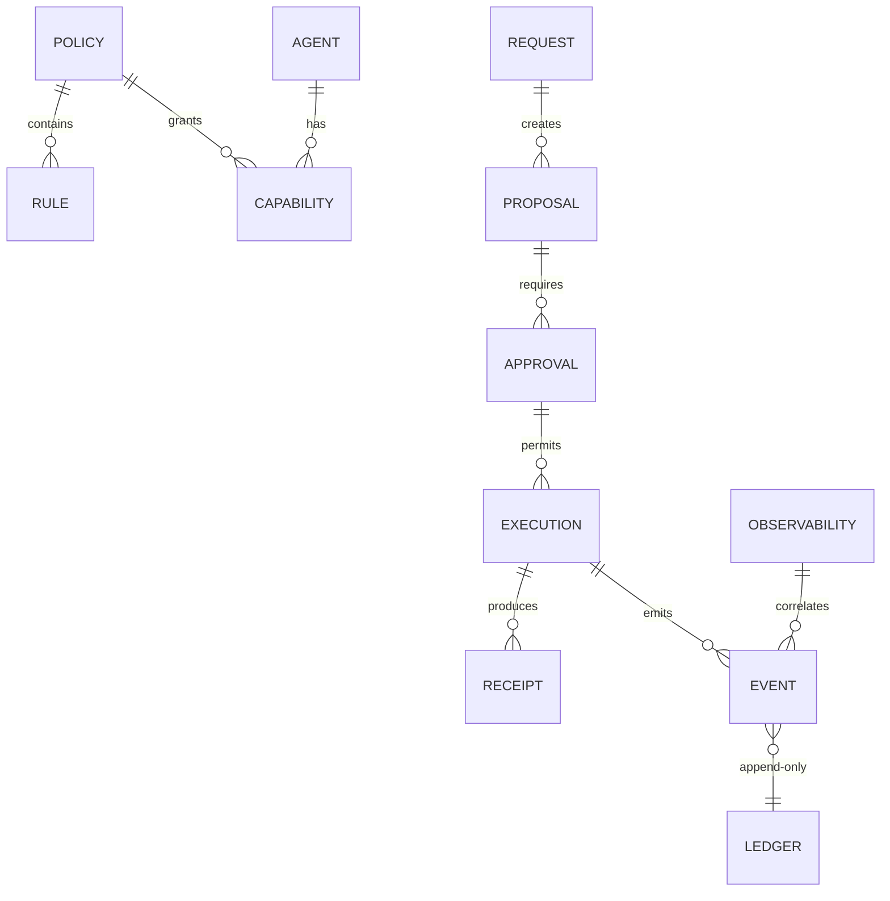
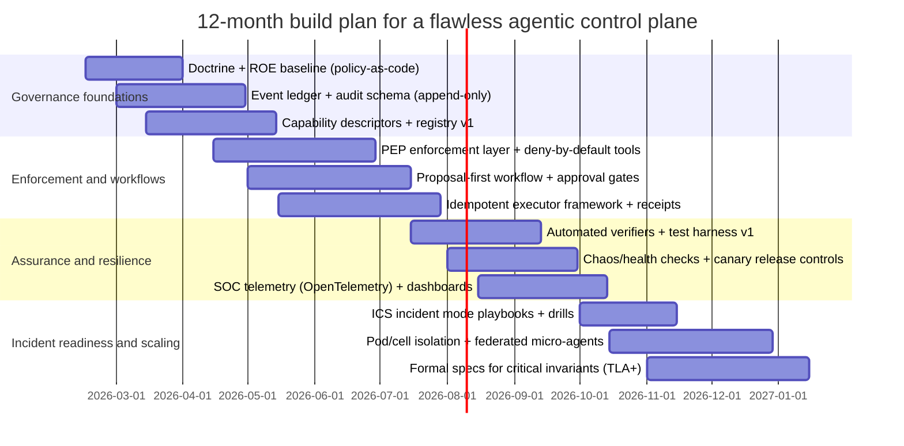

# Designing an Always-on Agentic AI Organisation for a Flawless Control Plane

## Executive summary

A “flawless” always-on agentic AI organisation is best modelled as a **high-assurance control plane** for distributed systems: it continuously arbitrates who/what may act, under which constraints, with durable auditability and bounded cost. This is closer to **Zero Trust Architecture**—separating _policy decision_ from _policy enforcement_—than to a single “smart assistant”. citeturn0search0turn0search4

The strongest research-backed theme across security controls, incident management doctrine, and multi-agent systems is that reliability emerges from **hard boundaries and verifiable state transitions**, not from “better prompts”. Least privilege and separation of duties reduce single-actor abuse and mistakes; audit logging enables after-the-fact investigation; and formal workflow/state-machine patterns reduce inadvertent action drift. citeturn0search1turn0search17turn0search5turn8search35turn8search6turn5search11

Because agentic systems ingest untrusted inputs (web, email, documents) while possessing actuators (execution, outbound comms, purchases), modern threat guidance treats **prompt injection** and **excessive/unbounded agency and consumption** as primary risks. Your “proposal-first” instinct directly aligns with OWASP’s LLM guidance around prompt injection and unbounded consumption as major risks and cost drivers. citeturn6search0turn6search4turn6search28turn6search8

A practical “flawless control plane” architecture that supports later addition/removal of agents tends to converge on a hybrid:

- **Separation-of-duties triad** for high-impact actions (Plan → Approve/ROE → Execute), anchored in least privilege and segregation of duties principles. citeturn0search17turn0search5turn0search1
- **Event-sourced ledger + durable workflows** (append-only events, idempotent executors, explicit retries/catches) so actions are replayable, auditable, and crash-resumable. citeturn5search0turn5search11turn5search2
- **ICS-style functional command** for incident handling and operational scaling (Operations / Planning / Logistics / Finance/Admin), which maps cleanly onto agent “departments”. citeturn0search3turn9search3
- **Policy-as-code** (e.g., OPA-like pattern) to keep governance reviewable, testable, and portable across agents that you add/remove later. citeturn6search6turn6search2
- **SOC-like monitoring** (trace/metric/log correlation, threat-model mapping) to detect drift or compromise quickly. citeturn6search1turn6search5turn8search0

Evidence base for assurance: formal methods are repeatedly validated as high-ROI for correctness of distributed control logic (particularly state transitions and invariants); AWS’s experience with TLA+ is the most cited industry report of this kind. citeturn11search0turn11search15turn11search2

## Definitions, assumptions, and design invariants

### Definitions used in this report

**Control plane (for an AI organisation):** components that decide _whether_ and _how_ actions happen—policy evaluation, approvals, budgets/quotas, routing, audit logging, and incident mode controls. This corresponds to the “policy decision” and “policy enforcement” separation described in entity["organization","National Institute of Standards and Technology","us standards body"] guidance for Zero Trust architectures. citeturn0search0turn0search4

**Data plane:** components that perform side effects—tool calls, network calls, file writes, outbound messages, purchases, system execution.

**Flawless (your constraint):** least-privilege, compartmentalised, auditable, cost-controlled, quiet-by-default, resilient. In this report these are treated as **hard invariants** (must always be true), not “best-effort” guidelines. Principles for least privilege and separation of duties are explicitly codified in NIST control guidance (AC-6, AC-5) and audit logging in AU controls. citeturn0search5turn0search17turn8search35turn8search6

### Explicit assumptions (because scale/stack/budget are unspecified)

- **Initial operator model:** one primary owner/operator with the ability to add additional human approvers later (multi-approver gates).
- **Workload:** mixed low-impact (read-only research, drafts) and high-impact (credentialed actions, outbound comms, execution).
- **Deployment:** always-on service with persistent storage for event logs and audit records (not purely ephemeral). Event sourcing guidance assumes append-only storage and downstream materialised views. citeturn5search0
- **Threat model:** untrusted inputs are expected (prompt injection, malicious documents/links), consistent with OWASP LLM Top 10’s emphasis on prompt injection and unbounded consumption/excessive agency. citeturn6search0turn6search4turn6search28

### Non-negotiable invariants (recommended)

1. **Deny-by-default capabilities:** every agent starts with no actuators; privileges are granted explicitly (least privilege). citeturn0search5turn0search1
2. **Separation-of-duties on high-impact actions:** at minimum, the role that approves execution is not the same as the role that executes, reducing abuse without collusion. citeturn0search17turn0search1
3. **Append-only audit trail:** every proposal, approval/denial, tool invocation, and external receipt is logged as an auditable event. AU controls emphasise defining auditable events and generating audit records for them. citeturn8search35turn8search6
4. **Idempotent execution + receipts:** executors must be safe under at-least-once delivery (duplicate messages) and must produce verifiable receipts. Event sourcing and competing-consumers patterns explicitly call out append-only event stores and idempotent message handling. citeturn5search0turn5search3
5. **Budget enforcement as safety:** cost controls are mandatory (token spend, tool quotas, notification quotas), since OWASP explicitly identifies model denial-of-service / unbounded consumption patterns that drive instability and cost. citeturn6search0turn6search28
6. **Incident mode “freeze” authority:** the system must be able to quickly disable classes of action (outbound comms, exec, spend) and preserve evidence; this aligns with incident response planning recommendations (detect/respond/recover alignment) in NIST’s incident response guidance. citeturn0search6

## Organisational model taxonomy and reference org charts

This taxonomy intentionally spans (a) human organisational forms, (b) classic multi-agent coordination architectures, and (c) military/incident doctrine. The goal is not to “copy” a human org chart, but to use each model as a **control-plane pattern**: how decision rights, permissions, information flow, and accountability are arranged. citeturn1search17turn0search0

The reference charts below use consistent role labels:

- **PDP/ROE** = policy decision point / rules of engagement gate (decides).
- **PEP/Enforcer** = policy enforcement point (enforces and can deny/terminate).
- **Ledger/Audit** = append-only record + verification.  
  This mapping follows Zero Trust’s separation of policy decision and enforcement components. citeturn0search0turn0search4

### Bureaucratic organisation

Rationale: Bureaucracy emphasises formal rules, hierarchy, and written records—useful for auditability and predictable behaviour. Classic bureaucracy characteristics are described in Weberian bureaucracy excerpts; Mintzberg’s “machine bureaucracy” configuration provides an organisational-structure typology relevant to formalised, procedure-driven operations. citeturn4search11turn1search17

**ASCII org chart**

```text
Policy Office (PDP/ROE)
   |
Process Office (SOP owners) -----> Audit/Inspection Office
   |
Case Workers (Task Clerks) ---> Executor Service (PEP-guarded)
```

**Roles, permissions, and data flows**

| Role/agent              | Typical subagents        | Responsibilities                           | Minimum permissions          | Data flows                     |
| ----------------------- | ------------------------ | ------------------------------------------ | ---------------------------- | ------------------------------ |
| Policy Office (PDP/ROE) | policy reviewers         | define ROE, approve Class-H actions        | write policy; no execution   | proposals → decisions          |
| Process Office          | SOP writers              | standardise workflows; maintain checklists | write SOP docs; no execution | incidents → SOP updates        |
| Case Workers            | intake clerks            | triage requests; produce structured cases  | read inputs; write proposals | intake → proposal              |
| Audit/Inspection        | verifiers                | log review; after-action reports           | read ledger/logs only        | ledger → findings              |
| Executor (PEP-guarded)  | per-capability executors | perform approved actions                   | scoped credentials only      | approvals → actions → receipts |

### Matrix organisation

Rationale: Matrix structures introduce **dual authority** (e.g., functional manager + project manager). A classic matrix definition emphasises dual or multiple managerial accountability, which maps well onto separation between “capability owners” and “mission owners” in an AI organisation. citeturn1search6turn1search14

**ASCII org chart**

```text
             Mission Lead (per project)
                 |
Functional Leads (Security / Ops / Finance / Comms)
                 |
         Shared Executors & Specialists
```

**Roles, permissions, and data flows**

| Role/agent      | Subagents           | Responsibilities                               | Minimum permissions             | Data flows          |
| --------------- | ------------------- | ---------------------------------------------- | ------------------------------- | ------------------- |
| Mission Lead    | pod coordinators    | prioritise mission outcomes; accept/close work | read doctrine; write priorities | backlog → tasks     |
| Functional Lead | e.g., Security Lead | owns capability rules, standards, tooling      | can change rules; gated         | standards → policy  |
| Executor Pool   | task runners        | executes within capability constraints         | scoped tokens                   | tasks → receipts    |
| Auditor         | compliance reviewer | checks cross-functional compliance             | read-only telemetry             | receipts → audit    |
| Enforcer/PEP    | runtime guard       | blocks disallowed actions                      | deny/allow enforcement          | policy → allow/deny |

### Holacracy-style self-management

Rationale: Holacracy formalises governance via roles and “circles”, using explicit rules (a “constitution”) to encode authority and decision processes. This is directly compatible with “doctrine-as-source-of-truth” and modular agent addition/removal: roles can be created/retired without rewriting the whole org. citeturn1search0turn1search8

**ASCII org chart**

```text
General Circle (Meta-Governance)
   |
[Circle A] [Circle B] [Circle C]  (domain circles)
   |
Role Holders (agents) with explicit accountabilities
```

**Roles, permissions, and data flows**

| Role/agent             | Subagents        | Responsibilities                        | Minimum permissions     | Data flows                |
| ---------------------- | ---------------- | --------------------------------------- | ----------------------- | ------------------------- |
| General Circle         | governance roles | define role catalogue; resolve tensions | write doctrine; no exec | governance → roles        |
| Domain Circle Lead     | per-domain leads | prioritisation & scope boundaries       | write domain policy     | domain intents → tasks    |
| Role Holder (Planner)  | —                | drafts proposals & plans                | read sources; no exec   | intake → proposal         |
| Role Holder (Executor) | —                | execute within role’s scope             | scoped tools only       | approvals → actions       |
| Circle Auditor         | —                | periodic compliance checks              | read logs only          | logs → governance updates |

### Adhocracy (innovation network)

Rationale: Adhocracy is designed for complex, dynamic environments; Mintzberg’s typology highlights adhocracy as a configuration emphasising mutual adjustment and flexible teams. In agentic systems, adhocracy maps to rapidly assembled “task forces” and is valuable for research and exploration, but it must be bounded by hard enforcement to remain “flawless”. citeturn1search17

**ASCII org chart**

```text
Intent Owner
   |
Ad-hoc Task Force (Planner + Specialist + Verifier)
   |
Executor (PEP-guarded)  +  Ledger/Audit
```

**Roles, permissions, and data flows**

| Role/agent   | Subagents   | Responsibilities                      | Minimum permissions   | Data flows                |
| ------------ | ----------- | ------------------------------------- | --------------------- | ------------------------- |
| Intent Owner | —           | defines desired outcome & constraints | write intent; no exec | intent → task force       |
| Task Force   | specialists | explore options; prototype safely     | read-only tools       | sources → candidate plans |
| Verifier     | —           | tests/simulates before action         | test harness only     | plan → pass/fail          |
| Executor     | —           | executes approved plan                | scoped credentials    | approval → action         |
| Ledger/Audit | —           | immutable record                      | append-only           | events → audit            |

### Guilds and communities of practice

Rationale: Guilds (cross-cutting communities) are used in practice to share standards while allowing autonomous squads. Spotify’s “Squads/Tribes/Chapters/Guilds” model is a widely cited industry description of this structure. citeturn1search11

**ASCII org chart**

```text
Autonomous Pods (Squads) ---> Shared Standards (Chapters)
           \----------------> Voluntary Guilds (CoP)
```

**Roles, permissions, and data flows**

| Role/agent        | Subagents            | Responsibilities                      | Minimum permissions            | Data flows             |
| ----------------- | -------------------- | ------------------------------------- | ------------------------------ | ---------------------- |
| Pod Owner         | pod agents           | deliver domain outcomes end-to-end    | pod-scoped tools               | pod backlog → delivery |
| Chapter/Standards | lint/verifier agents | maintain shared engineering standards | can update templates; gated    | standards → pods       |
| Guild (CoP)       | knowledge curators   | share patterns, postmortems           | read-only + publish internally | lessons → patterns     |
| Central Policy    | ROE gate             | global safety/cost controls           | write policy; deny             | proposals → decisions  |
| Auditor           | —                    | cross-pod audits                      | read-only logs                 | logs → findings        |

### Platform ecosystem organisation

Rationale: Platforms are often described as “meta-organisations” coordinating autonomous complementors. Platform organisation research frames platforms as organisational forms with governance + technological architecture, and distinguishes internal vs external platforms. This is relevant because a modular “agent ecosystem” behaves like a platform: your control plane is the platform core; agents are complementors with governed interfaces and boundary resources (APIs, schemas). citeturn4search20turn4search28turn4search13

**ASCII org chart**

```text
Platform Core (Policy + Ledger + Boundary APIs)
   |
Certified Agents (ecosystem members) <-> Capability Marketplace/Registry
   |
External Integrations (tools, data sources) via gateways
```

**Roles, permissions, and data flows**

| Role/agent           | Subagents            | Responsibilities                | Minimum permissions     | Data flows                |
| -------------------- | -------------------- | ------------------------------- | ----------------------- | ------------------------- |
| Platform Core        | policy/ledger        | define contracts; enforce rules | deny/allow + logging    | requests → routed events  |
| Registry/Marketplace | capability directory | agent discovery/versioning      | write registry; no exec | agents ↔ registry         |
| Certified Agent      | per role             | task execution within contract  | scoped tokens           | events → actions/receipts |
| Boundary Resources   | schemas & SDKs       | stable interfaces               | versioned artefacts     | schemas → agents          |
| Auditor              | —                    | compliance reporting            | read telemetry          | telemetry → reports       |

### Hub-and-spoke (central governor + specialists)

Rationale: common early-stage pattern: central “governor” routes tasks to specialist agents. It is fast to bootstrap, but can become a bottleneck and a single point of drift if governance is not externalised into policy and logs (a Zero Trust concern). citeturn0search0

**ASCII org chart**

```text
Governor (Router)
   |----> Research Spoke (read-only)
   |----> Planning Spoke (proposal writer)
   |----> Execution Spoke (PEP-guarded)
   \----> Audit Spoke (read-only)
```

**Roles, permissions, and data flows**

| Role/agent      | Subagents  | Responsibilities           | Minimum permissions      | Data flows              |
| --------------- | ---------- | -------------------------- | ------------------------ | ----------------------- |
| Governor        | routers    | decides who handles what   | read policy; cannot exec | intake → dispatch       |
| Research Spoke  | retrievers | gather evidence            | network read only        | sources → brief         |
| Planning Spoke  | planners   | draft structured proposals | write proposals          | brief → proposal        |
| Execution Spoke | executors  | execute approved actions   | scoped credentials       | approval → action       |
| Audit Spoke     | verifiers  | independently verify       | read ledger only         | receipts → verification |

### Triad separation-of-duties (SoD)

Rationale: explicit segregation of planning, approval, and execution reduces risk “without collusion”. NIST’s separation-of-duties control statement describes dividing functions among roles and warns against combining access control administration with audit administration; least privilege further restricts what each role can do. citeturn0search17turn0search5

**ASCII org chart**

```text
Planner  --->  Approver/ROE (PDP)  --->  Executor (PEP-guarded)
                     |
                 Auditor/Verifier (independent)
```

**Roles, permissions, and data flows**

| Role/agent       | Subagents     | Responsibilities                 | Minimum permissions   | Data flows          |
| ---------------- | ------------- | -------------------------------- | --------------------- | ------------------- |
| Planner          | analysts      | plan, risk-tag, propose          | read inputs only      | intake → proposal   |
| Approver/ROE     | gatekeepers   | approve/deny, attach constraints | policy write; no exec | proposal → decision |
| Executor         | per-tool      | carry out approved steps         | scoped creds only     | decision → action   |
| Auditor/Verifier | test agents   | confirm receipts vs intent       | read logs only        | receipts → verdict  |
| Enforcer/PEP     | runtime guard | deny or terminate                | enforcement authority | policy → allow/deny |

### Functional departments (classic) and HQ staff

Rationale: functional departmentalisation is intuitive and scales by specialism. Military staff and doctrine reinforce that information management must avoid drowning subordinates; commanders should avoid demanding excessive information. This maps directly to “quiet-by-default” and “decision-relevant telemetry” design. citeturn9search0turn9search6

**ASCII org chart**

```text
Chief of Staff / Orchestrator
   |--> Ops (execution)
   |--> Planning (plans/sim)
   |--> Logistics (tooling/infra)
   |--> Finance (budgets)
   \--> Security/Intel (monitoring)
```

**Roles, permissions, and data flows**

| Department/agent | Subagents        | Responsibilities             | Minimum permissions     | Data flows           |
| ---------------- | ---------------- | ---------------------------- | ----------------------- | -------------------- |
| Ops              | runbook runners  | executes approved tasks      | scoped actuators        | approvals → actions  |
| Planning         | simulators       | plans & options              | read-only               | evidence → proposals |
| Logistics        | tool maintainers | manage toolchain/sandboxes   | infra rights; gated     | tooling → ops        |
| Finance          | budget sentinels | budgets/quotas, cost freezes | can freeze; no exec     | spend → controls     |
| Security/Intel   | detectors        | anomaly detection & triage   | read telemetry; contain | alerts → incidents   |

### Mission pods / compartmented cells

Rationale: cells optimise blast-radius containment and parallelism: each pod owns an end-to-end domain with its own scoped credentials. This is compatible with Zero Trust assumptions of explicit trust boundaries. citeturn0search0

**ASCII org chart**

```text
Council (Policy + Audit)
   |
[Pod A] [Pod B] [Pod C]  (each: plan+execute+verify)
```

**Roles, permissions, and data flows**

| Role/agent   | Subagents      | Responsibilities                    | Minimum permissions | Data flows            |
| ------------ | -------------- | ----------------------------------- | ------------------- | --------------------- |
| Council      | ROE + auditors | shared rules; cross-pod containment | deny + freeze       | proposals → decisions |
| Pod Planner  | per pod        | plan within pod scope               | read-only           | intake → proposal     |
| Pod Executor | per pod        | execute within pod scope            | pod-scoped creds    | approval → action     |
| Pod Verifier | per pod        | verify & reconcile receipts         | read-only           | receipts → verdict    |
| Pod Registry | per pod        | manage pod agent lifecycle          | write registry      | agents ↔ registry     |

### Pipeline / stage-gated workflow organisation

Rationale: stage gating makes control-flow explicit and testable, matching workflow-engine patterns for retries/catches and robust buffering of long-running tasks. AWS Step Functions documentation emphasises explicit retry/catch for state-machine steps. citeturn5search11turn5search13

**ASCII org chart**

```text
Intake -> Triage -> Plan -> Risk -> Gate -> Execute -> Verify -> Publish/Notify
```

**Roles, permissions, and data flows**

| Stage owner | Subagents            | Responsibilities                 | Minimum permissions  | Data flows           |
| ----------- | -------------------- | -------------------------------- | -------------------- | -------------------- |
| Risk/Gate   | policy engine        | apply ROE thresholds             | allow/deny only      | proposal → decision  |
| Execute     | idempotent executors | perform steps + receipts         | scoped credentials   | decision → receipts  |
| Verify      | verifiers            | compare receipts to plan         | read-only            | receipts → pass/fail |
| Publish     | comms agent          | send notifications conditionally | send-only; templated | verified → notify    |
| Ledger      | event store          | durable record                   | append-only          | events → audit       |

### Federated micro-agents (platform/microservices style)

Rationale: micro-agents connect through an event bus, and the control plane is a policy engine plus a ledger. This best supports adding/removing agents later: you can plug new agents into the bus, register capabilities, and apply policy centrally. Event sourcing explicitly recommends append-only event stores with handlers consuming events from queues. citeturn5search0turn5search6turn0search0

**ASCII org chart**

```text
Policy Engine (PDP) -> Enforcement (PEP)
            |
        Event Bus
  |---- Agent A ----|
  |---- Agent B ----|
  |---- Agent C ----|
            |
         Ledger/Audit
```

**Roles, permissions, and data flows**

| Role/agent          | Subagents       | Responsibilities              | Minimum permissions   | Data flows           |
| ------------------- | --------------- | ----------------------------- | --------------------- | -------------------- |
| Policy Engine (PDP) | rule evaluators | evaluate policy decisions     | write policy; no exec | request → allow/deny |
| Enforcement (PEP)   | runtime guards  | enforce deny/allow; terminate | enforcement authority | policy → enforcement |
| Event Bus           | partitions      | deliver events                | broker only           | agents ↔ bus         |
| Micro-agent         | per function    | small scoped behaviours       | minimal tools         | events → outputs     |
| Ledger/Audit        | verifiers       | append-only truth             | append-only           | events → audit       |

### Hierarchical agents (tree of delegation)

Rationale: hierarchical decomposition is natural for planning (parent decomposes goals into subgoals). In LLM-agent literature, multi-agent frameworks support agents that converse, and patterns like “reason then act” motivate explicit planning loops. citeturn10search0turn10search1

**ASCII org chart**

```text
Commander Agent
   |--> Sub-commander (domain)
           |--> Worker agents
           |--> Verifier agents
```

**Roles, permissions, and data flows**

| Role/agent    | Subagents      | Responsibilities         | Minimum permissions | Data flows         |
| ------------- | -------------- | ------------------------ | ------------------- | ------------------ |
| Commander     | sub-commanders | allocate subgoals        | dispatch only       | intent → tasks     |
| Sub-commander | workers        | local planning           | read-only           | tasks → proposals  |
| Worker        | tool users     | execute in bounded scope | scoped tools        | approval → action  |
| Verifier      | testers        | validate outcomes        | read-only           | receipts → verdict |
| Enforcer/PEP  | —              | prevent escalation       | terminate/deny      | policy → guard     |

### Market-based agents (auctions, contract nets, market-oriented programming)

Rationale: market mechanisms coordinate distributed agents via bids/prices. The Contract Net Protocol is a classic negotiation-based task allocation mechanism. Market-oriented programming treats allocation as a computational market reaching equilibrium. Market-based multi-agent building control (auctioneer + bidding controllers) is a concrete deployed-style example. citeturn2search0turn3search0turn3search8

**ASCII org chart**

```text
Auctioneer / Broker
   |
Bidders (agents) <----> Task/Resource Market
   |
Winners -> Executors -> Receipts -> Ledger/Audit
```

**Roles, permissions, and data flows**

| Role/agent          | Subagents      | Responsibilities              | Minimum permissions       | Data flows      |
| ------------------- | -------------- | ----------------------------- | ------------------------- | --------------- |
| Market Broker       | auctioneer     | run auctions; clear market    | allocate only             | bids → awards   |
| Bidder agents       | per capability | compute bids/costs            | read-only + local compute | tasks → bids    |
| Winners (Executors) | —              | perform awarded tasks         | scoped credentials        | award → action  |
| Ledger              | —              | record bids, awards, receipts | append-only               | events → audit  |
| Auditor             | —              | fairness + policy checks      | read-only                 | logs → findings |

### Blackboard systems (shared workspace + opportunistic control)

Rationale: Blackboard architectures use a shared “blackboard” data structure where independent knowledge sources post partial solutions and a control component schedules what to do next. Classic blackboard surveys and Hearsay-II descriptions emphasise asynchronous activation of knowledge sources based on data events. citeturn3search2turn3search26turn2search5

**ASCII org chart**

```text
Knowledge Sources (KS1..KSn) -> Blackboard (shared state)
                      |
               Control/Scheduler
                      |
             Executor (PEP-guarded) + Audit
```

**Roles, permissions, and data flows**

| Role/agent        | Subagents      | Responsibilities            | Minimum permissions      | Data flows            |
| ----------------- | -------------- | --------------------------- | ------------------------ | --------------------- |
| Knowledge Source  | specialised KS | propose partial results     | write to blackboard      | evidence → hypotheses |
| Blackboard        | shared store   | shared problem state        | append-only or versioned | KS ↔ blackboard       |
| Control/Scheduler | —              | choose next KS / action     | schedule only            | blackboard → actions  |
| Executor          | —              | perform actions if approved | scoped tools             | scheduled → action    |
| Auditor           | —              | verify blackboard actions   | read-only                | receipts → audit      |

### Swarm intelligence, stigmergy, and ant-colony patterns

Rationale: Swarm intelligence shows how simple agents can coordinate via local rules and indirect communication. Stigmergy (originally introduced to explain insect coordination) is an indirect coordination mechanism via traces left in the environment; ant algorithms explicitly connect stigmergy to optimisation and routing. Ant System and related ACO work formalise “pheromone” reinforcement as a coordination mechanism. citeturn3search3turn2search26turn2search3turn2search2

image_group{"layout":"carousel","aspect_ratio":"16:9","query":["ant colony pheromone trail foraging diagram","stigmergy termite nest building illustration","blackboard architecture artificial intelligence diagram"],"num_per_query":1}

**ASCII org chart**

```text
Agents (many) -> Environment/Ledger ("pheromone")
        \----> Local rules + feedback loops
                 |
            Emergent allocation (with guardrails)
```

**Roles, permissions, and data flows**

| Role/agent          | Subagents         | Responsibilities            | Minimum permissions   | Data flows            |
| ------------------- | ----------------- | --------------------------- | --------------------- | --------------------- |
| Swarm Workers       | many micro-agents | do small tasks; post traces | minimal tools         | actions → traces      |
| Environment/Ledger  | shared state      | stores “signals”            | append-only           | traces → next actions |
| Feedback Controller | —                 | tune reinforcement          | adjust weights; gated | metrics → tuning      |
| Enforcer/PEP        | —                 | safety boundary             | deny/kill             | policy → enforcement  |
| Auditor             | —                 | detect runaway loops        | read-only             | ledger → alerts       |

### Military command variants and Incident Command System

Rationale: military doctrine is especially relevant to always-on control planes because it operationalises decision rights under uncertainty.

- **Strict command-and-control (C2):** central approval chains; high clarity but slower and bottleneck-prone.
- **Mission command:** empowers subordinate initiative within commander’s intent and boundaries; doctrine explicitly defines commander’s intent and warns against excessive information demands. citeturn9search0turn9search6turn9search4
- **HQ staff pattern:** functional staff sections (planning/ops/logistics/etc.) that feed and execute commander intent. citeturn9search6turn9search0
- **ICS:** codified incident structure with Command, Operations, Planning, Logistics, Finance/Admin (and sometimes Intelligence/Investigations). citeturn0search3turn9search3turn0search7

**ASCII org chart (ICS)**

```text
Incident Commander
   |-- Command Staff (Safety/Liaison/PIO as needed)
   |-- Operations
   |-- Planning
   |-- Logistics
   \-- Finance/Admin
```

**Roles, permissions, and data flows**

| Role/agent         | Subagents      | Responsibilities            | Minimum permissions | Data flows           |
| ------------------ | -------------- | --------------------------- | ------------------- | -------------------- |
| Incident Commander | incident leads | sets objectives & posture   | can activate freeze | alerts → objectives  |
| Operations         | responders     | contain/restore services    | scoped actuators    | objectives → actions |
| Planning           | analysts       | plans, forecasts, war-games | read-only           | telemetry → plans    |
| Logistics          | tool owners    | access, comms, infra        | gated admin         | needs → provisioning |
| Finance/Admin      | budget guard   | cost control, approvals     | can freeze spend    | spend → controls     |

## Trade-offs matrix and selection heuristics

### Trade-offs matrix (qualitative scores)

Scores: 1 (low) to 5 (high). “Cost” is _operational cost/overhead_ (higher = more expensive). “Safety” reflects separation-of-duties feasibility and blast-radius control. These assessments are grounded in the core properties of each structure as described in organisational typologies, multi-agent coordination literature, and doctrine (e.g., strict vs mission command; blackboard; markets; event-driven governance). citeturn1search17turn2search0turn3search0turn3search2turn9search6turn0search3

| Model                  | Speed/latency | Safety/separation | Throughput/scale | Complexity/ops cost | Observability/audit | Resilience/blast radius | Cost |
| ---------------------- | ------------: | ----------------: | ---------------: | ------------------: | ------------------: | ----------------------: | ---: |
| Bureaucratic           |             2 |                 4 |                3 |                   3 |                   5 |                       3 |    3 |
| Matrix                 |             3 |                 3 |                4 |                   4 |                   4 |                       3 |    4 |
| Holacracy              |             3 |               3–4 |                4 |                   4 |                   4 |                       4 |    4 |
| Adhocracy              |             4 |               2–3 |                3 |                   3 |                   3 |                       3 |    3 |
| Guild network          |             3 |                 3 |                4 |                   3 |                 3–4 |                       3 |    3 |
| Platform ecosystem     |             4 |                 4 |                5 |                   5 |                   4 |                       5 |    5 |
| Hub-and-spoke          |             4 |                 2 |              2–3 |                   2 |                   3 |                       2 |    2 |
| Triad SoD              |             2 |                 5 |                3 |                   4 |                   5 |                       4 |    4 |
| Functional departments |             3 |                 4 |                4 |                   4 |                   4 |                       4 |    4 |
| Mission pods/cells     |             4 |                 4 |                5 |                   4 |                   4 |                       5 |    4 |
| Pipeline/stage-gated   |             2 |                 5 |                3 |                   4 |                   5 |                       4 |    4 |
| Federated micro-agents |             3 |                 5 |                5 |                   5 |                 4–5 |                       5 |    5 |
| Hierarchical agents    |             4 |                 3 |                4 |                   4 |                   3 |                       4 |    4 |
| Market-based agents    |             4 |               3–4 |                5 |                   5 |                   4 |                       5 |    5 |
| Blackboard systems     |             3 |               3–4 |                4 |                   4 |                   4 |                       4 |    4 |
| Swarm/stigmergy        |             5 |             2–4\* |                5 |                   5 |                 3–4 |                       5 |    4 |
| Strict C2              |             2 |                 4 |                2 |                   3 |                   4 |                       3 |    3 |
| Mission command        |             5 |             2–4\* |                4 |                   4 |                   3 |                       5 |    4 |
| ICS                    |             3 |                 4 |                4 |                   4 |                   4 |                       5 |    4 |

\*Swarm/mission-command safety hinges on **strong hard enforcement boundaries** (PEP) and ROE, because the model itself emphasises autonomy and indirect coordination. Stigmergy and mission command both rely on local initiative and environmental cues; without enforcement, they can amplify unsafe behaviour. citeturn3search3turn9search6turn0search0turn6search4turn6search28

### Visual trade-off chart (bar)

The chart below compares three _recommended hybrid archetypes_ (described later) across three decision objectives. The goal is not mathematical precision, but a compact picture of trade space. citeturn0search0turn0search3turn0search17turn5search0

```mermaid
xychart-beta
  title "Hybrid archetypes by optimisation objective (illustrative)"
  x-axis ["Speed","Safety/Audit","Multi-project scale"]
  y-axis "Score (0-5)" 0 --> 5
  bar "Speed hybrid" [5,3,3]
  bar "Safety hybrid" [2,5,4]
  bar "Scaling hybrid" [4,4,5]
```



### Selection heuristics

A reliable selection approach is to treat organisational models as **composable constraints**:

- If any actor can execute a high-impact action from untrusted input, you must add a **triad gate** (SoD) and/or stage gating. citeturn0search17turn6search4
- If your workload includes long-running tasks and intermittent failures, you need **durable execution** patterns (workflow engines, retries, idempotency). citeturn5search11turn5search2turn5search1
- If you anticipate adding/removing many agents, you need a **platform ecosystem** posture: capability registry + contracts + policy-as-code. citeturn4search20turn6search6turn5search0
- If you want operational resilience under incidents, embed an **ICS mode**: an explicit incident org chart and playbooks. citeturn0search3turn0search6turn9search3

## Governance and policy enforcement patterns

Governance is the “operating system” for your organisation: it encodes intent, permissions, escalation, and when the system must remain silent.

### Doctrine-as-source-of-truth (reviewable governance)

Treat doctrine as versioned “policy as code” so it is testable and reviewable. Policy engines are explicitly designed to offload policy decision-making from application code, enabling consistent enforcement across services. citeturn6search6turn6search2

A Zero Trust-aligned control plane design pattern is:

- **Policy decision** evaluates requests against doctrine and context.
- **Policy enforcement** enforces deny/allow decisions, logs outcomes, and can terminate sessions. citeturn0search0

### Proposal-first versus direct-action (with ROE)

Because prompt injection can manipulate behaviour and tool invocation when agents consume untrusted content, “proposal-first” should be the default for anything beyond read-only work. Prompt injection is OWASP’s #1 LLM risk category; unbounded consumption is explicitly framed as a risk enabling DoS and economic losses. citeturn6search4turn6search28turn6search0turn6search8

A practical ROE scheme for agentic organisations:

- **Class R (reversible/read-only):** may auto-execute without human approval.
- **Class L (limited impact):** auto-execute within strict quotas and canarying.
- **Class H (high impact):** proposal-first + approvals + verification + receipts.

This implements least privilege and separation of duties at the workflow level. citeturn0search5turn0search17turn8search35

### Approval gates and separation of duties as controls

NIST’s separation-of-duties guidance explicitly highlights dividing functions among different roles and taking care that the same personnel do not administer both access control and audit functions. This maps directly to “planner ≠ approver ≠ executor ≠ auditor” in an AI organisation. citeturn0search17

### Audit trails as explicit design artefacts

Audit guidance (AU controls) emphasises identifying auditable events, generating audit records for them, and ensuring audit record content supports investigations. In an AI control plane, the auditable events should include the “why” (proposal ID, approval ID) as well as the “what” (tool call, outcome). citeturn8search35turn8search6turn8search12

### Canarying, chaos/health checks, and self-repair

Chaos engineering principles explicitly include minimising blast radius in experimentation; this aligns with your “compartmentalised and resilient” requirement—new agents and policies should be canaried before full rollout. citeturn7search1turn7search14

Self-repair should be bounded: it may restart components, roll back to last-known-good policy bundle, or disable high-risk capabilities, but should not grant new privileges automatically (least privilege). citeturn0search5turn0search0

### Reference workflow (proposal-first)

```mermaid
flowchart TD
  A[Intake] --> B[Triage + classify]
  B --> C[Plan + risk tag]
  C --> D{ROE gate (policy engine)}
  D -->|deny| E[Reject + ledger event]
  D -->|allow (R/L)| F[Execute idempotently]
  D -->|require approval (H)| G[Human/dual approval queue]
  G -->|approved| F
  F --> H[Receipt capture]
  H --> I[Automated verification]
  I -->|fail| J[Containment + incident mode]
  I -->|pass| K[Notify (quiet-by-default rules)]
```

This structure mirrors durable workflow patterns that provide retries/catches and explicit failure paths, rather than ad hoc code paths. citeturn5search11turn5search2

### Entity relationship model (core control-plane objects)



Event-sourcing guidance frames system state as a sequence of events recorded in an append-only store; policy-as-code provides a structured basis for evaluating requests and producing decisions. citeturn5search0turn6search6

## Agent runtime architecture and engineering patterns

This section translates governance into concrete engineering patterns for always-on reliability.

### Interfaces and contracts (capability descriptors)

Multi-agent frameworks show how agents can converse and coordinate; however, “flawless control” requires that every agent has an explicit contract: inputs, outputs, and permitted actions. AutoGen’s emphasis on configurable conversable agents supports the concept of composing different agent roles, but it does not substitute for least-privilege enforcement. citeturn10search0turn0search5turn0search0

Recommended contract artefacts per agent:

- **Capability descriptor:** allowable tools, resource scopes, budgets.
- **Input schema:** message/event schema, required fields.
- **Output schema:** proposals, receipts, verification reports.

### Messaging and durability: event sourcing + durable execution

**Event sourcing:** record state changes as an append-only sequence of events; handlers persist them and build projections (read models). This supports auditability and replay. citeturn5search0

**Durable execution:** long-running workflows should be crash-resumable; durable-execution platforms and workflow engines explicitly aim to make orchestration “crash-proof execution”. citeturn5search2turn5search11turn10search3

### Idempotency and retries

Distributed delivery is often at-least-once; competing consumers guidance explicitly notes message ordering is not guaranteed and recommends idempotent processing. Retry patterns describe retry strategies for transient faults (including backoff). citeturn5search3turn5search1turn5search4

Practical executor design:

- Every irreversible action requires an **idempotency key** (proposal_id + step_id + target).
- Write “intent to act” to ledger before executing; write “receipt” after executing.
- Retries operate on stored intent and idempotency keys, not on regenerated natural-language instructions. citeturn5search0turn5search1

### Sandboxing, tool policies, and credential management

Least privilege requires credential compartmentalisation: separate tokens per agent and per capability class; privileged accounts should be restricted to specific roles. citeturn0search5turn0search33

Where available, enforce “hard” tool policies at the gateway (deny-by-default), so that model output cannot override restrictions. As an example of an always-on agent platform, some projects document layered controls such as per-session isolation and per-agent tool restrictions to prevent cross-user leakage and to bound what agents can do. citeturn7search9turn7search13

### Rate limiting, budgets, and quiet hours

OWASP’s LLM guidance explicitly warns about model denial of service / unbounded consumption leading to service disruption and increased costs, making rate limiting and budget governance safety-critical. citeturn6search0turn6search28

Recommended budget controls:

- **Per-agent token and tool quotas** (daily/weekly).
- **Per-capability “circuit breaker”** that can disable outbound comms or execution under anomaly conditions. Retry guidance emphasises distinguishing transient vs non-transient faults and cancelling when retries are not useful. citeturn5search1
- **Quiet-hours policy** enforced at the delivery layer: notifications are denied unless incident-mode or explicitly allowed.

### Observability as a control primitive

OpenTelemetry defines standardised telemetry (traces/metrics/logs) and OTLP defines transport/encoding for telemetry. Correlating traces, logs, and metrics becomes the basis of auditability and rapid incident triage. citeturn6search1turn6search5turn6search13

For a “flawless” control plane, treat the following as mandatory correlated IDs:

- request_id, proposal_id, approval_id, execution_id, idempotency_key, incident_id.

## Verification, assurance, and SOC-style monitoring

### Automated verifiers and human-in-the-loop thresholds

Automated verification should check:

- **Policy conformance:** actions match approved capability set (AC-6 intent). citeturn0search5
- **SoD conformance:** execution requires approval when mandated (AC-5 intent). citeturn0search17
- **Audit completeness:** all required event types are logged and time-correlated (AU-2/AU-12 intent). citeturn8search35turn8search6
- **Receipt matching:** external confirmations align with proposed plan.

Human-in-the-loop thresholds should trigger when:

- actions are Class H (credentials/spend/outbound publish),
- the system enters incident mode,
- spend or tool usage deviates materially (unbounded consumption patterns). citeturn6search28turn0search6

### Simulation, war-gaming, and rehearsal

Mission command doctrine stresses commander’s intent and avoiding information overload; translating this into agentic systems implies rehearsing “decision points” and limiting non-essential output. citeturn9search0turn9search6

Recommended rehearsals:

- **Replay-based simulation:** re-run workflows from the event log to validate determinism and idempotency. citeturn5search0
- **Prompt-injection drills:** inject malicious instructions in untrusted inputs and verify they route to proposal-only paths. citeturn6search4turn6search0
- **Incident drills (ICS):** practise switching to an incident org chart and invoking freezes/containment. citeturn0search3turn9search3turn0search6

### Red teaming and threat-model mapping

entity["organization","MITRE Corporation","us non-profit operator"] ATT&CK provides a knowledge base of adversary tactics and techniques; mapping your telemetry and detections to tactics like persistence and credential access gives a structured way to test coverage. citeturn8search0turn8search4turn8search26

### Formal methods for control-plane correctness

Formal methods are most applicable to your **control logic** (state machines, invariants, approval gates), not to every ML decision. Industry experience reports show that rigorous specification/model checking (notably TLA+) found subtle design bugs in critical distributed systems and improved confidence for performance optimisation. citeturn11search15turn11search0turn11search2

Recommended targets for formal specification:

- “No execute without approval” invariant for Class H.
- Idempotency invariant: repeated delivery does not create extra side effects.
- Incident-mode invariants: certain capabilities are disabled.

### SOC-like monitoring and incident response

NIST’s incident response guidance (Rev. 3) explicitly frames incident response as integrated with risk management and improving detection/response/recovery efficiency; this aligns with a control plane that can rapidly contain and recover. citeturn0search6

Operationally:

- Use OpenTelemetry for correlated traces/logs/metrics. citeturn6search1turn6search5
- Maintain an incident timeline in the ledger (append-only). citeturn5search0
- Run ICS structure during incidents (clear roles and escalation). citeturn0search3turn9search3

## Recommended hybrids, roadmap, and doctrine templates

### Recommended hybrid architectures

**Speed-optimised hybrid (A)**  
Best when latency and iteration speed matter most, but you still need safety boundaries.

- Hub-and-spoke for routing + fast triage.
- Stage gating only for Class H (triad gate).
- Hard budget caps and untrusted-input proposal-first rule. citeturn6search4turn6search28turn0search17

**Safety and auditability hybrid (B)**  
Best when your definition of “flawless” is paramount (least privilege, auditability, containment).

- Default pipeline/stage-gated flow for all but Class R.
- Triad SoD for Class H “by design”.
- Event-sourced ledger and durable workflows.
- ICS incident mode and runbooks. citeturn5search0turn5search11turn0search17turn0search3turn0search6

**Multi-project scaling hybrid (C)**  
Best when you expect multiple simultaneous missions/projects with frequent agent churn.

- Mission pods/cells for domain isolation.
- Federated micro-agents inside each pod (capability registry).
- Platform-core governance (policy-as-code, boundary resources, audit). citeturn4search20turn6search6turn5search0turn0search0

### Twelve-month implementation roadmap (phases, deliverables, KPIs)

This roadmap sequences governance and enforcement primitives before autonomy, consistent with OWASP risks (prompt injection/unbounded consumption) and NIST controls (least privilege, audit). citeturn6search0turn0search5turn8search35

**Phase outcomes (high level)**

- **Quarter 1:** policy + ledger foundation; capability descriptors; proposal workflow skeleton.
- **Quarter 2:** enforcement (PEP), approvals, idempotent executors, receipts.
- **Quarter 3:** verification harness + chaos/health checks + SOC telemetry + incident drills.
- **Quarter 4:** scaling into pods/federation; formal specs for critical invariants; hardening and cost optimisation. citeturn5search0turn7search1turn11search15turn6search1

**KPIs (suggested, adapt to your stack)**

- **Governance correctness:** % of Class H actions executed only with required approvals (target ~100%). citeturn0search17turn0search5
- **Audit completeness:** % of required audit event types present (target ~100%). citeturn8search35turn8search6
- **Duplicate side-effects:** number of duplicate irreversible actions per month (target → 0 via idempotency). citeturn5search3turn5search0
- **Cost bounds:** spend variance vs budget; number of “budget freeze” activations; OWASP unbounded consumption should trend down with quotas. citeturn6search28
- **Resilience:** error budget adherence and release freeze behaviour consistent with SRE error budget policy doctrine. citeturn6search3
- **Incident response:** MTTD/MTTR improvements aligned to incident response recommendations. citeturn0search6

### Gantt-style timeline (12 months)



Durable workflows, audit logging definitions, and separation-of-duties constraints are explicitly supported by the cited workflow and control guidance; formal methods and chaos engineering are included specifically for high-assurance invariants and resilience validation. citeturn5search11turn8search35turn0search17turn11search15turn7search1

### Sample doctrine and policy templates (Markdown)

#### Intake policy

```markdown
# Intake Policy

## Purpose

Define accepted work, classification, and defaults for an always-on system.

## Default posture

- Quiet-by-default: no outbound notifications unless explicitly permitted.
- Proposal-first for High-Impact actions.
- Deny-by-default capabilities; grant minimum required.

## Request schema (required fields)

- title:
- context:
- desired_outcome:
- constraints: (privacy, time, cost)
- risk_markers: (credentials? money? outbound publish? execution?)
- deadline: (optional)

## Classification

- Class R: read-only/reversible
- Class L: limited impact (quota-bound; canary allowed)
- Class H: high impact (approval required)
```

#### Proposal template

```markdown
# Proposal

## Summary

What will be done, and why.

## Intent

- purpose:
- desired end-state:
- constraints:

## Actions (ordered)

1. ...
2. ...

## Required capabilities

- tools:
- credentials:
- writable resources:
- spend ceiling:

## Risk and mitigations

- impact_class: R / L / H
- worst_case:
- mitigations:
- required approvals:

## Verification plan

- expected receipts:
- automated checks:
- human review threshold:
```

#### Approval / ROE template

```markdown
# Rules of Engagement (ROE)

## Decision function

Inputs: proposal, impact_class, context trust, budgets, incident_mode
Outputs: allow | deny | require_human | require_simulation | require_canary

## Hard denies

- Untrusted input attempting direct execution.
- Any action outside declared capabilities.
- Class H without approvals.

## Budgets and quotas

- tokens_per_day:
- tool_calls_per_day:
- spend_per_day:
- outbound_messages_per_day:

## Quiet hours

- delivery denied except incident_mode and explicit allowlist.
```

OWASP’s framing of prompt injection and unbounded consumption motivates proposal-first gating and explicit spend/tool quotas; NIST controls motivate least privilege and separation-of-duties enforcement; AU controls motivate explicit audited event selection. citeturn6search4turn6search28turn0search5turn0search17turn8search35

#### Incident response template (ICS-friendly)

```markdown
# Incident Response Playbook

## Triggers

- Policy violation attempt (denied tool / capability breach)
- Receipt mismatch (executed action != approved proposal)
- Spend spike / unbounded consumption pattern
- Suspicious input (prompt injection indicators)

## Immediate containment (first 5 minutes)

- Freeze Class H executors
- Disable outbound comms
- Preserve ledger snapshot
- Rotate/revoke affected credentials

## ICS activation

- Incident Commander: ...
- Operations: ...
- Planning: ...
- Logistics: ...
- Finance/Admin: ...

## Recovery

- Validate system state via ledger replay
- Canary re-enable capabilities
- Post-incident review and policy updates
```

ICS structure and NIST incident response guidance support formalising roles, containment, and recovery as repeatable procedures. citeturn0search3turn9search3turn0search6

### Case studies and exemplars (why these models are credible)

- **Formal methods for correctness of control logic:** AWS reports using TLA+ since 2011 to model-check critical distributed designs, finding subtle bugs and improving confidence; Lamport’s book provides the foundational language/tooling. citeturn11search15turn11search0turn11search2
- **Incident command organisational clarity:** ICS documentation codifies Command/Operations/Planning/Logistics/Finance/Admin as a scalable incident response structure, directly reusable as “incident mode” for an always-on AI organisation. citeturn0search3turn9search3
- **Blackboard collaboration for complex problem solving:** blackboard systems and Hearsay-II describe independent knowledge sources activated asynchronously based on data events, illustrating robust opportunistic coordination around a shared workspace. citeturn3search26turn3search2
- **Market-based coordination:** Contract Net Protocol formalises negotiation-based task allocation; market-oriented programming maps multi-agent allocation to price equilibria; auction-based multi-agent building control demonstrates practical implementation of price/bid mechanisms. citeturn2search0turn3search0turn3search8
- **Biological swarm/stigmergy coordination:** stigmergy history and ant/stigmergy literature describe coordination via environmental traces and reinforcement, supporting “indirect coordination” designs (with the caution that safety requires external enforcement). citeturn3search3turn2search26turn2search3
- **Human organisational structure typologies:** Mintzberg’s organisational structure typology provides a primary theoretical grounding for bureaucracy and adhocracy as distinct structural configurations; Holacracy’s constitution provides an official ruleset for role/circle governance. citeturn1search17turn1search0turn4search11
