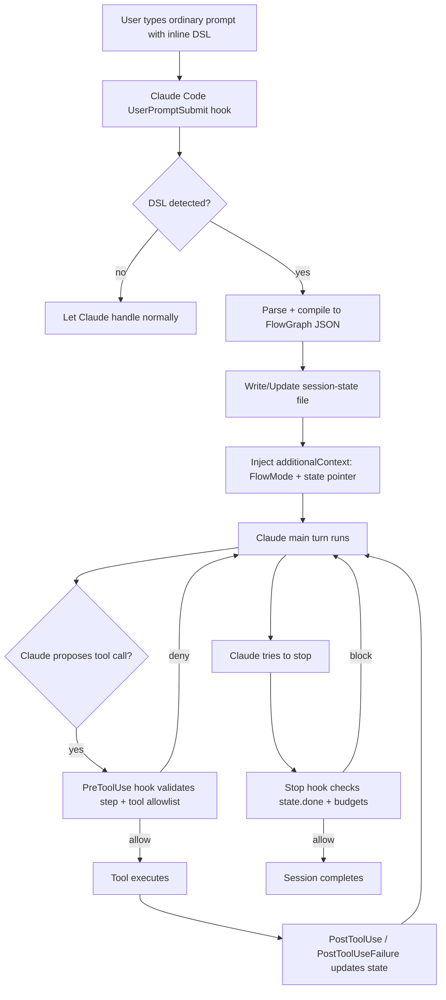

# Inline Control-Flow DSL Plugin for Claude Code and Codex

## Executive summary

Building a plugin/runtime that **detects an inline control‑flow DSL inside ordinary user prompts and enforces it deterministically** is feasible today, but it should be designed as a **small “workflow runtime” with adapters** rather than “just a prompt trick”.

On the Claude Code side, the key enablers are the hook lifecycle and decision controls: you can intercept the user’s prompt before the model sees it (`UserPromptSubmit`), inject discreet “hidden” context (`additionalContext`), and **block premature stopping** (`Stop`) or **block task completion** until quality gates pass (`TaskCompleted`). Claude Code also surfaces subagent lifecycle hooks (`SubagentStart`/`SubagentStop`) and compaction hooks (`PreCompact`/`PostCompact`) that matter for long‑running workflows and context hygiene. citeturn2view0turn2view1turn3view0turn2view4turn2view3

On the Codex side, there is no equivalent first‑class “prompt submit hook”, so enforcement is best done via a **runtime layer** that either (a) runs tasks in non‑interactive mode (`codex exec`) with structured outputs and schema validation (good for atomic nodes), or (b) runs Codex as an MCP server (`codex mcp-server`) so the runtime can maintain a thread across steps (best for multi‑node flows). The Codex SDK also provides a direct API for starting and resuming threads programmatically. citeturn7view0turn7view4turn7view2turn7view3

A practical first milestone is: implement a minimal DSL, compile it into a JSON graph, keep a **session state file** (node pointer + variables + budgets), and enforce step order using **Claude Code hooks** (block wrong tools, block stopping) and **Codex adapters** (exec or MCP). Keep branching and parallelism safe using **subagents** and (optionally) **worktree isolation** to avoid file conflicts. citeturn13view0turn13view2turn13view1turn10view1turn7view2

## Reference architecture

The core idea is to treat a user’s message as containing two layers:

1. **Normal natural language goal** (what the user wants)
2. **Inline “flow program”** that the runtime interprets (what must happen and in what order)

For Claude Code, you can implement this as a plugin that bundles hooks (and optionally an MCP server) because plugins can contain hooks and MCP servers, and plugin MCP servers start automatically when enabled. citeturn1view1turn11view0turn4view0

For portability to Codex, the “runtime” should be independent of Claude Code internals and expose a small API (e.g., local TCP/stdio/MCP). Both Claude Code and Codex support MCP integration patterns, but in different ways: Claude Code can connect to MCP servers and also bundle MCP servers inside plugins; Codex supports MCP servers via config and can itself be run as an MCP server. citeturn4view1turn11view0turn7view1turn7view2

A robust split looks like this:

- **DSL parser/compiler**: prompt → AST → JSON graph
- **Executor**: evaluates graph, maintains state, enforces budgets, determines the next permitted action(s)
- **Agent adapter(s)**:
  - Claude Code adapter: enforcement via hooks (and optionally a plugin MCP server tool)
  - Codex adapter: `codex exec` (atomic) or Codex MCP server (threaded) or Codex SDK (threaded)

### Execution flow diagram



The Claude Code hook event names and decision controls shown above are explicitly supported (including `UserPromptSubmit` context injection and blocking, plus `Stop` blocking with a reason, and tool gatekeeping through `PreToolUse`). citeturn2view0turn2view1turn2view6

## Minimal DSL grammar

You want a DSL that is:

- **easy to type in a normal prompt**
- **unambiguous to parse**
- **safe to execute** (explicit bounds)
- **compilable to a node graph**

A strong approach is to require a lightweight sentinel so you don’t “false positive” parse ordinary text. Example sentinel patterns: `flow:` block, or fenced block like `flow … `. The runtime can still “auto detect”, but only after recognising one of these sentinels.

### Minimal syntax examples

Example: loop until tests pass, bounded

```text
Goal: fix failing auth tests

flow:
  while not tests_pass max 4:
    prompt "Inspect failures; propose smallest next fix."
    run "pnpm test --filter auth"
  end
```

Example: branching with an explicit condition variable

```text
flow:
  prompt "Classify failure_mode. Output {failure_mode}."
  if failure_mode == "lint":
    run "pnpm lint"
  else:
    run "pnpm test"
  end
```

Example: approval gate before risky commands

```text
flow:
  approval "About to run migration. Continue?"
  run "pnpm prisma migrate deploy"
  end
```

Example: retry around a flaky step

```text
flow:
  retry max 3 backoff "exponential":
    run "pnpm test --filter flaky-suite"
  end
```

Example: parallel branches with merge

```text
flow:
  parallel:
    branch "A": prompt "Identify likely root cause."
    branch "B": prompt "Search for recent related commits."
  merge reduce "summarise"
  end
```

### Minimal grammar (EBNF-style)

This grammar is intentionally small and “graph-friendly”:

```text
Program      := (Preamble)? FlowBlock
Preamble     := .*?               # free text before flow:
FlowBlock    := "flow:" NEWLINE Block "end" NEWLINE?
Block        := (Stmt NEWLINE)*
Stmt         := PromptStmt
             | RunStmt
             | ApprovalStmt
             | IfStmt
             | WhileStmt
             | RetryStmt
             | ParallelStmt

PromptStmt   := "prompt" String ( "->" Binding )?
RunStmt      := ("run" | "shell") String ( "->" Binding )?
ApprovalStmt := "approval" String ( "->" Binding )?

IfStmt       := "if" Expr ":" NEWLINE Block ("else:" NEWLINE Block)? "end"
WhileStmt    := "while" Expr "max" Int ":" NEWLINE Block "end"

RetryStmt    := "retry" "max" Int ( "backoff" String )? ":" NEWLINE Block "end"

ParallelStmt := "parallel:" NEWLINE (BranchStmt NEWLINE)+ "merge" ReduceSpec
BranchStmt   := "branch" String ":" NEWLINE Block
ReduceSpec   := "reduce" String | "merge" String

Binding      := Identifier | "{" IdentList "}"
Expr         := Identifier (("=="|"!="|"<"|">"|"<="|">=") Literal)?
String       := quoted string
```

This aligns with your required primitives (prompt, if, while, run/shell, approval, retry, parallel, end) and compiles cleanly to a DAG with loop structures.

## JSON node schema and example outputs

A good mental model is: the DSL compiles to a **FlowGraph** which is a list/tree of nodes with explicit IDs, edges, and node-local settings. The executor never guesses; it advances a programme counter.

### Node schema (pragmatic JSON Schema)

Below is a compact JSON Schema-style description you can implement first (not complete JSON Schema spec, but close enough to drive validation). The key is that every node has:

- `id`, `type`
- `next` (or children)
- `inputs`
- `outputs` contract (optional)
- `budgets` (optional)

```json
{
  "$schema": "https://json-schema.org/draft/2020-12/schema",
  "title": "FlowGraph",
  "type": "object",
  "required": ["version", "entry", "nodes"],
  "properties": {
    "version": { "type": "string" },
    "entry": { "type": "string" },
    "nodes": {
      "type": "array",
      "items": { "$ref": "#/$defs/Node" }
    }
  },
  "$defs": {
    "Node": {
      "type": "object",
      "required": ["id", "type"],
      "properties": {
        "id": { "type": "string" },
        "type": {
          "type": "string",
          "enum": ["prompt", "run", "approval", "if", "while", "retry", "parallel", "end"]
        },
        "label": { "type": "string" },

        "inputs": { "type": "object" },
        "captures": { "type": "object" },

        "next": { "type": "string" },

        "cond": { "type": "string" },
        "then": { "type": "string" },
        "else": { "type": "string" },

        "body": { "type": "string" },
        "max": { "type": "integer" },

        "branches": {
          "type": "array",
          "items": {
            "type": "object",
            "required": ["name", "entry"],
            "properties": {
              "name": { "type": "string" },
              "entry": { "type": "string" },
              "isolation": { "type": "string", "enum": ["compact", "isolated_context", "worktree"] }
            }
          }
        },
        "reduce": {
          "type": "object",
          "properties": {
            "strategy": { "type": "string", "enum": ["summarise", "json_merge", "human_review"] },
            "schema": { "type": "object" }
          }
        },

        "budgets": {
          "type": "object",
          "properties": {
            "max_iterations": { "type": "integer" },
            "max_cost_usd": { "type": "number" },
            "max_tokens": { "type": "integer" },
            "max_seconds": { "type": "integer" }
          }
        }
      }
    }
  }
}
```

### Example compiled graph

For the DSL:

```text
flow:
  while not tests_pass max 3:
    prompt "Propose next fix; output {patch_plan, done_hint}."
    run "pnpm test --filter auth" -> {tests_pass}
  end
```

A compiled graph could look like:

```json
{
  "version": "0.1",
  "entry": "n1",
  "nodes": [
    {
      "id": "n1",
      "type": "while",
      "cond": "tests_pass != true",
      "max": 3,
      "body": "n2",
      "next": "n5"
    },
    {
      "id": "n2",
      "type": "prompt",
      "inputs": { "text": "Propose next fix; output {patch_plan, done_hint}." },
      "next": "n3"
    },
    {
      "id": "n3",
      "type": "run",
      "inputs": { "command": "pnpm test --filter auth" },
      "captures": { "tests_pass": "bool_from_exit_code" },
      "next": "n1"
    },
    { "id": "n5", "type": "end" }
  ]
}
```

### Node-level result output contract

Define a stable “runtime result” envelope that every node returns. This allows merging, replay, and logs.

```json
{
  "node_id": "n3",
  "status": "ok",
  "started_at": "2026-03-18T10:15:03+11:00",
  "ended_at": "2026-03-18T10:15:46+11:00",
  "artifacts": [
    { "kind": "command", "value": "pnpm test --filter auth" },
    { "kind": "exit_code", "value": 0 }
  ],
  "vars_delta": { "tests_pass": true },
  "summary": "auth tests passed"
}
```

This output envelope is also what your merge/reduce functions should consume.

## Execution semantics and context management

### Entering/exiting branches

You need to decide how branch execution interacts with the “main conversation context”. Both Claude Code and Codex explicitly caution (in different ways) that flooding the main thread with noisy intermediate output degrades long runs; Codex promotes subagent workflows specifically to limit “context pollution” and keep the main thread reliable. citeturn10view1turn9search5turn13view0

For Claude Code, subagents are first-class and can be configured with restricted tools, models, max turns, and even **worktree isolation** (`isolation: worktree`) so branches do not collide at the filesystem layer. Subagents also do not inherit the full main conversation system prompt and can be made more isolated (their system prompt is defined by the subagent definition). citeturn13view0turn13view1turn13view2

For Codex, subagents exist and are explicitly described as a way to run parallel work and then return a consolidated response; however, in your own runtime you will usually get more deterministic control by explicitly running parallel branch tasks and merging their structured outputs. citeturn10view1turn7view2turn7view3turn7view0

### Context per node: hidden context, state files, token budgets

A dependable enforcement pattern is:

- Store the authoritative flow state on disk (or in a local service), not “in the model’s memory”.
- Inject only the minimum required state summary into the model per turn.
- Treat tool outputs (like test logs) as “artifacts” that must be summarised and truncated.

On Claude Code:

- `UserPromptSubmit` gives you the raw submitted prompt and lets you **add discreet context** via JSON `additionalContext` (or plain stdout), or block the prompt entirely. This is where you detect and parse the DSL, create/update your session state file, and inject a FlowMode instruction that tells Claude what to do next. citeturn2view0
- You can also react to compaction (`PreCompact` / `PostCompact`) so you can re-inject a compact flow summary after Claude Code compacts the conversation, using the provided `compact_summary` from `PostCompact` to detect when you should refresh your own state injection. citeturn2view3
- Claude Code’s MCP tooling has output token warning thresholds and a configurable maximum via `MAX_MCP_OUTPUT_TOKENS` (useful if your branch tools produce large outputs). citeturn4view1
- The Tools reference notes that the Bash tool persists working directory between commands but does **not** persist environment variables, which matters for `run` nodes that assume `export` persists. You should either inject an env script (via `CLAUDE_ENV_FILE`) or set up env via a `SessionStart` hook if your workflow depends on shell env persistence. citeturn13view2turn1view0

On Codex:

- `codex exec` is designed for pipelines; it streams progress to stderr and prints only the final message to stdout, and it supports emitting newline-delimited JSON events (`--json`) and output validation via a JSON Schema (`--output-schema`). This is extremely useful for nodes that must return strict structured outputs. citeturn7view0turn7view4
- Codex config supports OpenTelemetry emission (optional) and also supports a notification command hook (`notify`) if you want an external “run finished / needs approval” integration. citeturn1view4turn8view0
- Codex MCP configuration can mark a server as `required`, and `codex exec` will fail fast if a required MCP server fails to initialise—useful if your runtime depends on a particular MCP tool being present. citeturn7view0turn7view1

### Context isolation vs compaction: trade-off table

| Strategy   | How it works                                                                                                                                                                                         | Pros                                                                                                        | Cons                                                                                                                                | Best for                                                                                                                 |
| ---------- | ---------------------------------------------------------------------------------------------------------------------------------------------------------------------------------------------------- | ----------------------------------------------------------------------------------------------------------- | ----------------------------------------------------------------------------------------------------------------------------------- | ------------------------------------------------------------------------------------------------------------------------ |
| Isolation  | Each branch runs in a separate subagent thread and only returns a structured summary + artifacts to the main thread. For Claude Code, optionally use `isolation: worktree` for filesystem isolation. | Keeps main context clean; reduces “context rot”; parallelism is safe; easier to enforce budgets per branch. | Higher token/cost overhead (multiple agents); requires a merge strategy; more moving parts.                                         | `parallel` branches, exploration-heavy steps, tasks that generate noisy diagnostics/logs. citeturn13view0turn10view1 |
| Compaction | Branch work occurs in the main thread but the runtime periodically compacts: store artifacts on disk, inject only summaries, rely on compaction hooks where available.                               | Simpler operationally; single thread; fewer merges.                                                         | Main thread accumulates noise; higher risk of losing key invariants after long runs/compaction; weaker guardrails for “step order”. | Tiny flows, low-noise steps, workflows that don’t need separate exploration threads. citeturn2view3turn10view1       |

### Merging branch results: reduce/merge rules and conflict resolution

Your merge model should treat each branch output as a structured object plus artifacts, and then apply deterministic merge rules:

- **Primitive vars** (booleans/strings/numbers): default _last-writer-wins_ (or explicit priority order).
- **Arrays** (e.g., findings): concat + de-dup.
- **Maps**: deep-merge with explicit collision rules (e.g., prefer branch with higher `confidence`).
- **Code changes**: do not “merge” by LLM reasoning. Use git-level primitives:
  - isolate code edits in worktrees/branches,
  - then merge/choose via a human approval node, or an automated “test & pick winner” reducer.

For Claude Code, worktree isolation is expressly supported for parallel sessions and for subagents. Claude Code’s docs describe starting sessions in worktrees and also configuring subagents with `isolation: worktree` so each branch has its own isolated copy of the repo and branch. citeturn13view1turn13view0

For Codex, you can achieve a similar effect by running branches in separate directories (e.g., temp copies or git worktrees you create yourself) and running `codex exec` in each directory, or by creating separate Codex threads per branch and only accepting patches from one branch. Codex’s non-interactive mode and SDK make this automation straightforward. citeturn7view0turn7view3

## Integration points: Claude Code hooks and Codex adapters

### Claude Code plugin points

Claude Code’s hooks are the backbone of “runtime enforcement”. These are the critical events for your design:

- **`UserPromptSubmit`**: fires before Claude processes the prompt; gives you the raw prompt and lets you add context (plain stdout) or discreet context (`additionalContext`) or block the prompt. This is your DSL detection and “FlowMode activation” point. citeturn2view0
- **`PreToolUse`**: fires before tool calls and can block/allow/ask, modify tool input, and add context. This is your “step gate”: only permit the tool(s) that are legal in the current node (e.g., only `Bash` during a `run` node, only `TaskUpdate` during bookkeeping). citeturn2view6turn1view0
- **`PostToolUse` / `PostToolUseFailure`**: update your state file after a tool succeeds/fails; this is how you set variables like `tests_pass` after a command. citeturn1view0
- **`Stop`**: fires when Claude finishes responding; you can block stopping with `{decision:"block", reason:"…"}` and must guard against infinite loops using `stop_hook_active`. This is your “prevent premature completion” enforcement. citeturn2view1turn3view0
- **`TaskCompleted`**: fires when a task is being marked completed; exit code 2 prevents completion and feeds stderr back to the model. This is your “quality gate” enforcement layer (tests/lint must pass). citeturn3view0
- **`SubagentStart` / `SubagentStop`**: coordinate `parallel` branches; `SubagentStop` uses the same “Stop” decision control style, and includes an `agent_transcript_path` and `last_assistant_message` for branch result capture. citeturn2view4turn2view1
- **`PreCompact` / `PostCompact`**: react to compaction so you can re-inject a compacted flow-state summary into context. citeturn2view3

Claude Code plugins can ship hooks and MCP server definitions, and they provide `${CLAUDE_PLUGIN_ROOT}` for stable paths regardless of install location (critical if you ship scripts and a local runtime binary). citeturn11view0turn4view0

### Codex equivalents: adapters you can build today

Codex does not expose the same “hook lifecycle” as Claude Code in its public CLI docs, so the cleanest equivalents are:

- **Non-interactive node execution (`codex exec`)**: run one node (prompt/run/test/analyse) with `--output-schema` to force structured results and `--json` to capture trace events. This works well for “atomic” nodes but is less ideal if you want cross-node continuity of reasoning unless you manage a persistent thread yourself. citeturn7view0turn7view4
- **Codex MCP server (`codex mcp-server`)**: keep Codex alive across steps and have your runtime call `codex` to start a session and `codex-reply` to continue using the returned `threadId`. This is the closest analogue to a multi-turn “agent runtime” that you can orchestrate deterministically. citeturn7view2turn1view2
- **Codex SDK**: start/resume threads directly in TypeScript from your executor (`startThread()`, `run()`, `resumeThread()`), which can be simpler than MCP for an MVP. citeturn7view3
- **Skills for auto-detection**: Codex skills can be invoked implicitly when a task matches the skill description, and skills use progressive disclosure so only metadata is loaded until a skill is selected. You can ship a “Flow Interpreter” skill that triggers based on flow sentinel patterns. citeturn5view1turn10view3

Also note: Codex has explicit sandbox and approval policies in config (`approval_policy`, `sandbox_mode`) that you can set per run to keep workflows safe and predictable, rather than relying on a conversational “please don’t do X.” citeturn8view2turn8view3turn7view0

## Guardrails, error handling, observability, and MVP plan

### Safety and guardrails

The difference between “cool demo” and “usable runtime” is strict bounding and explicit gates.

**Hard bounds (always enforce)**  
Implement these at the executor level (not in the model prompt):

- `max_iterations` for `while` and `retry`
- `max_cost` and/or `max_tokens` (budget-based fail/ask)
- `max_seconds` per node and per run
- `max_parallel` to cap branch explosion

On Claude Code, you must also guard against infinite stop-hook loops via `stop_hook_active` (explicitly provided in `Stop` and `SubagentStop` hook input). citeturn2view1turn2view4

**Premature completion prevention**  
Use a layered approach:

- `Stop` hook blocks stopping if `state.pc != end` or quality gates unmet. citeturn2view1turn3view0
- `TaskCompleted` hook blocks “task completion” and feeds back failures via exit code 2 (high-signal corrective loop). citeturn3view0

**Approval node semantics**  
Treat `approval "…"` as a _required human gate_.

- In Claude Code, approvals appear as permission prompts; there is a `PermissionRequest` hook event that can allow/deny on behalf of the user. Your runtime should generally **not auto-approve** except for explicitly opted-in safe commands. citeturn2view6turn1view0
- In Codex, approvals and sandbox controls are explicitly configurable (`approval_policy`, `sandbox_mode`), and `codex exec` defaults to read-only unless you opt into broader access. citeturn8view2turn7view0

### Error handling and retries

Retries must be deterministic and visible:

- A `retry` node should wrap a block and re-run it only on explicit failure signals (non-zero exit code, schema validation failure, tool failure).
- Claude Code provides `PostToolUseFailure` as a first-class hook event; use it to increment retry counters and decide whether to re-attempt or fail the node. citeturn1view0
- Codex can validate final output against a JSON Schema (`--output-schema`) and can stream structured JSON events (`--json`), which you can treat as your failure signal if the final output is malformed or missing required properties. citeturn7view4

A minimal retry policy that works well in practice:

- `max 3`, exponential backoff (e.g., 0.5s, 2s, 8s), then fail to an approval node (“Retry again?”) or stop with a clear error summary.

### Observability: traces, logs, run history

You need three layers of observability:

1. **Flow-level event log** (your runtime):
   - `FLOW_STARTED`, `NODE_STARTED`, `NODE_FINISHED`, `NODE_FAILED`, `MERGE_FINISHED`, `FLOW_ABORTED`
2. **Agent/Tool transcript references**:
   - Claude Code hook input includes `transcript_path` and subagent transcript paths; store those paths in your flow log so you can replay/debug. citeturn2view0turn2view4
3. **Underlying platform telemetry (optional)**:
   - Codex supports OpenTelemetry emission and documents representative event types; enabling OTel is valuable once you need performance/cost analytics across runs. citeturn1view4turn8view5

If you build the Codex path via `codex exec --json`, store the newline-delimited JSON stream as an artifact per node; this gives you a detailed trace with low extra engineering. citeturn7view4

### Sample run trace (illustrative)

Below is an example of what your runtime should persist (human-readable NDJSON). This is a _design example_:

```json
{"t":"2026-03-18T10:01:00+11:00","e":"FLOW_STARTED","session":"cc-abc123","entry":"n1"}
{"t":"2026-03-18T10:01:00+11:00","e":"NODE_STARTED","node":"n1","type":"while","iter":1}
{"t":"2026-03-18T10:01:01+11:00","e":"NODE_STARTED","node":"n2","type":"prompt"}
{"t":"2026-03-18T10:01:20+11:00","e":"NODE_FINISHED","node":"n2","vars":{"patch_plan":"edit auth.ts","done_hint":false}}
{"t":"2026-03-18T10:01:21+11:00","e":"NODE_STARTED","node":"n3","type":"run","cmd":"pnpm test --filter auth"}
{"t":"2026-03-18T10:02:05+11:00","e":"NODE_FINISHED","node":"n3","vars":{"tests_pass":false},"exit_code":1}
{"t":"2026-03-18T10:02:05+11:00","e":"NODE_STARTED","node":"n1","type":"while","iter":2}
{"t":"2026-03-18T10:04:40+11:00","e":"FLOW_FINISHED","status":"ok"}
```

### Minimal MVP implementation plan

This MVP targets Claude Code first (strong hook controls), then adds Codex via an adapter.

**Milestone: Minimal compiler and state**

- Implement DSL detection: sentinel `flow:` + indentation.
- Parser → AST → FlowGraph JSON.
- Persist state to a session file keyed by `session_id` (Claude Code provides `session_id` and `cwd` in hook input). citeturn2view0
- Decide a stable location: under the project directory (e.g., `.claude/flow/state/<session_id>.json`), or under your plugin cache using `${CLAUDE_PLUGIN_ROOT}` for tooling paths. citeturn11view0turn11view2

**Milestone: Claude Code enforcement loop**

- `UserPromptSubmit`:
  - parse DSL
  - write state
  - inject `additionalContext` with: FlowGraph hash, current node pointer, and “allowed next actions”
  - (optional) if parsing fails, block with a clear error. citeturn2view0
- `PreToolUse`:
  - read state
  - allow only expected tool(s) for current node
  - deny and provide a reason if the model deviates. citeturn2view6
- `PostToolUse` + `PostToolUseFailure`:
  - update node results and variables; implement `retry`. citeturn1view0
- `Stop`:
  - if not done, block stopping and inject the next node instruction as the “reason” so Claude continues deterministically. citeturn2view1turn3view0
- `TaskCompleted`:
  - enforce final gates (e.g., tests must pass); use exit code 2 for corrective feedback loops. citeturn3view0

**Milestone: Parallel branches**

- Implement `parallel` by spawning subagents.
- Default to **context isolation** using subagents; for code-changing branches, strongly prefer worktree isolation (`isolation: worktree`) to avoid conflicts. citeturn13view0turn13view1
- Capture results via `SubagentStop` and merge using your reduce strategy. citeturn2view4

**Milestone: Codex adapter**
Pick one of two entry paths:

- **Fast MVP**: `codex exec` per node with `--output-schema` and `--json`, run in the appropriate directory (or worktree) to keep filesystem state consistent. citeturn7view4turn7view0
- **Better continuity**: run Codex as an MCP server and have your runtime call `codex` / `codex-reply` using `threadId` so you keep a single Codex thread across nodes. citeturn7view2turn1view2

**Milestone: Observability and replay**

- Persist:
  - compiled FlowGraph
  - state snapshots
  - node result envelopes
  - references to Claude Code transcript paths (main + subagents)
  - (for Codex) JSON event streams per node
- Add a simple CLI: `flow replay <session_id>`, `flow status`, `flow export`.

Codex also supports OpenTelemetry config and a notification command hook, which you can use later for richer telemetry and user notifications. citeturn1view4turn8view0

### Tech stack suggestions

- **Runtime/executor**: TypeScript (Node 18+) for fast iteration and good JSON tooling; also aligns with Codex SDK usage. citeturn7view3
- **DSL parser**: PEG-style parser (e.g., nearley/peggy) or a hand-rolled indentation parser (the grammar is small).
- **State storage**: JSON on disk first; upgrade to SQLite if you need concurrency.
- **Claude Code integration**: plugin with hook scripts (Node or bash) plus optional plugin MCP server (Node) for a cleaner “tool call” interface. Claude Code plugins support bundling hooks and MCP servers and provide `${CLAUDE_PLUGIN_ROOT}`. citeturn11view0turn4view0
- **Codex integration**: start with `codex exec` and `--output-schema`; move to MCP server (`codex mcp-server`) if you need multi-node continuity. citeturn7view4turn7view2

### Simple MVP test cases

Test the enforcement properties, not just “it runs”.

1. **Tool gating**
   - DSL says `run "pnpm test"`.
   - If the model tries `Bash "rm -rf …"` or even `Write` when it shouldn’t, `PreToolUse` must deny. (Claude Code supports PreToolUse denial with a reason.) citeturn2view6

2. **Stop blocking**
   - DSL loop has `max 2`.
   - If the model says “done” after 1 iteration with failing tests, `Stop` must block and force continuation. citeturn2view1turn3view0

3. **Task completion gate**
   - Add a final `TaskCompleted` check (tests must pass).
   - Ensure exit code 2 prevents completion and feeds back stderr guidance. citeturn3view0

4. **Parallel + merge**
   - Two branches return structured JSON.
   - Merge reducer deterministically merges without leaking branch scratch notes into main context (use subagents for isolation). citeturn13view0turn10view1

5. **Compaction resilience**
   - Simulate a long transcript, trigger compaction.
   - Verify `PostCompact` handler re-injects the compact flow state summary. citeturn2view3

6. **Codex node schema validation**
   - Run a `prompt` node via `codex exec --output-schema …`.
   - Ensure malformed output fails and triggers retry or approval. citeturn7view4turn7view0
