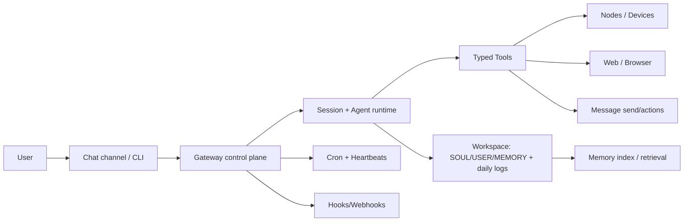
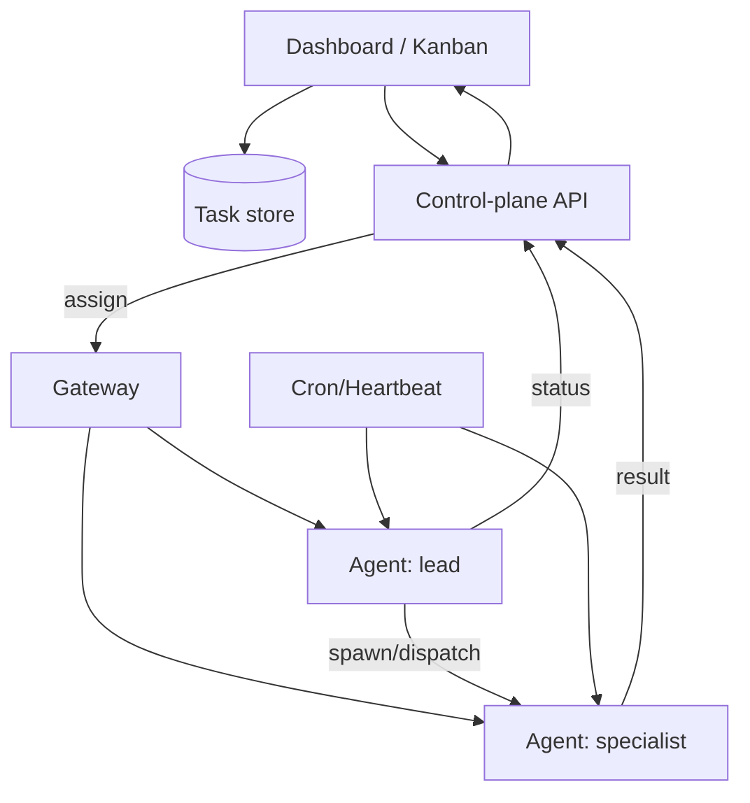
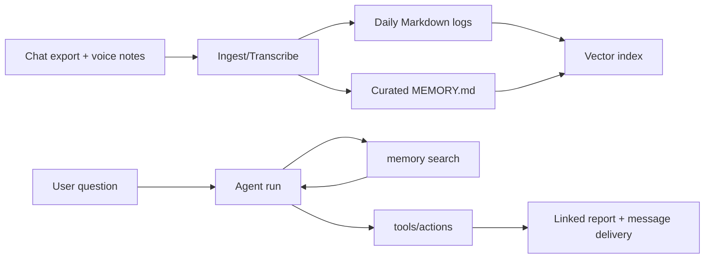

# Extending OpenClaw Beyond Baseline Capabilities

## Scope, constraints, and what “beyond baseline” means

This report surveys how practitioners push OpenClaw past “a helpful assistant that answers in chat” into an always-on automation and coordination layer for work and life. The emphasis is on concrete extension surfaces (skills, tools, plugins, hooks, memory, multi-agent routing), the orchestration/control-plane patterns that emerge when those surfaces are combined, and the security/operational consequences of doing so. citeturn21view1turn10view8turn10view7turn10view9

Unspecified constraints (left open-ended by the request) that materially change architectural choices:

- **Scale**: solo-user, household/team, or multi-tenant hosted service. citeturn26view0turn12view0  
- **Budget**: flat subscription vs pay-per-token APIs; token burn from heartbeats/sub-agents; “cheap model + safety controls” vs “strong model for tool use”. citeturn11view8turn24search18turn10view6turn24search13  
- **Blast radius tolerance**: a dedicated “assistant machine/VPS” vs running on a primary laptop with personal credentials. citeturn4search4turn10view6  
- **Security posture**: strict allowlists + sandboxing + multi-agent segregation vs convenience-first “full host access”. citeturn10view6turn21view0turn25view1  

## Baseline platform model and extension surfaces

OpenClaw’s baseline “shape” matters because nearly every advanced extension is ultimately a composition of: (a) a control plane (Gateway), (b) sessions/agents, (c) tool invocation, (d) memory files + retrieval, and (e) inbound/outbound channels plus automation triggers. citeturn21view1turn10view8turn10view7turn23view0turn25view1

### Core runtime: Gateway as control plane

The Gateway is described as a WebSocket server and control plane for “channels, nodes, sessions, hooks”. It is designed to be run locally by default and includes safety guardrails (for example, refusing non-loopback binds without authentication configured). citeturn10view8turn24search20turn24search10

**Key extension implication:** once you can programmatically create sessions, route messages, spawn sub-sessions, and schedule recurring runs, OpenClaw becomes a general-purpose automation fabric rather than a single chat bot. citeturn11view4turn11view6turn25view1turn24search18

### Tools vs skills vs plugins vs hooks

OpenClaw documentation draws a strong line:

- **Tools**: first-class, typed capabilities (browser, nodes, canvas, cron, sessions, message, etc.), with allow/deny policies and provider-specific tool policy support. citeturn10view7turn4search3turn25view1  
- **Skills**: primarily Markdown “how-to” bundles (a folder with `SKILL.md` plus supporting text files) distributed via ClawHub; they teach the agent *how* to use tools/CLIs/APIs. citeturn9search13turn9search20turn3search11turn5search0  
- **Plugins**: code modules that extend OpenClaw with extra features, including commands, tools, and Gateway RPC; installed and configured through the CLI and config. citeturn4search1turn23view1  
- **Hooks**: event-driven scripts invoked on internal events or via external HTTP webhooks, used to wire OpenClaw runs into other systems. citeturn27search15turn11view11  

This composition is the core mechanism by which people “extend OpenClaw beyond baseline”: not by changing the agent’s LLM, but by designing reliable toolchains, event loops, and separated execution contexts around it. citeturn10view7turn27search15turn23view0turn25view1

### Workspace and memory as a programmable substrate

OpenClaw’s “workspace” conventionally contains durable context files such as `AGENTS.md`, `SOUL.md`, `USER.md`, `MEMORY.md`, with daily append-only logs under `memory/YYYY-MM-DD.md`. The docs explicitly recommend keeping these files in the workspace, not under the state directory. citeturn11view0turn23view0

Memory is not only “notes”; it is operational:

- the agent can be instructed to write to memory (“If someone says ‘remember this,’ write it down”). citeturn23view0  
- OpenClaw can trigger an **automatic memory flush** before compaction to preserve durable facts. citeturn23view0  
- a **vector memory search** index can be built over `MEMORY.md` and `memory/*.md`, with provider selection logic (local vs OpenAI vs Google Gemini vs Voyage) and an explicit note that some OAuth flows do not cover embeddings. citeturn23view0turn11view1  
- `openclaw memory` CLI exposes status/index/search, allowing operational pipelines to measure and refresh retrieval. citeturn23view1turn22search5  

The result is that “large-memory pipelines” are often less about magical long context and more about disciplined capture + indexing + scheduled reflection loops. citeturn23view0turn23view1turn23view3  

### Baseline architecture diagram



This diagram reflects the Gateway’s role (sessions/channels/hooks), the typed tools inventory, and the workspace/memory layout described in official documentation. citeturn10view8turn10view7turn11view6turn23view0turn11view11turn27search15  

## Skill and tool synthesis inside chat

The most “remarkable” extensions are rarely a single plugin; they are *synthesis patterns* where the assistant is taught to assemble tools/skills into a repeatable workflow, often initiated from a chat thread itself.

### Skill distribution and automation via the public registry

ClawHub is described as a public registry where skills are folders containing `SKILL.md` (plus supporting text files), with versioning, indexing, and CLI-based install/update/sync flows. citeturn9search13turn9search20turn3search11

An emerging “beyond baseline” pattern is **skill-on-demand acquisition**: enabling the assistant to search for and pull in new skills as needed (rather than a human pre-installing everything). citeturn5search2turn9search13turn9search20

**Minimal conceptual architecture:**

- a lead session receives a user request;
- the agent queries ClawHub for relevant skills;
- it installs a candidate skill into the workspace;
- it validates required environment variables/binaries;
- it executes the skill’s recommended tool/CLI flow and reports. citeturn9search20turn4search3turn10view6turn24search3

**Example pseudocode: skill-on-demand resolution**
```pseudo
function handle_request(text):
  plan = classify(text)
  if plan.requires_capability not in current_tools_and_skills:
     candidates = clawhub.search(plan.keywords)
     best = rank(candidates, by=trust_signals + required_perms + recency)
     install(best)
     verify_requirements(best.requiredEnv, best.requiredBins)
  run = execute(plan, tools, skills)
  return render(run.result)
```
This aligns with ClawHub’s install/update model and with OpenClaw’s explicit separation of “skills as instructions” and “tools as capabilities.” citeturn9search13turn10view7turn24search3

### Tools as typed, policy-controlled “organs” rather than shell glue

The tools documentation emphasises that tools are first-class and typed, replacing older “shelling” skill patterns. It also spells out allow/deny configuration, including preventing disallowed tools from being sent to model providers. citeturn4search3turn10view7turn25view1

This drives a common synthesis approach:

- keep the **high-risk tools** (browser, exec, web fetch/search) restricted to specific agents or contexts;
- install multiple “instructional” skills that *teach composition* without granting permission by themselves. citeturn10view6turn5search15

### Plugins add new tool surfaces and RPC: when Markdown is not enough

Plugins are documented as code modules extending commands/tools/Gateway RPC, installed via CLI and configured under `plugins.entries.<id>.config`. citeturn4search1turn23view1

**Why communities reach for plugins:** when you want *guaranteed semantics* (API clients, OAuth refresh, structured tool responses, scheduled jobs), “prompt-only skills” become fragile; a plugin can enforce schema and implement robust error handling. This is concretely illustrated by the OuraClaw project, which provides both an agent tool (`oura_data`) and scheduled summaries with background token refresh. citeturn10view4turn6search1

**Plugin-style tool skeleton (TypeScript-like pseudocode)**
```pseudo
export tool oura_data(params):
  token = tokenStore.getOrRefresh()
  resp = http.get("https://api.ouraring.com/v2/usercollection/daily_sleep", auth=token)
  return normalize(resp)

cron "ouraclaw-morning" at 07:00:
  data = oura_data({date: today})
  summary = summarise_for_user(data)
  message.send(to=preferred_channel, text=summary)
```
This mirrors OuraClaw’s documented features: a tool for fetching data, token refresh, and cron-driven summaries. citeturn10view4turn11view6

### Hooks and webhooks: turning OpenClaw into an event-driven automation bus

OpenClaw supports hook configuration with an authentication token and explicit endpoints (`POST /hooks/wake`, `POST /hooks/agent`), including optional explicit agent routing and delivery controls. citeturn11view11turn27search15

This underpins “messaging automation with persistent memory” architectures where:

- external systems push events (email, monitoring alerts, “task created”);
- hooks map events to a specific agent/sessionKey;
- the agent consults workspace memory + vector search;
- actions are executed and delivered back to the appropriate channel. citeturn11view11turn23view0turn25view3turn27search13  

## Multi-agent orchestration and control-plane patterns

Beyond baseline, OpenClaw is frequently used less as “one assistant” and more as a **multiplexed agent runtime**: multiple agents with isolated workspaces and tool policies, routed by channel/account/peer, plus within-run sub-agents for parallelism and specialised reasoning.

### Multi-agent routing: isolation by workspace + deterministic bindings

The configuration reference documents:

- per-agent definitions (`agents.list[]`) with workspace and sandbox overrides; citeturn25view1  
- routing via `bindings` with deterministic match order (peer/guild/team/accountId, then default agent); citeturn25view1  
- examples of “read-only tools + read-only workspace” agent profiles (e.g. `workspaceAccess: "ro"` or `"none"` and allowlisted tools only). citeturn25view1turn10view6  

This is the foundation of advanced architectures that separate:

- **inbound-untrusted** surfaces (group chats, public channels, emails) → low-permission “reader/triage” agents;  
- **privileged execution** (file writes, exec, browser) → a private agent or explicitly approved run. citeturn10view6turn25view1turn21view0

### Message routing and queue control: scaling “chat-as-control-plane”

When OpenClaw is embedded in multiple high-volume channels, the bottleneck is often not compute, but *conversation concurrency*: messages arriving while a run is active.

OpenClaw exposes `messages.queue` configuration to control behaviour (collect/followup/steer/interrupt), including a cap and overflow policy (summarise/old/new), and notes that media flushes immediately while text can be debounced. citeturn25view5turn27search20

Separately, message deduplication is addressed at the message-model level: channels can redeliver after reconnects, so OpenClaw keeps a short-lived cache so duplicates do not trigger another agent run. citeturn27search1

These two facilities form a common “beyond baseline” scaling pattern:

- **dedupe** to prevent replay storms;
- **collect** to batch bursts into one turn;
- **summarise overflow** to preserve intent under cap pressure;
- **interrupt** reserved for operator control channels. citeturn27search1turn27search20turn25view5

### Sub-agents and cross-session orchestration

OpenClaw supports session-level tools (`sessions_list`, `sessions_history`, `sessions_send`, `sessions_spawn`, `session_status`) enabling one session to inspect or message another. citeturn11view4turn10view7turn25view1

It also documents “sub-agents” as separate contexts with independent token usage, concurrency defaults, and auto-archiving. This is central to orchestration patterns where the “lead” agent spawns specialised workers and receives summarised findings back. citeturn24search18turn27search11

**Practical orchestration patterns observed in community tooling:**

- **Lead + specialists**: a lead agent delegates research, drafting, code changes, or monitoring to specialist agents, each with a tuned tool policy and model selection. citeturn26view0turn12view0turn24search18  
- **Kanban/control-plane**: work items are managed outside the chat thread (dashboard + database), with agents polling/pushing updates via heartbeat or webhooks. citeturn12view0turn26view0turn11view11  
- **“Repo as memory”**: the “state store” is a git repository; sessions are committed as artifacts so the agent can grep its own history and maintain long-lived context. citeturn12view2  

### Control-plane workflows: Mission Control as an archetype

Two variants illustrate the same control-plane pattern:

- The open-source **Mission Control** dashboard (Next.js + SQLite) communicates with the Gateway via WebSocket and coordinates tasks, including an “AI planning” step and automatic dispatch to agents. citeturn12view0turn10view2  
- A separately described hosted “Mission Control” concept uses a database + dashboard + heartbeat polling (REST) to coordinate squads, sync `SOUL.md`, and run staggered crons to avoid cost spikes. citeturn26view0  

Both embody a core idea: **OpenClaw runs the worker loops; an external control plane provides shared state, visibility, and policy.** citeturn12view0turn26view0turn25view1turn11view8  



This flow aligns with documented Gateway-controlled cron/heartbeat capabilities and with the Mission Control implementations described in sources. citeturn11view6turn11view8turn12view0turn26view0  

## Persistent automation, browser/voice/messaging, and large-memory pipelines

### Always-on voice: Talk Mode, TTS, and voice directives

Talk Mode is documented as a continuous “Listening → Thinking → Speaking” loop with interrupt-on-speech behaviour and transcript sending on silence windows, writing replies to WebChat. It also supports a JSON “voice directive” line at the top of a reply to switch voices. citeturn27search0

Text-to-speech support is configurable under `messages.tts`, with provider options including entity["company","ElevenLabs","voice ai company"] and an OpenAI-based option, plus a fallback mode that does not require API keys. citeturn27search3

**Beyond baseline extension:** voice becomes an *automation surface* when combined with (a) persistent memory and (b) tool execution. A typical advanced flow is: voice input → transcription → memory lookup → action execution → voice reply + optional message send to another channel. Media handling documentation notes how inbound media can be downloaded into a temporary file and made available to command parsing, including transcriptions. citeturn27search9turn27search18turn24search3

### Messaging automation: cross-channel actions as a tool

The `message` tool supports sending and performing actions across several messaging surfaces (send, react, read, edit/delete, thread operations, search, etc.). citeturn27search13turn10view7

Advanced users leverage this to build “operational loops”:

- monitor one channel, summarise and forward to another;
- post structured updates (including cards where supported);
- implement human-in-the-loop approvals by replying to a specific thread. citeturn27search13turn11view11turn10view6

### Browser automation: “no API needed” workflows

A recurring showcase theme is using browser control to execute tasks where no formal API exists (log in, click through flows, screenshot pages, etc.). The tools inventory includes a dedicated `browser` tool, and the security guide repeatedly flags browser+web fetch/search as high-risk tools to restrict and sandbox. citeturn10view7turn10view6turn28view0

The community has operationalised this via specialist “browser agents” and dashboards that: (a) queue work, (b) perform browser tasks, (c) store results to workspace memory, and (d) deliver a confirmation message back to chat. citeturn10view6turn23view0turn27search13turn25view1

### Persistent memory pipelines: from daily logs to semantic recall

OpenClaw’s memory concept is intentionally Markdown-first (daily logs + optional curated memory), but it adds a derived vector index to improve recall under token budgets. citeturn23view0turn23view3

Key mechanisms people extend:

- **Semantic search indexing** via `openclaw memory index/search`, including provider selection and deep status probes. citeturn23view1turn23view0  
- **Automatic compaction-aware memory flush** to preserve durable facts. citeturn23view0  
- **Nightly “review → write memory” loops** (often implemented as skills) that mine session history for stable preferences/decisions and update `MEMORY.md`. This matches the “compound engineering” class of skills referenced in community lists and discussions. citeturn22search0turn11view6turn23view0  

A concrete community example in the official showcase describes a “WhatsApp Memory Vault” pipeline that ingests exports, transcribes 1,000+ voice notes, cross-checks against git logs, and outputs linked Markdown reports. citeturn28view0

### Example architecture: large-memory ingestion + retrieval + action



This reflects the documented memory indexing model and the “large-memory vault” style pipeline described in the showcase. citeturn23view0turn23view1turn28view0turn27search13  

## Notable community projects and case studies

This section focuses on projects that exemplify “beyond baseline” usage, with attention to architecture, integrations, deployment, failure modes, observability, and cost drivers.

### Security layer as an extension: ClawSec

**What it is:** ClawSec positions itself as a security skill suite for OpenClaw-style agents, including drift detection for critical prompt files (SOUL/IDENTITY), checksum verification, automated audits, and CVE polling. citeturn12view1turn11view16

**Architecture:** a “skill-of-skills” installer that fetches and installs multiple security skills, verifies integrity, and sets up periodic checks. citeturn12view1turn11view16

**Integrations/APIs:** relies on external threat intelligence feeds (the project explicitly references automated CVE polling). citeturn11view16turn12view1

**Deployment pattern:** installable suite; can be invoked by the agent itself via fetching a SKILL.md release artifact. citeturn12view1turn9search13

**Failure modes:** false positives/negatives in “prompt injection marker” detection; integrity verification failing under partial installs or network errors; cron drift. These are typical for self-check/verification tools, and are one reason log+health integrations matter. citeturn12view1turn24search5turn11view6

**Observability:** OpenClaw supports file logs and `openclaw logs --follow` to tail gateway logs; these become the natural monitoring surface for security suites as well. citeturn24search5turn24search8

### Dev workflow automation: gitclaw (GitHub Issues + Actions as the runtime)

**What it is:** a personal AI assistant that runs entirely through GitHub Issues and Actions; each issue becomes a chat thread, and conversation history is committed to the repo as sessions, enabling long-term memory and grep-able self-history. citeturn12view2

This is “beyond baseline” because it reframes the control plane: instead of a local Gateway as the long-running server, orchestration is delegated to CI infrastructure and git storage. citeturn12view2

**Architecture highlights:**
- **Repo-as-storage** (`state/…` mappings + `sessions/*.jsonl`). citeturn12view2  
- **Trigger model**: issue open/comment = resume session; commits after every turn. citeturn12view2  
- **Security model**: workflow responds only to repository owners/members/collaborators, with a recommendation to use private repos for private conversations. citeturn12view2  

**Failure modes:** CI rate limits/timeouts; secrets misconfiguration; accidental disclosure if repo is public; permission misuse in CI environments (a broader class of CI/CD risk studied in the Granite paper for GitHub Actions permission granularity). citeturn12view2turn3academia19

**Monitoring:** CI job logs serve as the primary event stream; git history is the audit log. citeturn12view2

### Kanban/control-plane: Mission Control dashboards

**Open-source dashboard variant:** The Mission Control repo documents a local architecture: Next.js dashboard ↔ Gateway (WS), with a SQLite database and an “AI planning” stage that asks clarifying questions, creates a specialised agent, and dispatches tasks. citeturn12view0turn10view2

**Hosted squad/control-plane concept:** A separate write-up details a more elaborate, multi-tenant approach using database tables + API endpoints, with agents polling via heartbeat (REST) and syncing SOUL.md edits from a dashboard; it also highlights a key integration pitfall where OpenClaw’s default heartbeat behaviour can short-circuit unless prompts/workarounds force the external API call. citeturn26view0turn11view8

**Why this matters:** it surfaces a general rule—when you add a control plane, you must explicitly design for “agent laziness” (pattern matching) and ensure the skill/tool path is actually executed (for example via explicit tool-use requirements, test harnesses, and observability). citeturn26view0turn24search11turn24search22

### Hardware control: BambuLab printer CLI + agent orchestration

A representative trajectory for “hardware control beyond baseline” is: build a deterministic CLI around a device’s network protocol, then teach the agent to use it.

**Bambu CLI:** `bambu-cli` is a Go CLI for controlling BambuLab printers directly over MQTT/FTPS/camera. It documents required reachable ports (8883 MQTT, 990 FTPS, 6000 camera), environment variables for profiles and access codes, and cautions against passing access codes via flags. It also provides Homebrew installation and quick-start commands (create profile, status, print start). citeturn20view0turn20view4turn15search3

**Architecture (typical):**
- OpenClaw agent calls `exec` tool (or a sandboxed exec) to run `bambu-cli status/print/camera` commands;
- parse outputs → update a task board or send a progress notification;
- optionally attach camera snapshots to messages. citeturn20view4turn10view6turn27search13turn10view7

**Failure modes:** device unreachable/ports blocked; authentication/access code mishandling; long-running print monitoring causing token burn if polled too frequently; risky expansion of `exec` permissions. citeturn20view0turn11view8turn10view6

### Health integrations: Oura and WHOOP as “personal telemetry” inputs

**OuraClaw:** provides an agent tool (`oura_data`), a skill to interpret scores, scheduled summaries (morning/evening), and background token refresh; setup uses an interactive wizard and OAuth flow. citeturn10view4turn6search1

**whoopskill:** is a Node CLI intended to be taught as a skill; it explicitly documents exit codes including authentication errors, rate limits, and network errors—useful for designing robust agent wrappers. citeturn10view5

**Architecture pattern (health):**
- data retrieval tool/CLI;
- normalisation to structured JSON;
- summarisation into “daily brief” with trend analysis;
- write to memory (daily log) + optionally a curated “health baseline” in long-term memory. citeturn23view0turn10view4turn10view5

**Cost/compute:** “always-on” health agents are often implemented as crons/heartbeats; the docs warn that shorter heartbeat intervals burn more tokens and recommend careful tuning and smaller prompts. citeturn11view8turn11view6

### Large-memory search sidecars: Karakeep semantic search

The `karakeep-semantic-search` project demonstrates a high-leverage “sidecar retrieval service” pattern:

- an architecture diagram in the repo shows Karakeep → semantic search app → entity["company","Qdrant","vector database"], with embeddings via OpenAI or a local Ollama option; citeturn30view0turn30view1  
- a single-container Docker deployment bundles Qdrant (persistent volume `/qdrant/storage`), with environment variables for Karakeep URL/API key and OpenAI API key; citeturn30view0  
- it includes a ready-to-use skill bundle for integration with “Clawdis” style agents. citeturn30view3  

This specific pattern—externalise retrieval into a sidecar, keep the agent’s memory store canonical in Markdown or a primary system, and use the agent to orchestrate queries—is consistent with OpenClaw’s own “Markdown source-of-truth + derived index” research direction. citeturn23view3turn23view0turn30view0  

### Telephony bridges: Clawdia Bridge

The `clawdia-bridge` repo documents an HTTP bridge connecting a entity["company","Vapi","voice agent platform"] voice assistant to an OpenClaw-style assistant via a WebSocket connection to the Gateway. Its README includes a “How it works” pipeline: phone call → Vapi → POST /ask → bridge → WebSocket to Gateway → assistant → response back to Vapi for speech. citeturn30view4turn30view5

This is “beyond baseline” because it treats the Gateway as a *backend for real-time voice infrastructure*, rather than a convenience for chat apps, and it introduces the operational expectations of telephony: health endpoints, latency budgets, and consistent failure signalling. The repo explicitly includes a `GET /health` endpoint response format. citeturn30view5

### Home automation deployments: Home Assistant add-on + Nix-first “home OS” patterns

**Home Assistant add-on:** the `openclaw-ha-addon` repo packages the Gateway as a Home Assistant OS add-on with SSH tunnel support, and includes tools such as a Google Workspace CLI and GitHub CLI inside the add-on environment; configuration includes ports, repository/branch, GitHub token, SSH port and authorised keys. citeturn30view8turn30view9

This extension pattern matters because it shifts OpenClaw into a “home server appliance” operational model—persistent, remotely accessible via tunnels, and integrated with a home automation stack. citeturn30view8turn30view9

**GoHome:** a separate “home automation system” shows a Nix-native, single binary design with gRPC + HTTP (metrics/health), compiled-in plugins, Prometheus metrics and Grafana dashboards, and local OAuth token persistence with an S3 mirror for disaster recovery. It explicitly contrasts this with common “Docker/HAOS” operational pain. citeturn30view12turn30view11

Even when OpenClaw is not embedded directly, this demonstrates a broader ecosystem direction: treat agents as the conversational interface to a more deterministic home control plane, while exposing observability endpoints to keep automation auditable. citeturn30view12turn27search15turn10view6

### “Tool as curriculum”: xuezh Chinese learning engine

The `xuezh` repo is a CLI-first Mandarin learning engine, explicitly designed to be used behind a bot runtime, where the bot calls `xuezh` commands and parses JSON outputs. It specifies required credentials (Azure Speech key/region) and includes concrete flows: voice pronunciation assessment, text-to-speech generation, and progress recap reports. citeturn29view0

This is a distilled example of “beyond baseline” design: the agent does **routing, state, and narrative**; the specialised learning engine does deterministic scoring and data retrieval. citeturn29view0turn10view7

## Security, privacy, observability, and cost/compute tradeoffs

### Security reality: the extension ecosystem is a major attack surface

In early February 2026, multiple reports highlighted malicious skills in the ClawHub ecosystem, including “hundreds” of malicious add-ons and infostealer delivery mechanisms, raising concerns about the inherent risk of letting an agent execute local commands and follow instructions found in skill markdown. citeturn5news18turn9search8

A separate Reuters report notes an official warning in China about security risks from improperly configured deployments, with emphasis on audits and access controls. citeturn5news19

Academic work has also begun to systematise agent security evaluation: a February 2026 paper proposes an end-to-end personalised agent security benchmark and reports critical vulnerabilities across prompt processing, tool usage, and memory retrieval for OpenClaw as a case study. citeturn5academia22

**Core risk classes relevant to “beyond baseline” extensions:**
- **Supply chain via skills**: “instruction bundles” can socially engineer operators or the agent into harmful actions. citeturn5news18turn9search15turn9search13  
- **Prompt injection via inbound channels**: treating inbound DMs/groups/emails as untrusted input is explicitly emphasised in the repo’s security defaults. citeturn21view0turn10view6  
- **Tool escalation**: `exec` + `browser` + file access can turn a prompt compromise into full system compromise if not sandboxed/allowlisted. citeturn10view6turn4search3turn21view0  
- **Memory poisoning**: compromised inputs can persist in durable memory, affecting future decisions; the PASB paper highlights risks in memory retrieval stages. citeturn5academia22turn23view0  
- **Logs/transcripts leakage**: the security guide explicitly notes that logs and transcripts can leak sensitive information even when access controls are correct. citeturn24search17turn24search5  

### Mitigation patterns that practitioners actually deploy

The official security guide recommends mitigation patterns that map cleanly onto multi-agent and tool-policy design:

- enable sandboxing and strict tool allowlists, particularly for sessions that touch untrusted input; citeturn10view6turn21view0  
- use a **read-only “reader agent”** to summarise untrusted content and pass only the summary to a privileged agent; citeturn10view6turn25view1  
- keep secrets out of prompts; prefer env/config; citeturn10view6turn24search4turn24search3  
- treat group contexts differently from private contexts; OpenClaw’s README describes a default model where the main session has host access, while “non-main sessions” can be run inside per-session Docker sandboxes with limited tool allowlists. citeturn21view0turn10view6  
- use DM pairing and allowlists to reduce unsolicited inbound attack surface. citeturn21view0turn24search10  

A practical ecosystem mitigation is that OpenClaw announced a partnership with entity["company","VirusTotal","malware scanning service"] for skill security scanning, and community projects explicitly reference VirusTotal reports and code review prior to installation. citeturn5search6turn6search0

ClawSec represents a “defence as installable suite” approach, adding drift detection and integrity verification for the agent’s own cognition files. citeturn12view1turn11view16

### Observability: logs, diagnostics, health, and usage tracking

OpenClaw has two major log “surfaces” (console and file logs), with gateway file logs defaulting to a rolling file under `/tmp/openclaw/` and accessible via CLI (`openclaw logs --follow`) and the Control UI. citeturn24search2turn24search5turn24search8

The FAQ and troubleshooting guidance point to operational commands such as `openclaw status --deep`, `openclaw health --json`, and `openclaw doctor` (repairs/migrations + health checks). citeturn24search1turn24search10turn11view2

Usage tracking is described as pulling quota/usage directly from provider endpoints, rather than estimating costs. citeturn24search6turn24search3

For “beyond baseline” builds, these become non-optional: multi-agent systems need a central view of failures (timeouts, sandbox errors, tool-call exceptions, auth expiry), and dashboards/control planes often ingest these logs. citeturn12view0turn26view0turn24search5turn11view6

### Cost/compute tradeoffs: where spending actually comes from

OpenClaw’s cost drivers are explicitly enumerated in the API usage/cost reference: model responses (chat + tools) dominate, followed by media understanding (audio/image/video) and memory embeddings/semantic search. citeturn24search3turn23view0turn27search3

Operational loops can be surprisingly expensive:

- **Heartbeats run full agent turns**, and the configuration docs warn that shorter intervals burn more tokens; keeping `HEARTBEAT.md` small and/or choosing a cheaper model is advised. citeturn11view8turn11view6  
- **Sub-agents** have their own context and token usage; model downgrades for sub-agents are a documented cost-control knob. citeturn24search18turn27search11  

A representative tradeoff between pay-per-token and flat subscription tooling is summarised in the “Claude Max API Proxy” documentation: pay-per-token for a premium model vs a flat monthly subscription, where break-even depends on volume. citeturn24search13

**Illustrative cost curve (conceptual chart)**  
Assume input:output tokens = 4:1 for tool-heavy automation; the “pay-per-token” line uses the cited per‑1M token prices for a premium tier as an example, while “flat plan” is constant:

```
Monthly cost ($)
300 |                                 *
250 |                               *
200 |------------------------------*----------------  flat subscription
150 |                        *
100 |                  *
 50 |            *
  0 +------------------------------------------------
      0      2M      4M      6M      8M     10M   input tokens/month
```

The purpose is not exact budgeting (prices and token ratios vary), but to emphasise that “always-on” pipelines (heartbeats, browser polling, multi-agent squads) can shift a user from sporadic token spend into sustained, predictable cost regimes. citeturn24search13turn11view8turn26view0turn24search18  

### Comparative table: projects, interfaces, orchestration, and security posture

| Project / pattern | What it extends | Interfaces | Orchestration pattern | Security posture notes |
|---|---|---|---|---|
| Mission Control (open-source dashboard) citeturn12view0 | Task planning + dispatch + visibility layer | Web dashboard + Gateway WS | Kanban/control-plane → agent dispatch | Local DB + WS; safety depends on agent tool policies and Gateway auth. citeturn12view0turn10view6 |
| Hosted “Mission Control” concept citeturn26view0 | Multi-tenant squad design + SOUL sync + heartbeat API | Dashboard + REST heartbeat | Staggered cron/heartbeat polling | Explicitly highlights heartbeat short-circuit failure and need for robust prompting/workarounds. citeturn26view0turn11view8 |
| gitclaw citeturn12view2 | Serverless orchestration via CI + git memory | GitHub Issues/Actions | Repo-as-state + event triggers (issue/comment) | Access limited to collaborators; privacy requires private repo; inherits CI permission risks. citeturn12view2turn3academia19 |
| OuraClaw citeturn10view4 | Health telemetry tool + scheduled summaries | Agent tool + cron deliveries | Periodic summaries + background token refresh | OAuth/token handling; blast radius depends on where credentials are stored and tool access. citeturn10view4turn10view6turn24search3 |
| whoopskill citeturn10view5 | Health CLI used as skill substrate | CLI invoked by agent | CLI wrapper + trend scripts | Exit codes support robust wrappers; still depends on exec permissions and secret hygiene. citeturn10view5turn10view6 |
| Bambu CLI hardware control citeturn20view4turn20view0 | Physical device control via local network | CLI + optional image capture | Polling/monitor loop + notification | Network exposure (ports), credential handling, and exec sandboxing dominate risk. citeturn20view0turn10view6 |
| Wiener Linien transport skill citeturn18view1 | Public transport real-time lookups | Shell scripts/API calls | Stateless query skill | Lower risk than host exec; still a supply-chain surface if installed unreviewed. citeturn18view1turn9search15 |
| Karakeep semantic search sidecar citeturn30view0turn30view3 | External retrieval system + vector DB | Docker sidecar + skill | Sidecar service + agent query | Bundles vector DB; depends on API key handling and network exposure of the sidecar. citeturn30view0turn24search3 |
| Clawdia bridge citeturn30view4turn30view5 | Telephony/voice assistant ↔ Gateway bridge | HTTP + Gateway WS | Real-time request/response relay | Adds health endpoint; introduces telephony-grade reliability expectations and WS auth considerations. citeturn30view5turn24search10turn10view8 |
| Home Assistant add-on citeturn30view8turn30view9 | Appliance-style deployment + tunnel access | Home automation OS add-on + SSH | Persistent service in HA OS | Ships with additional CLIs; tunnel keys and auth controls become critical. citeturn30view9turn10view6 |
| ClawSec security suite citeturn12view1 | Security automation for skills/context files | Agent-invoked install + cron | Integrity verification + audits | Defence layer; still relies on correct baseline controls (sandbox, secrets, logs hygiene). citeturn12view1turn24search17turn10view6 |

### Primary-source links and references

The most authoritative sources for the behaviours described above are:

- OpenClaw core repo (architecture highlights, security defaults, sandbox model) hosted on entity["company","GitHub","code hosting platform"]. citeturn21view1turn21view0  
- Official docs for tools, configuration, hooks/webhooks, memory, logging, and security. citeturn10view7turn10view9turn11view11turn23view0turn24search5turn10view6  
- ClawHub registry design and skill packaging (`SKILL.md` bundles). citeturn9search13turn3search11turn9search20  
- Security reporting on malicious skills (notably from entity["organization","The Verge","technology news site"]) and policy warnings (from entity["organization","Reuters","news agency"]). citeturn5news18turn5news19  
- Security research and evaluation frameworks (PASB paper) and CI/CD permission hardening research (Granite). citeturn5academia22turn3academia19  
- Representative community projects: Mission Control, gitclaw, ClawSec, hardware/health/memory sidecars. citeturn12view0turn12view2turn12view1turn20view4turn10view4turn30view0turn30view4