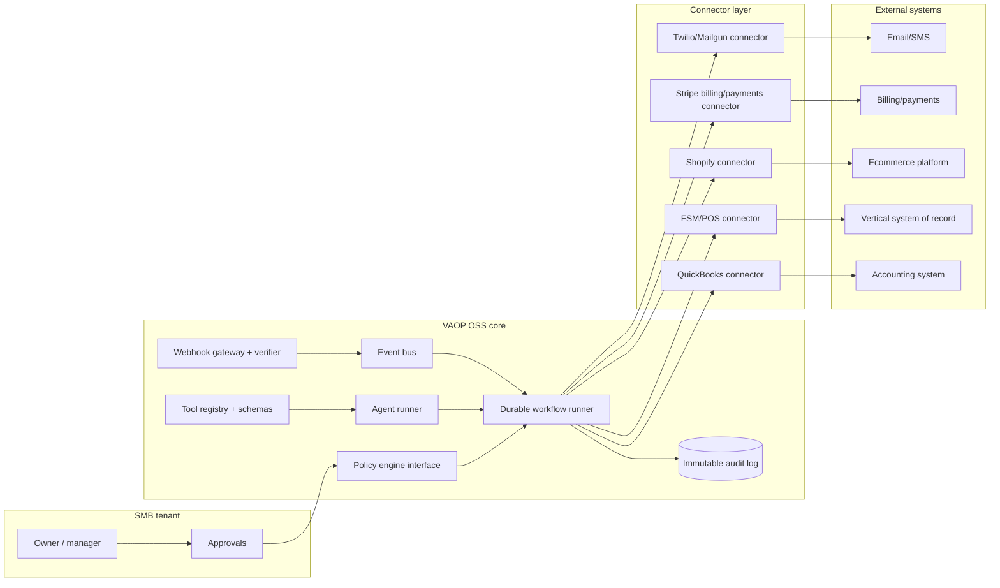
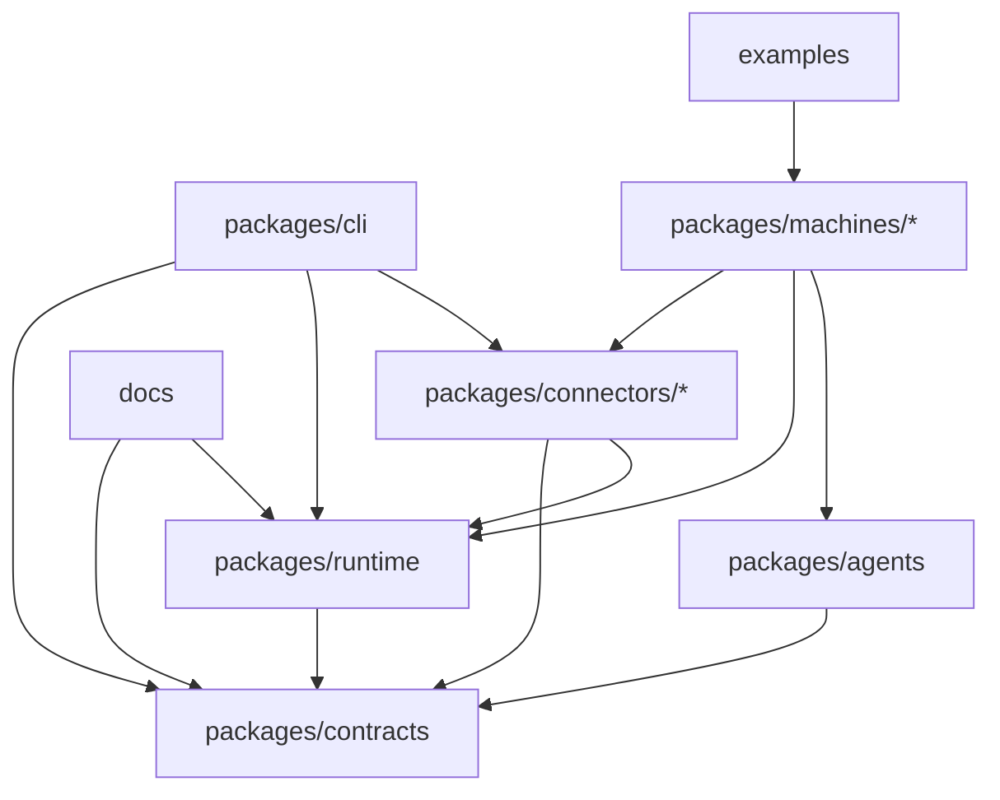

# Open-source modular agentic automation platform for a Vertical Autonomous Operations Provider

## Executive summary

An open-source GitHub project to build a modular “agentic automation component platform” for SMB operations—so that operators can assemble a **Vertical Autonomous Operations Provider (VAOP)** for trades, hospitality (restaurants/pubs), and retail—is technically feasible and strategically plausible, but it succeeds only if the project is designed around five realities: **(1) vendor API access constraints**, **(2) stringent governance for autonomous actions**, **(3) multi-tenant security and auditability as first-class concerns**, **(4) long‑running, failure-tolerant workflow execution**, and **(5) a licensing/governance model that matches the intended commercialisation path**. citeturn0search28turn7search6turn7search1turn9search8turn5search3

From the vendor surface perspective, the “connectors first” approach is strongest because all three target verticals already have a credible system-of-record layer with developer tooling and test/sandbox environments: QuickBooks provides sandbox companies; Toast provides a sandbox environment with simulated payment processing; ServiceTitan provides an integration environment that can be a clone of production data for customers; Shopify provides dev stores and has strong API documentation (but with important constraints and migrations). citeturn4search0turn4search2turn4search6turn4search1turn1search9

However, vendor terms and approval processes materially shape what an open-source VAOP toolkit can promise. Shopify’s API terms emphasise credential secrecy, impose obligations around service providers handling merchant data, and reserve broad rights; Intuit’s developer terms explicitly reserve rights to suspend access; ServiceTitan and Toast also publish API terms that restrict misuse and can revoke permissions. This implies the project must treat each connector as a “compliance adapter” with explicit capability flags, not as a guaranteed write-capable integration. citeturn7search6turn7search1turn0search28turn7search0

The economic enablement layer is agentic automation plus durable orchestration. Modern agent SDKs and tool-calling/structured outputs make it practical to generate high-quality drafts and action plans, while keeping a full trace of tool calls, guardrails, and handoffs for audit and debugging. OpenAI’s Agents SDK and Responses API documentation describes tool use, traces, and structured outputs patterns that fit this need; in parallel, an OSS durable workflow engine (e.g., Temporal) provides the “resume/retry/signal/human approval” backbone that agentic workflows need in production. citeturn9search8turn9search1turn0search3turn5search3turn5search19

Because you’re operating in en‑AU, the project should adopt an “Australia-safe” compliance baseline by default: treat payroll as regulated/high-liability, include audit trails for employee updates, and explicitly wall off BAS/tax-agent activities behind interfaces that require registered practitioners (or exclude them from the OSS scope). Australia’s Notifiable Data Breaches scheme and BAS agent registration framework are concrete regulatory anchors for defaults around breach response, data minimisation, and professional indemnity requirements. citeturn2search0turn2search4turn2search1turn2search5turn3search2

## Core architecture and recommended repo structure

### Architectural intent

The project should be positioned as an **automation substrate**: it composes repeatable “machines” (billing/AR, reviews, content, demos, reconciliation, onboarding) from three primitives:

1. **Connectors** (idempotent API adapters + webhook ingestion) for vendor systems and communications.
2. **Workflows** (durable, stateful orchestration with retries, timers, and human approvals).
3. **Agents** (policy‑bounded planners/explainers that propose actions and generate artefacts, with schema enforcement and traces). citeturn9search8turn9search1turn0search3turn5search19

This separation matters because vendor APIs are rate-limited and versioned, webhooks can be missed, and many tasks require “eventual correctness” rather than immediate correctness. For example, QuickBooks webhooks documentation recommends compensating for missed events via Change Data Capture (CDC) calls back to the last processed webhook timestamp—this is a workflow concern, not an “agent prompt” concern. citeturn0search14turn0search18

### Recommended GitHub repo/module structure

A **monorepo** with strongly isolated packages makes reuse and composition easier than many loosely related repos, because connectors, contracts, and workflow test harnesses share build tooling and fixtures. The repo should also support both **hosted multi-tenant** and **self-hosted** modes without forking (commercial differences should be configuration, not architecture). citeturn5search3turn4search1turn4search0

**Proposed top-level layout**

- `docs/` — architecture, security model, compliance notes, connector capability matrix, threat model.
- `packages/contracts/` — canonical schemas, capability flags, policy inputs/outputs (JSON Schema + OpenAPI).
- `packages/runtime/` — workflow engine integration, tenancy, event bus, audit log, approval service.
- `packages/agents/` — reusable agent templates (planning, drafting, classification), tool registry bindings, evaluation harness.
- `packages/connectors/` — one subpackage per vendor (e.g., `quickbooks`, `toast`, `servicetitan`, `shopify`, `stripe`, `twilio`, `mailgun`, `openai`), each with: OAuth/auth, rate-limit handling, webhooks, sandbox mode.
- `packages/machines/` — task-focused compositions (billing/AR, review responder, content machine, demo machine).
- `packages/cli/` — scaffolding, local dev, sandbox provisioning helpers, test runner.
- `examples/` — end-to-end reference deployments per vertical pack (trades/hospitality/retail).
- `infra/` — Kubernetes/terraform templates for hosted mode, plus docker-compose for local/self-hosted mode.

This structure explicitly mirrors how vendors segment their developer experiences: developer portals, sandbox environments, and distinct authentication models. QuickBooks provides sandbox companies and region-specific base URLs; Toast provides a sandbox environment and a developer portal environment selector; ServiceTitan provides an integration environment that for customers can be a clone of production data; Shopify provides dev stores via its developer tooling. citeturn4search4turn4search2turn4search6turn4search1turn4search17

### Module inventory table

| Module | Primary responsibility | Key external constraints / sources |
|---|---|---|
| `contracts` | Canonical data models, tool schemas, capability flags, policy input/output contracts | Schema discipline aligns with structured outputs and tool calling patterns. citeturn0search3turn9search20 |
| `runtime` | Tenancy isolation, audit log, approvals, orchestration integration, webhook ingestion | Durable workflows are required for retries/timers/human approvals in production. citeturn5search3turn5search19 |
| `connectors/*` | Vendor-specific auth, API clients, rate limiting, webhooks, sandbox tooling | Vendor rate limits and environments are explicit: QuickBooks throttles per realm/app; Shopify rate limits; ServiceTitan per-tenant limits; Twilio queueing and limits. citeturn0search6turn1search13turn0search8turn1search19turn1search1 |
| `agents` | Agent templates, tool registry, traces, eval harness | Agents SDK provides traces of tool calls and guardrails; Responses API supports built-in tools and structured outputs. citeturn9search1turn9search8turn9search4turn0search3 |
| `machines/*` | Reusable “business outcomes” packages composed from connectors + workflows + agents | Must respect regulated boundaries (e.g., tax/BAS); enforce human approvals for payroll/tax actions. citeturn2search1turn3search2turn3search1 |
| `cli` | DX: scaffold modules, run fixtures, start local stacks, run integration tests | Strong sandbox strategy is available across target vendors (QuickBooks, Toast, ServiceTitan, Shopify, Stripe, Mailgun). citeturn4search0turn4search2turn4search6turn4search1turn1search3turn10search19 |

## Interface contracts and agent composition patterns

### Contract design goals

The internal interfaces should be:

- **Deterministic and typed** at boundaries (schemas for tool inputs/outputs, approvals, and audit events).
- **Idempotent** for all side-effecting operations (repeat-safe retries).
- **Capability-aware** (connectors may be read-only, write-limited, or environment-limited based on vendor access level).
- **Traceable** (every proposed and executed action results in an auditable event). citeturn0search14turn9search1turn0search3turn7search6

These goals are directly motivated by vendor integration realities:

- QuickBooks recommends CDC calls to backfill missed webhook events (implying you need replayable sync). citeturn0search14  
- Shopify and ServiceTitan enforce rate limits and return 429s when exceeded, requiring retry scheduling. citeturn7search10turn0search6turn0search8  
- Toast explicitly recommends an audit trail for employee updates so administrators can see what triggered changes (implying you must emit causality metadata into your own log). citeturn0search1turn0search5turn4search5  

### Recommended internal APIs

A practical pattern is to define three core interfaces in `contracts`:

**Connector interface (capability-first)**  
- `capabilities(): CapabilitySet` (read/write scopes, entities, webhook support, sandbox availability)  
- `read(query): Page<Result>`  
- `write(command): WriteReceipt` (requires idempotency key; may be “not supported”)  
- `webhook.verifyAndParse(request): Event[]`  
- `sync.reconcile(cursor): SyncReport` (CDC/backfill equivalent)

The design is grounded in documented vendor behaviours: QuickBooks has explicit throttles and recommends backfill via CDC; ServiceTitan and Shopify publish rate limits; Toast’s APIs and environment separation (sandbox vs production) are explicit. citeturn0search14turn0search6turn0search8turn1search13turn4search2

**Machine interface (durable workflow with optional agent planner)**  
- `plan(context) -> ProposedActionSet` (agent-generated, schema-validated)  
- `approve(actionSet, approver) -> ApprovedActionSet` (policy gate; human approvals)  
- `execute(approvedActionSet) -> ExecutionReport` (connector actions with retries)  
- `explain(report) -> HumanReadableSummary` (agent-generated narrative + linked audit trail)

This aligns with agent SDK patterns: tool calling produces actions; tracing is used for debugging and audit; structured outputs enforce schemas. citeturn9search8turn9search1turn0search3turn9search20

**Policy/approval interface (explicit governance)**  
- `evaluate(policyInput) -> policyDecision` (allow/deny/needsApproval + reasons)  
- `thresholds` (spend limits, payroll run gates, customer-impacting messages)  
Using a policy engine is not required, but it is a strong fit for enforcing consistent guardrails across “machines”. The Open Policy Agent project exists specifically to unify policy enforcement across systems via policy-as-code and APIs. citeturn6search3turn6search11turn6search19

### Tool schemas and structured outputs

For agent-tool composition, the most robust approach is:

- Define tool contracts as **JSON Schema** in `contracts/`.
- Generate language bindings (TypeScript + Python) and tool wrappers.
- Use structured outputs/function calling so the model must produce schema‑valid calls. citeturn0search3turn9search20turn9search4

This is directly supported by OpenAI’s structured outputs guidance, which explains structured output via function calling and JSON schema response formats. citeturn0search3turn9search20

## Reuse inventory: OSS building blocks and vendor APIs

### Vendor APIs and environments to prioritise

Your target connectors are viable largely because each vendor provides explicit development and testing paths:

- QuickBooks: sandbox companies “look and act” like normal companies; developer documentation covers rate limits and throttling; webhooks have recommended reliability practices. citeturn4search4turn0search6turn0search14turn0search2  
- Toast: sandbox environment is intended for development/testing, with simulated payment processing; labour API covers employee/jobs/shifts; standard API access has explicit requirements; partner integrations require a partnership process. citeturn4search2turn0search5turn0search21turn7search16turn7search4  
- ServiceTitan: integration environment exists, and for customers it can be a clone of production data; default rate limit is documented; API terms restrict abuse. citeturn4search6turn0search8turn0search28turn4search9  
- Shopify: REST Admin API is described as legacy, with a requirement that new public apps use GraphQL Admin API; dev stores are a standard testing mechanism; protected customer data access is approval-gated; API terms constrain credential handling and third-party service provider obligations. citeturn1search9turn4search1turn7search18turn7search6  
- Stripe: test mode and sandboxes support safe testing; Connect OAuth supports multi-party accounts (useful for VAOP multi-tenant); invoices and invoicing APIs support automated invoice creation; webhook docs define event delivery for real-time workflows; security guidance frames PCI responsibility as shared. citeturn1search3turn1search0turn1search14turn10search16turn1search22turn1search6  
- Twilio: subaccounts help segment usage per customer; documentation covers rate limits/queues; messaging services are recommended for higher volume complexity. citeturn1search4turn1search1turn1search19turn10search2  
- Mailgun: documentation includes API key management with granular access control and role-based auth; webhooks and test mode support safe integration tests without sending real email. citeturn1search5turn1search20turn10search19turn1search24  

### Existing OSS projects to reuse

A critical design choice is whether your project includes its own agent runtime and orchestration, or composes existing OSS. The evidence strongly favours composition: mature projects exist for agent orchestration, durable execution, policy enforcement, and integration token management.

**Agent frameworks and SDKs**
- OpenAI Agents SDK (Python and JS/TS) provides primitives for instructions/tools/handoffs and tracing. citeturn9search8turn9search1turn9search5turn9search6  
- LangChain/LangGraph are MIT-licensed frameworks for agents and agent graphs. citeturn5search0turn5search12  
- LlamaIndex is MIT-licensed and focuses on agents over data; its Workflows subproject is explicitly an event-driven workflowing approach. citeturn5search1turn5search5  
- Microsoft Agent Framework and AutoGen are MIT-licensed options with multi-agent workflow patterns (useful if you want model-provider flexibility and enterprise integration). citeturn5search6turn5search2turn5search14  

**Durable workflow/orchestration**
- Temporal is an MIT-licensed durable execution platform designed for resilient workflows with retries and long-running state. citeturn5search3turn5search19turn5search7  

**Policy-as-code**
- Open Policy Agent is an open source policy engine with APIs for unified policy enforcement. citeturn6search3turn6search11  

**OAuth/token management & connector scaffolding**
- Nango offers integration infrastructure under the Elastic License (source-available, not OSI-approved), explicitly positioned as a layer for API access and token management; it is structurally relevant, but its licence and commercial model must be considered carefully if you want a pure open-source stack. citeturn6search0turn2search3  

**Data movement connectors**
- Meltano is MIT-licensed and, via Singer taps/targets, provides a large ecosystem of connector patterns; individual taps can have restrictive licences (e.g., AGPL), which matters if you plan to reuse code directly. citeturn6search26turn6search34turn8search22  
- Airbyte’s connector ecosystem is extensive but includes Elastic License coverage for some components, reinforcing that open connector platforms often shift away from OSI licences for commercial reasons. citeturn6search21turn6search5turn2search3  

### Reuse candidate comparison table

| Need | Best-fit reuse candidate | Why it fits | Licence note |
|---|---|---|---|
| Durable orchestration + retries + human approvals | Temporal | Designed for resilient, long-running workflows and retries; supports production reliability patterns. citeturn5search3turn5search19 | MIT (per project positioning and repo). citeturn5search3turn5search7 |
| Agent primitives + tracing | OpenAI Agents SDK | Built-in tracing and tool-call/event records; explicit support for handoffs and traces. citeturn9search1turn9search8 | MIT. citeturn9search3turn9search6 |
| Policy gating for autonomous actions | Open Policy Agent | Purpose-built policy-as-code engine with simple APIs for policy decisions. citeturn6search11turn6search19 | Apache-style permissive (project licence text describes permissive conditions and patent grant). citeturn6search7 |
| OAuth/token storage service | Nango | Explicitly designed for integration OAuth flows and token management. citeturn6search8turn6search0 | Elastic License (not OSI-approved). citeturn6search0turn2search3 |
| Connector build patterns | Meltano / Singer | Large ecosystem; code-first connector scaffolding. citeturn6search26turn6search14 | Mixed; some taps are AGPL. citeturn6search34turn8search22 |

## Security, data governance, and compliance requirements

### Baseline threat model for a VAOP automation toolkit

A VAOP toolkit necessarily touches high-risk data and actions:

- Payroll and employee data (identity, pay rates, hours), where AU employers have record-keeping and pay slip obligations, and records must be retained for years. citeturn3search4turn3search1turn3search18  
- Customer contact data (marketing/email/SMS) and review interactions—privacy and consent risks are amplified if the platform is multi-tenant. citeturn11search5turn11search2  
- Payment flows (billing/AR) where PCI DSS scoping must be explicitly designed and documented. citeturn2search2turn1search6turn7search7  

Accordingly, the project must treat “security defaults” as part of the public API: safe-by-default tenancy isolation, least-privilege credentials, audit trails, and a hard separation between “drafting” and “executing”.

### PCI: design to minimise scope

The Payment Card Industry Data Security Standard provides technical and operational requirements designed to protect payment account data, and any system that stores/processes/transmits cardholder data can be pulled into scope. citeturn2search2turn2search6  
Stripe’s security and integration guidance frames PCI as a shared responsibility and describes architectural isolation of card data within Stripe’s infrastructure, supporting the standard best practice: **avoid handling PAN/card data directly**, and architect around tokens and processor-hosted UIs wherever possible. citeturn1search6turn7search7turn1search10

**Open-source project implication:** the billing/AR machine should integrate at the “invoicing and payment intent” layer and explicitly prohibit storage of card details in the toolkit’s data stores. Your `contracts` module should include a “PCI-scope invariant” (no PAN fields anywhere) and enforce it in CI.

### Privacy law: AU defaults and portability

As of the OAIC’s published guidance, most small businesses (≤$3m turnover) are not covered by the Privacy Act, but some are; importantly, the **operator of a hosted VAOP platform** may itself be covered by the Privacy Act depending on turnover and activities, and the platform’s customers may also be covered depending on their sector and behaviour. citeturn11search0turn11search11turn2search4  
The OAIC also documents that eligible data breaches likely to cause serious harm must be notified to affected individuals and the OAIC (Notifiable Data Breaches scheme), implying that incident response must be a built-in operational capability, not an afterthought. citeturn2search0turn2search8turn2search12

**Open-source project implication:** include an opinionated incident-response playbook and logging/trace retention guidance in `docs/`, and bake “data minimisation + purpose limitation” into connector contracts (only request/store data needed for the machine’s function). citeturn11search2turn11search30turn2search0

### Payroll and TAS/BAS boundaries in Australia

For payroll, Australia has explicit employer reporting obligations under Single Touch Payroll; the ATO provides employer reporting guidelines for STP. citeturn3search2turn3search5  
For BAS services, the Tax Practitioners Board states that providing BAS services for a fee generally requires registration, and includes professional indemnity insurance obligations and qualification pathways. citeturn2search1turn2search5turn2search21turn2search25

**Open-source project implication:** the payroll connector should be designed as “data movement + validation + submission workflow scaffolding” with explicit human approval checkpoints, and the toolkit should avoid packaging anything that could be construed as BAS/tax-agent services unless it is explicitly a “registered practitioner plug-in” (and documented as such). citeturn2search1turn3search2

### Co-employment and HR control risks

Even if the OSS project is “just software”, VAOP implementations that provide HR/payroll operations can drift into employer-like control patterns; this is why many jurisdictions develop doctrines like co-employment/joint employer concepts. Industry guidance describes co-employment as a contractual allocation/sharing of employer responsibilities in PEO contexts. citeturn2search1turn2search17turn11search0

**Open-source project implication:** bake an “authority boundary” into the approval model: the platform can draft, validate, and queue actions, but employer-of-record decisions (hiring/firing, disciplinary actions, pay changes) must explicitly require business-side authorisation.

### Vendor terms shape your connector promises

Three examples show why your connectors must advertise capability and comply with strict credential handling:

- Shopify’s API terms require keeping API credentials secure and restrict sharing; they also impose obligations if you use a service provider to process merchant data. citeturn7search6turn7search18  
- Intuit’s developer terms explicitly reserve the right to revoke/suspend access and remove apps from marketing channels. citeturn7search1  
- Toast’s API access requirements include subscription and permissions, and its partnership process requires agreements for partner integration. citeturn7search16turn7search4  
- ServiceTitan’s API terms include restrictions against circumventing documentation or API limits. citeturn0search28turn0search8  

## Licensing, contributor governance, deployment patterns, monetisation, roadmap, and risks

### Licensing strategy

The licence decision should follow the intended adoption and commercialisation model:

- If the goal is **maximal ecosystem adoption** (other operators building machines/connectors), choose a permissive OSI-approved licence—typically **Apache 2.0**. Apache 2.0 is OSI-approved and includes explicit licence text and SPDX identifiers; OSI maintains the canonical list of licences that meet the Open Source Definition. citeturn8search19turn2search3turn2search27  
- If the goal is to prevent cloud “strip-mining” by hosted competitors, consider **AGPL** for strong copyleft, but expect meaningful adoption friction in SMB SaaS contexts (legal review overhead). SPDX provides canonical identifiers and differentiates “only” vs “or later”. citeturn8search22turn8search3turn2search3  
- If you want “open-ish” source with commercial protection, you would leave OSI territory (e.g., Elastic Licence patterns used by some integration tools), but that contradicts a strict “open-source project” positioning and can fragment community trust. citeturn6search0turn2search3turn6search25  

**Recommendation:** Apache 2.0 for the core platform + a clear trademark policy (trademark policy not covered here, but operationally important). Apache 2.0 plus strong governance/brand controls tends to be the cleanest path if the monetisation is “hosted VAOP platform + enterprise features + partner programme”.

### Contributor governance and supply-chain security

A credible OSS VAOP toolkit must be harder to compromise than the average OSS repo because it will handle OAuth secrets, payroll data, and automation with real-world effects.

Recommended governance primitives:

- Adopt a code of conduct such as the Contributor Covenant (widely used in OSS) to set participation standards. citeturn8search0turn8search8  
- Use **DCO sign-offs** (Developer Certificate of Origin) to reduce contribution IP risk without heavy CLAs; DCO text and Linux Foundation guidance define the sign-off concept. citeturn8search1turn8search5turn8search13  
- Use an automated supply-chain posture tool such as OpenSSF Scorecard; OpenSSF describes Scorecard as automated checks to assess security risks in open source projects, and the official GitHub Action exists to run it. citeturn8search10turn8search14turn8search35  
- Require SPDX licence headers and an SBOM process; SPDX maintains the canonical licence list and identifiers. citeturn8search3turn8search32  

### Deployment patterns: multi-tenant SaaS vs self-hosted vs hybrid

The project should explicitly support three deployment modes, because vertical operators have different risk appetites and data residency preferences:

**Hosted multi-tenant SaaS (commercial default)**  
- Strongest DX and fastest iteration, but highest security burden.  
- Tenancy isolation must include per-tenant encryption keys, strict OAuth secret segregation, and audit logs.  
- Twilio subaccounts are a first-class pattern for segmenting customer usage and lifecycle (create/deactivate per customer). citeturn1search4turn1search11  
- Stripe Connect OAuth supports multi-party models where each customer can connect their own Stripe account (useful for “VAOP as platform”). citeturn1search14turn1search0  

**Self-hosted (community and regulated purchasers)**  
- Leverages the same code, but moves operational burden to adopters.  
- Sandbox strategies remain valuable: QuickBooks sandbox companies, Toast sandbox environment, ServiceTitan integration environment, Shopify dev stores, Stripe test mode/sandboxes, Mailgun test mode. citeturn4search4turn4search2turn4search6turn4search1turn1search3turn10search19  

**Hybrid (control plane hosted; data plane self-hosted)**  
- Often the best compromise for a VAOP tool: hosted orchestration/monitoring while sensitive connectors run in customer VPC.  
- Particularly relevant where vendor terms restrict credential sharing and require service provider agreements (Shopify), or where payroll/employee data sensitivity is high. citeturn7search6turn3search4turn0search1  

### Sample developer experience (DX) expectations

A compelling OS project here is essentially a “toolkit + scaffolder”. Your CLI should prioritise:

- Connector scaffolding (`new connector`) with OAuth boilerplate, webhook verification, and rate-limit backoff defaults (429 handling). Shopify explicitly documents rate limiting and retry headers; QuickBooks and ServiceTitan publish throttles. citeturn7search10turn0search6turn0search8  
- Sandbox bootstrap (`sandbox init`) that guides users to QuickBooks sandbox companies and Toast/ServiceTitan test environments. citeturn4search4turn4search2turn4search6  
- Machine templates (`new machine billing-ar`) that include: policy gates, approval steps, and idempotency patterns.  
- Trace viewing (`trace tail`) that hooks into the agent SDK trace facilities (or OpenTelemetry exporter) so developers can debug tool calls and guardrails. citeturn9search1turn9search29turn9search33  

Example CLI sketch (illustrative):

```bash
vaop init --mode self-hosted
vaop connector new quickbooks --lang ts
vaop connector test quickbooks --sandbox
vaop machine new billing-ar --stripe --quickbooks
vaop machine run billing-ar --tenant demo_pub_01 --dry-run
vaop approvals list --tenant demo_pub_01
vaop approvals approve <approval_id>
vaop trace tail --tenant demo_pub_01
```

This DX model is consistent with how vendors encourage testing: Shopify CLI connects to dev stores, QuickBooks provides sandbox companies, Stripe has test mode/sandboxes, Mailgun offers test mode, and Toast/ServiceTitan provide sandbox/integration environments. citeturn4search1turn4search4turn1search3turn10search19turn4search2turn4search6  

### Integration testing and sandbox strategy

To avoid “works on my machine” connectors, require each connector to implement a standard test suite:

- **Contract tests**: schema validation for read/write models; idempotency invariants.  
- **Sandbox smoke tests**: use vendor test environments where available: QuickBooks sandbox, Toast sandbox, Shopify dev store, Stripe test mode/sandboxes, Mailgun test mode; ServiceTitan integration environment where credentials allow. citeturn4search4turn4search2turn4search1turn1search3turn10search19turn4search6  
- **Webhook replay tests**: validate verification and “missed event” backfill logic, following vendor guidance such as QuickBooks CDC backfill. citeturn0search14turn1search22turn1search20  
- **Rate-limit tests**: prove exponential backoff and queueing under published constraints (Shopify, QuickBooks, ServiceTitan). citeturn7search10turn0search6turn0search8  

### Monetisation and commercialisation paths

A pure permissive-licence OSS core can be monetised via:

- **Hosted managed service** (multi-tenant VAOP control plane): mirrors how some durable execution platforms monetise (open source core + hosted cloud). citeturn5search7turn5search3  
- **Enterprise features** delivered as separate closed modules (SSO, advanced compliance, dedicated tenancy).  
- **Partner programme** for vendors and operators, acknowledging real partner agreement gates (Toast partner process explicitly includes partner agreements before moving forward). citeturn7search4turn4search11  
- **Connector maintenance contracts** (guaranteed compatibility windows and response SLAs), which addresses the reality that vendor APIs change, rate limits evolve, and access can be revoked. citeturn7search1turn7search6turn0search28  

If you choose a non-OSI licence (Elastic-style), you’re moving toward “source-available” monetisation patterns (as seen in Nango and parts of the Airbyte ecosystem), but that should be a deliberate branding decision since OSI defines what qualifies as open source. citeturn6search0turn6search21turn2search3  

### Twelve-month roadmap and milestones

A realistic roadmap should optimise for **one vertical pack** first (hospitality or trades), because vendor access and data models differ materially.

**Months 0–3: foundation and contracts**
- Publish `contracts` module (schemas, capability flags, audit event model) and a security model doc.
- Ship `runtime` MVP: tenancy, approvals, audit log, webhook ingestion, policy interface.
- Choose and integrate an agent SDK with tracing enabled by default for debugging. citeturn9search1turn9search8turn6search11  

**Months 3–6: first vertical pack and two machines**
- Implement 3–4 connectors with sandbox support: QuickBooks + Stripe + Mailgun/Twilio + either Toast or ServiceTitan (choose one vertical). citeturn4search4turn1search3turn10search19turn1search4turn4search2turn4search6  
- Deliver two “machines” end-to-end:
  - Billing/AR machine: invoice creation + reminders + reconciliation workflow (Stripe invoices + webhooks + QuickBooks posting, all gated by approvals). citeturn10search16turn10search20turn1search22turn0search6  
  - Review responder machine: ingestion + draft responses + policy gates (API for review platforms would be added later; machine can start as “draft generator + queue”).  
- CLI scaffolding and local stack.

**Months 6–9: operational hardening**
- Add durable workflow engine integration (or formalise your own retry/schedule system), focusing on replay, compensation, and human-in-the-loop signals. citeturn5search3turn5search19  
- Build structured evaluation harness for agent outputs (schema validity, action proposal quality, refusal correctness). citeturn0search3turn9search17  
- Add OpenSSF Scorecard, security policy, and secret scanning defaults. citeturn8search10turn8search14  

**Months 9–12: expand machines, add second vertical pack**
- Content machine: multi-channel campaign drafts and scheduling with guardrails (bounded by consent and privacy guidance). citeturn11search5turn11search9turn10search2turn1search20  
- Demo machine: deterministic “synthetic tenant” generation from sandbox sources (Shopify dev store test data, QuickBooks sandbox data). citeturn4search1turn4search4turn4search29  
- Second vertical pack (whichever you didn’t choose first): integrate its system-of-record connector and map core machines.

Success criteria by month 12 should be framed in terms of reusability and safety, not “number of agents”:
- ≥80% of machine actions are either A) safely autonomous under policy or B) correctly queued for approval.
- Rehydration and replay correctness demonstrated (webhook miss simulation + CDC/backfill). citeturn0search14turn1search22  
- Clear capability matrices for each connector under varying levels of vendor access (e.g., Toast standard API access vs partner integration). citeturn0search5turn7search16turn7search4  

### Key risks and mitigations

**Risk: vendor access gating breaks “plug-and-play” promises**  
Toast’s standard API access has explicit requirements (employee status, subscription level, permissions) and partner integrations introduce commercial agreements; Shopify requires compliance with API terms and protected data approvals. Mitigation: capability discovery, graceful degradation (read-only modes), and explicit “connector maturity levels”. citeturn7search16turn7search4turn7search18turn7search6  

**Risk: API changes and deprecations undermine long-term stability**  
Shopify’s REST Admin API is labelled legacy with public-app GraphQL requirements; OpenAI’s platform has documented deprecations (e.g., Assistants API deprecation timeline and model deprecations). Mitigation: versioned connectors, contract tests, pinned API versions, and a “compatibility window” policy. citeturn1search9turn0search11turn9search7  

**Risk: security incidents from token handling and webhook exposure**  
Mailgun emphasises role-based access controls for API keys; Twilio documents secure API best practices and rate limits; Shopify terms emphasise credential secrecy. Mitigation: secrets vault integration, short-lived tokens where possible, mandatory webhook signature verification, and strict separation between tenants. citeturn1search5turn1search11turn7search6turn1search20  

**Risk: regulated-scope creep (payroll/BAS/tax)**  
TPB registration rules and PI insurance obligations exist for BAS services; Fair Work and ATO obligations create legal exposure if automation “submits” without proper authority. Mitigation: hard-coded approval gates, “registered practitioner plug-in” boundaries, and conservative defaults (draft-only outputs for tax/BAS). citeturn2search1turn2search5turn3search1turn3search2  

## Mermaid diagrams

### System architecture



### Repo dependency graph

