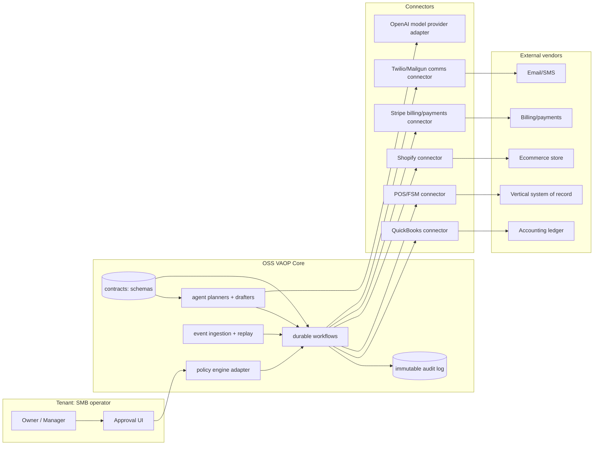
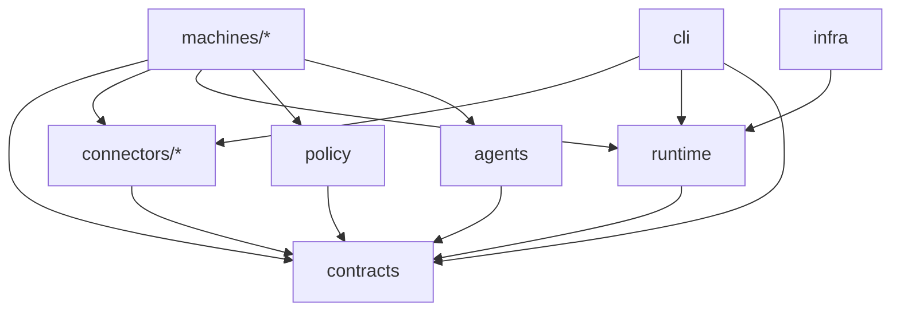

# Open-source agentic automation ecosystem for assembling Vertical Autonomous Operations Provider platforms on entity["company","GitHub","code hosting platform"]

## Executive summary

A modular open-source platform for “agentic operations components” (connectors + durable workflows + policy gates + agent planners) is a credible way to accelerate the creation of **Vertical Autonomous Operations Provider (VAOP)** offerings for SMB verticals (trades, restaurants/pubs, retail). The key is to treat **agent autonomy as an execution problem, not a prompting problem**: reliable VAOP automation requires (a) durable workflow orchestration, (b) strict interface contracts (JSON Schema/OpenAPI), (c) idempotent writes and replay-safe event ingestion, (d) capability flags for connectors (because vendor access differs per tenant and per partner tier), and (e) auditable human-in-the-loop checkpoints for regulated or high-liability actions. citeturn10search4turn10search2turn0search6turn3search22turn0search1

The primary constraint is not model quality; it’s **ecosystem friction**. Several “system-of-record” vendors expose strong APIs and sandboxes, but access is frequently gated by partner programs or additional approvals (for example, Toast hostnames/credentials are issued by Toast’s integrations team and production access is tied to approval; Shopify gates “protected customer data” and specific identifying fields behind review/approval and enforcement; Intuit reserves broad rights to revoke/suspend API access). These factors force connector implementations to degrade gracefully, separate “read vs write” capabilities, and support “manual bootstrap” steps. citeturn12search2turn13search0turn5search0turn4search1

From a security perspective, recent supply-chain incidents in the agent ecosystem (notably OpenClaw’s “skills” marketplace being used to distribute malicious extensions) show that “ecosystem extensibility” is also an attack surface. An OSS VAOP project must bake in provenance, scanning, permissioning, and least-privilege defaults from day one—especially because VAOP automations touch payroll, customer comms, and payments. citeturn12search20turn12search12turn0news38

**Assumptions used in this report:** (1) English (en‑AU) and date context 15 Feb 2026; (2) region is “default AU where regulatory baselines are needed”, otherwise vendor APIs are treated as global; (3) the target is a modular platform that can be deployed as multi-tenant SaaS, self-hosted, or hybrid; (4) the VAOP operator wants to remain on the “operations automation” side rather than providing regulated tax/BAS advice directly unless properly registered/licensed. citeturn7search6turn7search1turn9search3

## Landscape survey of OSS frameworks, engines, connector platforms, and protocols

The VAOP build stack tends to decompose into four layers: **agent frameworks**, **durable workflow engines**, **connector/data-movement platforms**, and **policy/tooling protocols**. Below is a survey of the most relevant open-source options, including OpenClaw-style agent ecosystems.

image_group{"layout":"carousel","aspect_ratio":"1:1","query":["LangChain logo","OpenAI Agents SDK logo","Temporal workflow engine logo","Open Policy Agent OPA logo","Airbyte logo","OpenClaw logo"],"num_per_query":1}

### Framework and engine candidates

| Component class | Project / ecosystem | Licence and openness | What it is (primary description) | Maturity and fit for VAOP components |
|---|---|---|---|---|
| Agent SDK | OpenAI Agents SDK (by entity["company","OpenAI","ai company"]) | MIT (SDK is open source). citeturn3search6turn3search0 | An agent SDK designed to build agentic apps with tools, handoffs, streaming, and full traces. Tracing is enabled by default and captures LLM generations, tool calls, guardrails, and events. citeturn3search22turn0search5 | Strong fit when you want deterministic tool schemas + traceability as first-class primitives. Particularly aligned with a VAOP platform’s need for audit, debugging, and “why did the agent do that?” explainability. citeturn0search5turn0search1 |
| Agent framework | LangChain | MIT. citeturn1search0turn1search4 | A widely used open-source framework for building LLM apps and agents, with a large integration ecosystem. citeturn1search4turn1search28 | Good for prototyping and broad tool support. For VAOP production, you usually still need a separate durability layer (long-running workflows, human approvals, retries) because “agent loops” ≠ durable execution. citeturn0search6turn10search4 |
| Agent graph/orchestration | LangGraph | MIT (library). citeturn1search1turn1search5 | A low-level orchestration framework for long-running, stateful agents. citeturn1search5 | Useful for modelling multi-step agent state machines. Note: “LangGraph Platform / server” may introduce production licensing requirements (e.g., docs note licence key for production usage for the API server command). citeturn1search17 |
| Agent framework over data | LlamaIndex | MIT. citeturn1search2turn1search6 | A framework for building LLM-powered agents over your data. citeturn1search6 | Strong when VAOP workflows depend on document-heavy operations (contracts, invoices, emails). Still requires durable orchestration and governance if it will execute actions, not just answer questions. citeturn0search6turn0search1 |
| Multi-agent framework | AutoGen | Mixed: code under MIT; documentation/content under CC BY 4.0 (per repository legal notice). citeturn1search11turn1search23 | A framework for multi-agent applications; repo notes new users should check Microsoft Agent Framework, while AutoGen continues with bug fixes/security patches. citeturn1search11turn1search15 | Strong for research/prototyping multi-agent cooperation, but for VAOP you want predictable, auditable executions; treat it as a modelling tool, not your core execution substrate. citeturn0search6turn0search5 |
| Durable workflow engine | Temporal | MIT (server and major SDKs are MIT). citeturn0search2turn0search6turn0search12 | A durable execution platform where workflows execute resiliently, automatically handling failures and retries. citeturn0search6 | Excellent VAOP backbone: retries, timeouts, scheduled tasks, and human approvals are native patterns in durable workflows. Temporal also explicitly supports both self-hosted and hosted cloud paths. citeturn0search6turn0search21 |
| Policy engine | Open Policy Agent (OPA) | Apache 2.0; CNCF Graduated project. citeturn2search4turn2search8 | A general-purpose policy engine for unified, context-aware policy enforcement across the stack. citeturn2search4 | Strong fit for a VAOP platform because it separates “what is allowed” (policy) from “how work executes” (workflows/agents). This is valuable for approvals (ad spend, payroll submission, refunds) and consent enforcement. citeturn2search16turn13search0 |
| Tool integration protocol | Model Context Protocol (MCP) (introduced by entity["company","Anthropic","ai company"]) | Open protocol; reference servers exist as OSS. citeturn3search35turn3search12turn3search2 | A standard way to connect LLM apps to external tools/data via MCP servers and clients. citeturn3search35turn3search12 | Useful for connector modularity and DX. However, MCP alone is not a security control; you still need sandboxing, permissions, and supply-chain hygiene (see OpenClaw skill incidents). citeturn12search12turn12search20 |

### Connector and data-movement platform candidates

| Class | Project | Licence and openness | What it focuses on | VAOP-specific suitability (constraints and leverage) |
|---|---|---|---|---|
| ELT/data movement platform | Airbyte | Airbyte connectors largely ELv2; Airbyte Protocol is MIT; Airbyte Cloud/Enterprise are closed source and require commercial licensing. citeturn0search10turn0search13 | Large ecosystem of connectors; strong for replication into a warehouse or lake. citeturn0search10 | Useful if your VAOP platform needs analytics replication. But ELv2 restrictions are material: Airbyte’s ELv2 terms restrict offering the software as a hosted/managed service to third parties. That conflicts with “VAOP as hosted platform” unless you separate components or negotiate. citeturn0search13turn0search3 |
| “Integrations as code” | Nango | “Elastic licence” / source-available; repo describes free self-hosted with limited features and paid cloud/enterprise. citeturn2search1turn2search9 | OAuth/token management + integration functions with a CLI and deployment. citeturn2search9 | Very aligned to the “connector plane” problem (tokens, refresh, scheduled sync). But licence is not OSI-approved open-source in the traditional sense, so embedding it into an Apache-licensed VAOP core needs legal/strategic decisions. citeturn2search1turn8search3 |
| Data integration engine | Meltano | MIT. citeturn2search2turn2search22 | Code-first data integration leveraging Singer taps/targets and a large plugin hub. citeturn2search22turn2search18 | Strong for building and running extract/load pipelines. For VAOP automation you may still need “action connectors” (write paths) and durable orchestration; Singer is mostly about moving data, not executing business actions. citeturn2search19turn0search6 |
| Connector spec ecosystem | Singer | Open standard for “taps” and “targets”. citeturn2search19turn2search14 | Defines how extraction scripts and load scripts communicate; large third-party ecosystem. citeturn2search19 | Great for ingestion and warehousing. Licence fragmentation exists in the ecosystem: some taps are AGPL, which can constrain commercial embedding. citeturn2search11turn2search3 |

### OpenClaw and “personal agent ecosystems” as relevant precedent

OpenClaw is positioned as a personal AI assistant with an agent-driven workspace (“Live Canvas”), tools (browser/canvas/nodes/cron/sessions), and actions for messaging platforms. It is MIT-licensed. citeturn0search0turn3search9

For VAOP builders, OpenClaw is relevant less as a direct dependency and more as a **case study in extensibility and security**: it demonstrates how fast an “agent + tool integrations + scheduled automation” ecosystem can grow—and how quickly extension/skill marketplaces become malware delivery channels if provenance and sandboxing are weak. citeturn12search20turn12search12turn0news38

## Agentic automation use cases and the human-in-the-loop boundary

A VAOP platform spans business functions where the cost of errors ranges from “annoying” (a bad email draft) to “catastrophic” (payroll/pay slips non-compliance, tax/BAS lodging issues, payments mishandling, privacy breaches). For that reason, a practical architecture distinguishes:

- **A0: Autonomous, policy-bounded execution** (safe, reversible, low-liability).
- **A1: Agent-proposed, human-approved execution** (high leverage, still controlled).
- **H: Human-only** (regulated advice, employment decisions, disputes, exceptions). citeturn11search0turn9search3turn7search6

### Automation potential by function

| Function | “Now” automatable (A0/A1) examples | Hard boundary (H) examples | Why the boundary exists (AU-forward rationale) |
|---|---|---|---|
| Marketing | AI-assisted campaign drafting where humans review; automated “set-and-forget” campaigns based on guest/customer data; automated email copy assistants. citeturn11search1turn11search5 | Brand repositioning; high-budget spend shifts without explicit approval; crisis comms. | Reputational and commercial risk is high; autonomy must be spend- and content-gated. citeturn2search4 |
| Reviews/reputation | Draft responses and queue for approval; consolidate review feeds; respond with pre-approved templates. ServiceTitan explicitly markets “respond quickly to reviews” and automated review requests. citeturn11search10turn11search33 | Legal threats and defamation-sensitive responses; serious customer disputes. | Human judgement needed for liability and escalations. |
| Finance/bookkeeping ops | Agentic categorisation suggestions, anomaly flagging, BAS-prep checks; QuickBooks AU describes AI agents that automate workflows and help with GST/BAS reconciliation while the business stays “in control”. citeturn11search0turn11search12 | Providing BAS services “for a fee” without registration; tax advice; signing/lodging as agent unless properly registered. | Australia has regulated tax/BAS services; BAS agent registration and PI insurance requirements exist. citeturn7search6turn7search2 |
| Billing/AR | Invoice creation and reminders; payment status monitoring; “get paid” workflows; idempotent payment operations; webhook-driven state updates. citeturn5search10turn10search2turn10search15 | Negotiated settlements/collections disputes; chargeback and fraud adjudication. | Payment and contractual disputes need human negotiation; fintech actions must be reliable, replay-safe, and auditable. citeturn9search1turn10search2 |
| Payroll/HR ops | Draft payroll runs, timesheet exception checks, compliance checklists. QuickBooks’ broader “virtual team of AI agents” messaging includes payroll and sales tax agents in its ecosystem. citeturn11search18turn11search28 | Hiring/firing decisions; industrial relations disputes; policy exceptions. | Employers must generate compliant pay slips and records; pay slips must be issued within one working day and include prescribed information. citeturn9search12turn9search3 |
| IT/support | SaaS user provisioning/deprovisioning drafts; password reset workflows; ticket triage and escalation. | Security incident response decisions; privileged access to endpoints without strong controls. | Privacy breach consequences and notification obligations under the NDB scheme if covered by the Privacy Act and likely serious harm. citeturn7search4turn7search0 |
| Sales/CRM | Lead triage from inboxes; follow-up drafts; task prioritisation. QuickBooks AU describes agents sourcing and prioritising customer opportunities from connected inboxes. citeturn11search24turn11search0 | Pricing strategy; contract negotiation; major revenue commitments. | Commercial judgement and high-context strategy remain human-dominant. |

### Practical implication for an OSS VAOP platform

A viable OSS platform should ship as **A1-first** (draft + approval + audit), then selectively graduate “safe actions” into A0 once policies, idempotency, and monitoring are proven. This also aligns with vendor platform direction: workflows increasingly promote “AI drafts, you review.” citeturn11search1turn11search0

## Reference modular architecture and repo layout for an OSS VAOP platform

A VAOP platform is best modelled as **connectors + durable workflows + policy gates + agents-as-planners**, rather than “agents that directly click around.” Durable workflows exist to handle long-running tasks, retries, and human approvals, while agents generate structured plans and content within strict schemas. citeturn0search6turn0search1turn10search4

### Core design principles and interface contracts

**Typed contracts (JSON Schema / OpenAPI) as the centre of gravity.**  
Use JSON Schema to define tool inputs/outputs and to enforce structured outputs for agent planners. OpenAI’s “Structured Outputs” guidance explicitly frames JSON Schema as a way to ensure responses follow required shapes. citeturn0search1turn0search27

**Idempotency and replay safety as non-negotiable for “machines.”**  
Stripe’s API guidance describes idempotency keys to safely retry POST requests and prevent duplicate operations; this is exactly the failure mode that breaks billing/AR and payment workflows in VAOP automation. citeturn10search2turn10search15turn10search9

**Event ingestion must plan for missed webhooks.**  
Intuit QuickBooks webhooks documentation explicitly recommends Change Data Capture (CDC) backfills to compensate for missed events and requires prompt endpoint responses (e.g., within a short timeout) to avoid retries. A VAOP platform must build “reconcile and backfill” as a standard connector capability. citeturn10search4turn10search8

**Capability flags to handle vendor access reality.**  
Because vendor access, environments, and scopes differ (Toast hostnames via integrations team; Shopify protected data approvals; ServiceTitan production only via customers), each connector should expose a capability set so workflows can degrade: read-only mode, no-webhook mode, no-sandbox mode, etc. citeturn12search2turn13search0turn4search15

### Recommended monorepo layout and module responsibilities

| Module | Responsibility | Key dependencies |
|---|---|---|
| `packages/contracts` | Canonical schemas (entities, tool I/O), capability flags, policy decision schemas | JSON Schema discipline; structured outputs. citeturn0search1 |
| `packages/connectors/*` | One package per vendor: OAuth/auth, webhooks, rate limit backoff, sandbox mode, idempotent write wrappers | Vendor sandbox + rate limits + terms. citeturn10search16turn5search2turn6search0turn12search1 |
| `packages/runtime` | Tenancy, event bus, workflow runners, audit log, approval queue | Durable orchestration (Temporal) + audit. citeturn0search6turn0search5 |
| `packages/policy` | Policy evaluation interface (OPA adapters), prebuilt “VAOP policy packs” | Policy engine; compliance-ready approvals. citeturn2search4turn2search16 |
| `packages/agents` | Planner/drafter agents with tool registry and tracing | Agent SDK + tracing. citeturn0search5turn3search22 |
| `packages/machines/*` | Outcome-focused components: billing/AR machine, review responder, content machine, demo machine, etc. | Contracts + connectors + runtime + policy. |
| `packages/cli` | Local dev, sandbox bootstrap, scaffolding, test runner | Vendor sandboxes and fixtures. citeturn4search8turn5search9turn6search3 |
| `infra/` | Helm/Terraform/docker-compose for SaaS/self-hosted/hybrid | Deployment mode patterns. citeturn0search21 |

### Mermaid system architecture



### Mermaid repo dependency graph



## Inventory of vendor APIs and sandbox/testing constraints for OSS connectors

An OSS VAOP connector layer must assume two things: (1) APIs have **rate limits and auth churn**; (2) APIs have **legal/partner constraints** that affect whether an open-source connector is “usable by anyone” vs “usable by approved partners.”

### Vendor API and sandbox matrix

| Vendor | Auth basics | Sandbox / testing options | Key constraints affecting OSS connectors |
|---|---|---|---|
| entity["company","Intuit","financial software company"] (QuickBooks APIs) | OAuth 2.0; tokens expire and must be refreshed; disconnect invalidates tokens. citeturn4search5 | Sandbox companies: region-specific, up to 10, active two years (per portal docs); sandbox base URL exists. citeturn4search0turn4search4 | Explicit rate limits (e.g., per-realm/per-app) and webhook reliability guidance requiring CDC backfill; Intuit reserves right to revoke/suspend API access. citeturn10search16turn10search4turn4search1 |
| entity["company","Toast","restaurant POS company"] | API credentials and environment access are managed through Toast partner integration process. citeturn12search22turn12search5 | Toast sandbox has simulated payment processing; hostnames issued by Toast integrations team; production hostnames after approval. citeturn12search2turn4search2 | Strong partner gating: sandbox/prod hostnames are not public; API Terms of Use govern authorised access; partner agreement required to proceed in integration process. citeturn12search1turn12search5turn12search2 |
| entity["company","ServiceTitan","field service software company"] | OAuth + app keys; integration/prod environments have distinct endpoints and tenant/customer-controlled credentials. citeturn4search15turn4search11 | Integration environment exists with separate domains; production access only for customers; documented default rate limits. citeturn4search15turn4search7turn4search3 | Customer-mediated production access; rate limits (e.g., 60 calls/sec per app per tenant); API Terms of Use apply. citeturn4search7turn4search19 |
| entity["company","Shopify","ecommerce platform company"] | OAuth for apps; strict credential handling requirements. citeturn5search0turn5search9 | Dev stores for safe testing; can generate test data. citeturn5search9turn5search1 | API terms prohibit sharing API credentials with third parties; “protected customer data” and fields (name/email/phone/address etc.) require requests/approval and can be enforced at runtime. citeturn5search0turn13search0turn13search1 |
| entity["company","Stripe","payments company"] | API keys; OAuth for Connect; webhooks for events. citeturn5search10turn5search3turn5search7 | Explicit test mode and Sandboxes; extensive webhook testing guidance. citeturn5search2turn5search6 | Strong idempotency guidance and tooling; safe retries depend on Idempotency-Key usage. citeturn10search2turn10search15turn10search9 |
| entity["company","Twilio","communications platform company"] | Account + Auth Token; subaccounts supported through REST API. citeturn6search0 | Subaccounts and messaging services support segmented use; rate limits/queues documented. citeturn6search1turn6search0 | Throughput/queue constraints vary by channel; for multi-tenant VAOP, subaccounts are a practical boundary for billing/log separation. citeturn6search0turn6search1 |
| entity["company","Mailgun","email delivery service company"] | API keys; RBAC keys support least privilege. citeturn6search2turn6search26 | Sandbox domains + “test mode” allow safe non-delivery testing; sandbox recipients are authorised. citeturn6search3turn6search7 | RBAC keys and IP allowlists are relevant for tenant isolation; test mode reduces accidental sends during CI. citeturn6search2turn6search7turn6search26 |
| OpenAI Responses/Agents | Tools include web search and file search; agents can use tools with traceability. citeturn3search4turn3search7turn0search5 | No “sandbox” in the same sense; safety requires environment separation and data minimisation. | Treat model calls as untrusted; enforce schemas (structured outputs) and do not pass secrets unless strictly needed. citeturn0search1turn0search5 |

### How these constraints shape OSS connector design

A reusable connector package should explicitly encode:

- **Access tier** (Dev-only vs partner-approved vs customer-provisioned), because Toast’s sandbox/prod hostnames and scopes are issued via integrations team and partner program. citeturn12search2turn12search22  
- **Data sensitivity class** (protected customer data, employee/payroll data) with enforcement pathways, because Shopify conditions access to protected customer data and identifies specific fields requiring additional approval and review. citeturn13search0turn13search1  
- **Rate-limit and retry contracts**, because QuickBooks and ServiceTitan publish concrete throttles, and Stripe recommends idempotency keys on POST. citeturn10search16turn4search7turn10search9  
- **Reconciliation/backfill methods**, because QuickBooks webhooks explicitly recommend CDC backfills for missed events (and similar patterns exist across webhook-based APIs). citeturn10search4turn5search10  

## Security, data governance, and AU compliance defaults

A VAOP platform touches: payments, payroll, financial ledgers, customer contact data, and potentially regulated tax/BAS workflows. The OSS project should therefore define strong defaults suitable for Australia, even if deployments are global.

### Privacy and breach response baselines

The entity["organization","Office of the Australian Information Commissioner","privacy regulator australia"] explains that under the Notifiable Data Breaches (NDB) scheme, organisations covered by the Privacy Act must notify affected individuals and the OAIC when a breach is likely to result in serious harm. The OAIC also notes there is generally a maximum of 30 days to assess whether a breach is likely to result in serious harm. citeturn7search4turn7search8

For SMB VAOP designs, two nuances matter:

- Not all small businesses are covered by Australia’s Privacy Act (OAIC defines a small business as ≤$3m annual turnover, with exceptions), but a VAOP operator or hosted platform may be covered depending on turnover and activities; therefore, building NDB-ready controls remains prudent. citeturn7search1turn7search5  
- “Protected customer data” restrictions can also be imposed contractually by platforms even when local law is permissive—Shopify’s protected customer data scope controls are a practical example of platform-enforced privacy controls. citeturn13search0turn13search1  

### Payroll, record-keeping, and operational compliance

The entity["organization","Fair Work Ombudsman","workplace regulator australia"] provides that employees must receive pay slips within one working day of being paid and that pay slips must include prescribed information, including details of payments, deductions, and super contributions. These requirements directly affect how far “payroll automation” can go without human verification and strong audit logs. citeturn9search12turn9search3

The entity["organization","Australian Taxation Office","tax authority australia"] publishes employer reporting guidance for Single Touch Payroll (STP), which formalises payroll reporting obligations through STP-enabled software. A VAOP platform that touches payroll processes must treat STP submissions and payroll run correctness as high-liability checkpoints rather than autonomous agent actions. citeturn7search3turn7search11

### BAS/tax agent boundaries

The entity["organization","Tax Practitioners Board","tax practitioners regulator australia"] describes BAS agent registration requirements and associated obligations, including advising how PI insurance requirements are met; the TPB also states registered tax and BAS agents must maintain PI insurance that meets requirements and failing to do so can breach ongoing registration requirements. This implies the OSS VAOP project should either (a) exclude BAS/tax services modules by default or (b) clearly design “registered practitioner plug-in” boundaries. citeturn7search6turn7search2

### Payments and PCI DSS scope control

The entity["organization","PCI Security Standards Council","payment card security standards"] states PCI DSS provides a baseline of technical and operational requirements designed to protect payment account data. PCI SSC also published PCI DSS v4.0.1 as a limited revision (June 2024) with clarifications and no new/deleted requirements. For a VAOP platform, the simplest principle is to minimise PCI scope: avoid storing card data, rely on tokenised processors (e.g., Stripe), and isolate webhook/event processing. citeturn9search1turn9search0turn5search10

### Security defaults informed by OpenClaw’s ecosystem lessons

OpenClaw’s recent marketplace/skill incidents are a sharp warning. Multiple reports describe malicious “skills” distributed via OpenClaw’s extension ecosystem, including malware and infostealers; security commentary emphasises that agent tools can be a new supply-chain attack surface when extensions are not sandboxed or vetted. citeturn12search20turn12search12turn12news40

For an OSS VAOP project that intends to support third-party “machines” and connectors, recommended defaults include:

- **A signed registry model** for contributed modules (machines/connectors), plus scanning and provenance checks, because “installing a skill” is equivalent to granting executable authority in many agent systems. citeturn12search20turn12search12  
- **Least-privilege keys and scoped credentials** (e.g., Mailgun RBAC API keys). citeturn6search2turn6search26  
- **Tenant isolation primitives** (separate encryption keys per tenant; separate vendor subaccounts where available such as Twilio subaccounts). citeturn6search0turn5search0  
- **Mandatory idempotency and audit logging for all side effects**, aligning with Stripe idempotency guidance and QuickBooks webhook replay/reconcile expectations. citeturn10search2turn10search4  

## Delivery model: deployment patterns, DX/testing, licensing/governance, monetisation, roadmap, and risks

This section consolidates the “how you ship it” decisions, because they are interdependent: deployment mode affects licence choice, connector strategy, and monetisation.

### Deployment patterns for a modular VAOP OSS platform

**Multi-tenant SaaS (hosted control plane):**  
Best DX and fastest iteration, but strongest security burden. Platform terms like Shopify’s credential secrecy and protected data requirements imply strict secrets storage, encryption, access controls, and review processes. citeturn5search0turn13search0turn13search7

**Self-hosted:**  
Useful for operators who need maximal control, and aligns with OSS adoption. It is also consistent with how durability platforms like Temporal position themselves as open source you can host yourself. citeturn0search21turn0search6

**Hybrid:**  
Typically the most pragmatic for VAOP: host the orchestration/observability plane centrally, but run sensitive connectors in a tenant-controlled environment. This reduces blast radius and fits cases where data controls/approvals are strict (Shopify protected data), and where partner-issued hostnames are involved (Toast). citeturn13search0turn12search2turn12search22

### Developer experience and sandbox-first integration testing

A VAOP OSS project wins on “time to first working machine.” That requires a CLI that can:

- Scaffold connectors with OAuth flows, webhook verification, and rate-limit backoff defaults. Intuit and Shopify publish explicit rate limits; Intuit publishes detailed throttle limits and recommends waiting before retry after 429 responses. citeturn10search16turn10search0  
- Bootstrap vendor sandboxes/dev stores: Intuit sandbox companies, Shopify dev stores with generated test data, Stripe test mode + sandboxes, Mailgun sandbox domains + test mode. citeturn4search0turn5search9turn5search2turn6search3turn6search7  
- Run contract tests and replay tests: QuickBooks explicitly recommends CDC backfill to mitigate missed webhooks, so “webhook miss simulation + CDC reconcile” should be a required connector test. citeturn10search4turn10search8  

A minimal “DX slice” can be demonstrated even without partner-only APIs (e.g., using Stripe + Mailgun + Intuit sandbox), which is strategically important given Toast access gating. citeturn12search2turn5search2turn4search0

### Licensing and contributor governance options

The licence decision determines your contributor surface and monetisation. A useful framing is: **OSI-open** vs **source-available**.

| Option | Typical use | Pros | Cons |
|---|---|---|---|
| Apache 2.0 (OSI-approved) | Community-first OSS core | Permissive; widely adopted; OSI-approved. citeturn8search7turn8search3 | Harder to prevent “hosted competitors” from offering your OSS as a service without contributing back. |
| AGPLv3 (OSI-approved) | “Open core but force cloud sharing” | Network copyleft can discourage unreciprocated SaaS forks. citeturn8search3turn2search11 | Significant adoption friction in SMB SaaS; many companies avoid AGPL dependencies; not ideal if you want broad connector contributions. |
| ELv2 / Elastic-style (source-available) | “Allow use, restrict hosted service” | Explicitly blocks “offering it as a managed service” patterns (as described in Airbyte’s ELv2 guidance). citeturn0search13turn0search10 | Not OSI-approved; may fragment community trust if positioned as “open source.” Airbyte itself documents Cloud/Enterprise as closed source with commercial licensing in contrast to protocol/connector licensing. citeturn0search10turn8search3 |

For a VAOP component toolkit that aims to attract connector contributions and be embedded by operators, **Apache 2.0** is usually the cleanest default, with monetisation via hosted services and enterprise controls. citeturn8search7turn0search21

**Contributor governance and supply-chain security should be explicit.**  
Adopt a standard code of conduct (Contributor Covenant 2.1), use a DCO sign-off flow (Developer Certificate of Origin 1.1), and run continuous supply-chain checks with OpenSSF Scorecard (including the official GitHub Action). citeturn8search2turn8search0turn8search1turn8search5

### Monetisation and commercialisation paths

A modular VAOP OSS platform can monetise without undermining the OSS core:

- **Hosted managed service / cloud**: Temporal explicitly positions itself as OSS self-hosted with an option to use Temporal Cloud. This is a widely understood monetisation pattern. citeturn0search21turn0search6  
- **Partner program and compliance support**: Toast’s integration partnership process requires a signed partner agreement before moving forward; Shopify requires protected customer data review processes and may demand security assurances (e.g., through partner programmes). This creates a natural paid tier: “we maintain the connectors, handle partner approvals, provide SLAs, and certify compliance.” citeturn12search5turn13search0turn13search7  
- **Connector maintenance subscriptions**: vendor APIs change (Intuit announces upcoming API changes and throttling updates) and access can be revoked; paid maintenance contracts are credible value. citeturn10search6turn4search1  
- **Dual licensing**: viable if you own most code and want a commercial licence for proprietary embedding, but it increases governance complexity.

### Twelve-month roadmap and milestones for the OSS project

A realistic 12‑month plan should optimise for (a) one “vertical pack” and (b) 2–3 machines that demonstrably save operator time while staying within safe execution boundaries.

```mermaid
flowchart TD
  A[Months 0–2: contracts + skeleton runtime] --> B[Months 2–4: baseline connectors + sandbox harness]
  B --> C[Months 4–6: first machines (billing/AR + review responder)]
  C --> D[Months 6–8: durability hardening (replay, approvals, audit)]
  D --> E[Months 8–10: second vertical pack + marketing/content machine]
  E --> F[Months 10–12: ecosystem hardening (registry, signing, scanning) + operator DX]
```

Milestone definitions grounded in vendor realities:

- **Connector maturity gates:** you can only claim “production-ready” when rate-limit handling and replay/backfill are implemented (QuickBooks CDC guidance), and when idempotent writes are guaranteed for payment/billing actions (Stripe idempotency). citeturn10search4turn10search2  
- **Partner-gated connectors:** Toast connectors may remain “community dev mode” until partner-hostnames and approvals are available; your architecture should not block progress on other vendors while Toast access is negotiated. citeturn12search2turn12search22  
- **Security baseline gate:** before enabling a public plugin/machine registry, implement provenance and scanning controls, learning directly from OpenClaw’s extension marketplace incidents. citeturn12search20turn8search5  

### Risk analysis and mitigations

| Risk | Why it matters for VAOP OSS | Mitigation (design-time, not policy-time) |
|---|---|---|
| Vendor access gating (partner-only APIs) | Toast hostnames and scoped access come via partner process; Shopify protected data requires review; ServiceTitan production access is customer-mediated. citeturn12search2turn13search0turn4search15 | Capability flags + read-only degradation; “connector maturity levels”; vertical packs built around accessible substrates first; avoid making partner-gated connectors core to the platform boot path. citeturn12search2turn10search16 |
| Licence incompatibility | ELv2 components restrict offering as managed service; some Singer taps are AGPL; this can conflict with hosted VAOP monetisation. citeturn0search13turn2search11turn8search3 | Keep core permissive; treat source-available dependencies as optional adapters; provide clear “licence boundary” docs and CI checks (SPDX). citeturn8search11turn2search1 |
| Non-deterministic agent outputs | VAOP execution must be reliable and auditable; freeform text is not acceptable for tool execution. citeturn0search1turn0search5 | Enforce JSON Schema structured outputs; separate planner vs executor; keep executor pure and idempotent; require approval for high-liability actions. citeturn0search1turn10search2turn2search4 |
| Webhook loss and state drift | Relying on webhooks alone leads to missed events and inconsistent ledgers. citeturn10search4 | Standard “reconcile loop” per connector (CDC-style backfills); nightly full deltas; deterministic cursors; event replay in tests. citeturn10search4turn10search8 |
| Supply-chain malware in extensions | OpenClaw shows marketplaces become malware targets; VAOP touches more sensitive assets (finance/payroll). citeturn12search20turn12news40 | Signed modules, scanning, provenance, permission model, minimal host privileges, least-privilege credentials, continuous Scorecard-style checks. citeturn8search5turn6search2turn5search0 |
| Compliance drift for AU ops | Payroll and BAS boundaries are regulated; privacy breach obligations are operationally real. citeturn9search3turn7search6turn7search4 | Ship “AU-safe defaults”: human approvals for payroll submission and lodging; clear “not a BAS service” boundaries; audit logs; breach response runbooks aligned to OAIC guidance. citeturn7search0turn7search2turn9search12 |

In aggregate, the strongest technical recommendation is to base the OSS VAOP platform on a **durable workflow engine (Temporal-class) plus strict schema-bound agent planning**, and to treat connectors as **compliance-aware adapters** rather than “just API clients.” This aligns with vendor-documented realities: rate limits, webhook reliability backfills, and partner/terms constraints are the true “sharp edges” you must design around. citeturn0search6turn10search4turn10search16turn12search5turn5search0