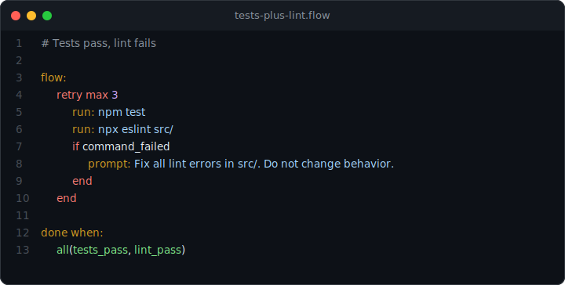

# Tests Pass, Lint Fails

> Tests pass. Lint fails. Claude stops anyway -- unless you add a gate.

<p align="center">
  
</p>

## What you'll see

The code in `src/utils.js` is logically correct -- tests pass. But it uses `var` instead of `const` and has an unused variable. With `all(tests_pass, lint_pass)`, the runtime blocks completion until both checks pass.

## Prerequisites

- [Claude Code](https://docs.anthropic.com/en/docs/claude-code/overview)
- Node.js >= 22
- prompt-language: `npx @45ck/prompt-language`

## Run it

```bash
cd examples/public/02-tests-plus-lint
npm install
claude
```

## The flow

```
Goal: Fix all lint errors in src/utils.js

flow:
  retry max 3
    run: npm test
    run: npx eslint src/
    if command_failed
      prompt: Fix all lint errors in src/. Do not change behavior.
    end
  end

done when:
  all(tests_pass, lint_pass)
```

## What happens

1. `run: npm test` passes -- the logic is correct.
2. `run: npx eslint src/` fails -- `var` instead of `const`, unused variable.
3. Claude fixes the lint errors while preserving behavior.
4. The `retry` loops until both `npm test` and `npx eslint src/` exit 0.
5. The compound gate `all(tests_pass, lint_pass)` confirms both checks pass before completing.

## Without the gate

A single `tests_pass` gate would let Claude stop after tests pass, leaving lint violations in place. The `all()` composition catches this.

## Why it matters

Real codebases have multiple quality checks. Compound gates ensure all of them pass, not just the obvious one.

## Next steps

- [All proof examples](../) | [Main README](../../../README.md)
- [Getting started](../../../docs/guides/getting-started.md) | [DSL cheatsheet](../../../docs/reference/dsl-cheatsheet.md)
