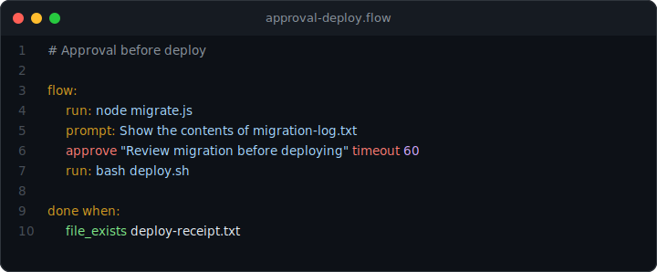

# Approval Before Deploy

> Block a destructive action until a human says yes.

<p align="center">
  
</p>

## What you'll see

The flow runs a database migration, shows the results, then pauses for human approval before deploying. The `approve` node blocks execution until a human explicitly approves. If no approval comes within the timeout, the flow advances without deploying.

## Prerequisites

- [Claude Code](https://docs.anthropic.com/en/docs/claude-code/overview)
- Node.js >= 22
- prompt-language: `npx @45ck/prompt-language`

## Run it

```bash
cd examples/public/03-approval-before-deploy
claude
```

## The flow

```
Goal: Run migration then deploy after approval

flow:
  run: node migrate.js
  prompt: Show the contents of migration-log.txt to the user.
  approve "Review migration log before deploying" timeout 60
  run: bash deploy.sh

done when:
  file_exists deploy-receipt.txt
```

## What happens

1. `run: node migrate.js` executes the migration and writes `migration-log.txt`.
2. The `prompt` asks Claude to show the migration results.
3. `approve` pauses the flow and asks the human to review before continuing.
4. If approved, `run: bash deploy.sh` deploys and writes `deploy-receipt.txt`.
5. The `file_exists` gate confirms the deploy actually happened.

## Without the gate

Without `approve`, the deploy runs immediately after migration with no human checkpoint. A bad migration would auto-deploy.

## Why it matters

Some actions are destructive and irreversible. The `approve` node gives humans a mandatory checkpoint before the flow continues.

## Next steps

- [All proof examples](../) | [Main README](../../../README.md)
- [Getting started](../../../docs/guides/getting-started.md) | [DSL cheatsheet](../../../docs/reference/dsl-cheatsheet.md)
