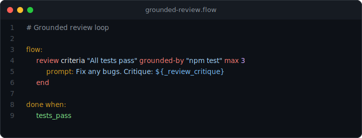

# Grounded Review Loop

> AI reviews code, but the critique is grounded in real test output.

<p align="center">
  
</p>

## What you'll see

The `review` node asks Claude to evaluate the code, but grounds its critique in actual `npm test` output. If tests fail, the critique includes the real error messages. Claude then fixes the bugs using that grounded feedback.

## Prerequisites

- [Claude Code](https://docs.anthropic.com/en/docs/claude-code/overview)
- Node.js >= 22
- prompt-language: `npx @45ck/prompt-language`

## Run it

```bash
cd examples/public/04-grounded-review-loop
claude
```

## The flow

```
Goal: Fix the factorial bug using grounded review

flow:
  review criteria "All tests pass and code is correct" grounded-by "npm test" max 3
    prompt: Fix any bugs. Review critique: ${_review_critique}
  end

done when:
  tests_pass
```

## What happens

1. The `review` node runs `npm test` to ground its evaluation in real output.
2. Tests fail: `factorial(5)` returns 24 instead of 120 (off-by-one in the loop).
3. The critique includes the actual test failures, not just AI speculation.
4. Claude fixes the `i < n` to `i <= n` bug using the grounded feedback.
5. The `review` loops until its criteria are met or `max 3` iterations.
6. The `tests_pass` gate confirms the fix is real.

## Without the gate

An ungrounded review would rely on Claude reading the code and guessing. Grounding forces the review to incorporate real test output, making the critique specific and actionable.

## Why it matters

AI code review is more useful when it has real data. The `grounded-by` directive ensures the AI critique reflects actual program behavior, not just static analysis.

## Next steps

- [All proof examples](../) | [Main README](../../../README.md)
- [Getting started](../../../docs/guides/getting-started.md) | [DSL cheatsheet](../../../docs/reference/dsl-cheatsheet.md)
