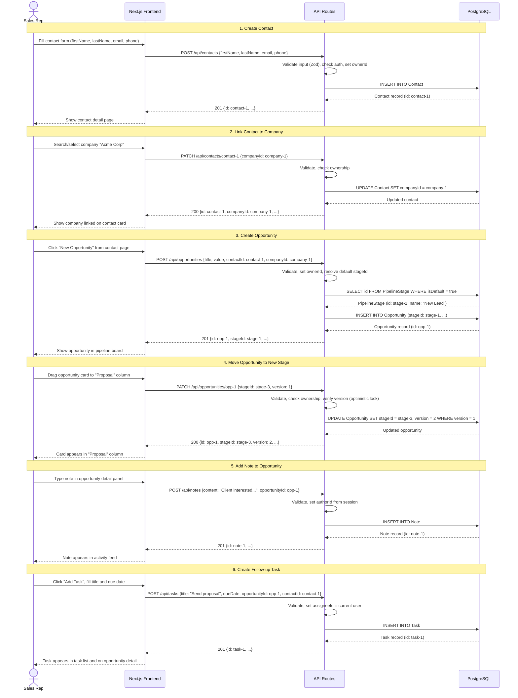

# Sequence Diagram -- Contact to Opportunity Flow

A Sales Rep creates a contact, links it to a company, creates an opportunity, moves it through a pipeline stage, adds a note, and creates a follow-up task.

## Mermaid Diagram

## Step-by-Step Narrative

1. **Create Contact** -- Rep submits a contact form. The API validates with Zod, assigns the current user as owner, and inserts into the Contact table. The new contact is returned with its generated UUID.

2. **Link to Company** -- Rep selects an existing company from a search dropdown. A PATCH request updates the contact's `companyId`. The API verifies the Rep owns the contact before allowing the update.

3. **Create Opportunity** -- Rep creates an opportunity from the contact's detail page. The API auto-assigns the default pipeline stage (the one with `isDefault = true`) and links the opportunity to both the contact and company.

4. **Move to New Stage** -- Rep drags the opportunity card on the Kanban board. The UI sends a PATCH with the new `stageId` and the current `version` for optimistic concurrency control. If another user modified the record, the API returns 409 Conflict.

5. **Add Note** -- Rep types a note in the opportunity's activity panel. The API sets the `authorId` from the authenticated session and links the note to the opportunity.

6. **Create Follow-up Task** -- Rep creates a task with a due date, linked to both the opportunity and the contact. The task is assigned to the current user by default.
