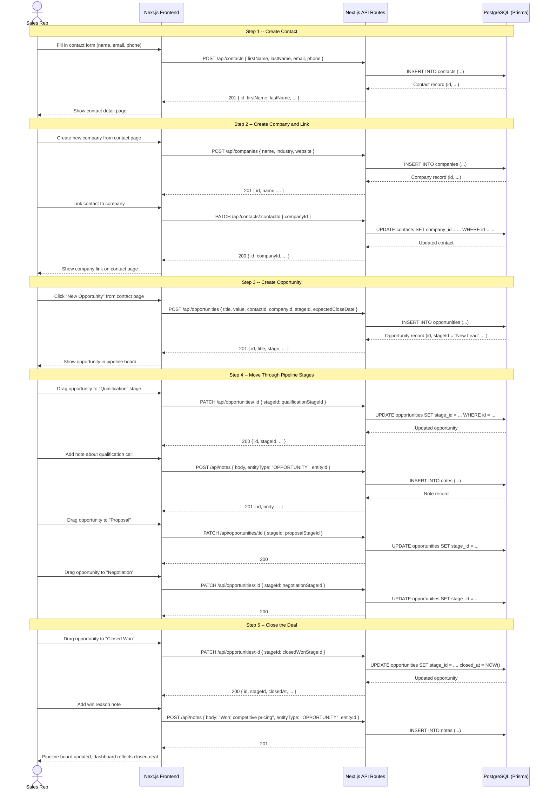

# Sequence Diagram -- Contact to Closed Deal

## Overview

This sequence shows the core sales workflow: a Sales Rep creates a contact, links it to a company, creates an opportunity, moves it through pipeline stages, and closes the deal.

## Sequence (Mermaid)

## Step-by-Step Narrative

### Step 1: Create Contact

The rep fills in a contact form with first name, last name, email, and phone. The frontend sends a `POST /api/contacts` request. The API validates the input, sets the `ownerId` to the authenticated user and `orgId` from the session, then inserts the record via Prisma. The new contact is returned and displayed.

### Step 2: Create Company and Link

From the contact detail page, the rep creates a new company record. Then they link the contact to the company by updating the contact's `companyId`. Both operations are standard CRUD calls.

### Step 3: Create Opportunity

The rep creates an opportunity linked to the contact (and optionally the company). The opportunity is assigned to the first pipeline stage ("New Lead") by default, or the rep selects a stage explicitly. The opportunity appears on the pipeline board.

### Step 4: Move Through Pipeline Stages

The rep drags the opportunity card across the pipeline board. Each drag triggers a `PATCH /api/opportunities/:id` call that updates the `stageId`. The rep adds notes at each stage to record context (qualification details, proposal feedback, negotiation terms).

### Step 5: Close the Deal

When the deal is won, the rep moves the opportunity to "Closed Won". The API sets the `closedAt` timestamp. The rep adds a final note recording the win reason. The dashboard totals update to reflect the new closed revenue.

## Error Cases

| Scenario | Handling |
|----------|----------|
| Contact creation with duplicate email | API returns 409 Conflict with message |
| Opportunity moved to invalid stage | API validates stageId belongs to org, returns 400 |
| Unauthenticated request | API returns 401, frontend redirects to login |
| User tries to access another org's data | API filters by orgId from session, returns 404 |
